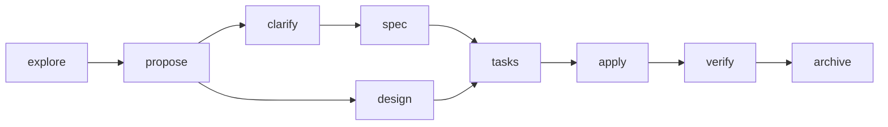

<!-- ai-workspace:begin:aiws:header -->
# ai-workspace-generator — AI Agent Guide (AGENTS.md)

Node/TypeScript CLI that scaffolds and adapts AI workspaces (Claude Code + Copilot) from one config.

This file is the **single source of truth** for AI agents (Claude Code, GitHub Copilot, Cursor…).
Tool-specific files (`CLAUDE.md`, `.github/copilot-instructions.md`) are generated adapters that
mirror or import this content — **edit rules here**, then run `ai-workspace sync`.

Sections between `ai-workspace:begin/end` markers are generated. Add your own notes **outside** them;
they survive regeneration.
<!-- ai-workspace:end:aiws:header -->

<!-- ai-workspace:begin:aiws:core -->
## Universal conventions (Layer 0)

These apply to every contributor and every file, regardless of language.

### Encoding & line endings
- Files are **UTF-8**, no BOM. Newlines are **LF**. Final newline at EOF.
- `.editorconfig` and `.gitattributes` enforce this — do not fight them.

### Commits
- **Conventional Commits** in the **imperative mood**: `feat:`, `fix:`, `refactor:`, `docs:`, `test:`, `chore:`.
- Subject ≤ 72 chars, present tense ("add", not "added"). Explain the *why* in the body.
- One logical change per commit. Do not mix refactors with behavior changes.

### Code style
- Match the surrounding code: naming, structure, comment density, idioms.
- Names are descriptive and in **English**. No abbreviations that aren't standard.
- Keep functions small and single-purpose. Prefer early returns over deep nesting.
- No dead code, no commented-out blocks, no leftover debug logging.

### Reviews & safety
- Never commit secrets. Never weaken auth, validation, or escaping to "make it work".
- Validate inputs at boundaries. Handle errors explicitly — no silent catches.
- Changes that are hard to reverse or outward-facing need explicit confirmation.

### Token efficiency (how agents should work here)
- **Reference, don't duplicate.** Link to skills/docs instead of restating them.
- Load detail on demand: read scoped instructions/skills only when relevant.
- Prefer the living docs (`docs/development/status/PROJECT-STATE.md`) over re-scanning the whole repo.
- Use **context7** (MCP) for up-to-date, version-pinned library docs instead of guessing.
- **Offer, don't dump.** When extra explanation is optional, offer "say **X** and I'll explain X" instead of long unsolicited detail.

### Diagrams
- Use **Mermaid** for architecture, data flow, module dependencies and the SDD lifecycle.
- Keep diagrams in `docs/development/status/ARCHITECTURE.md`; regenerate with `/aiws-doc-sync`.
- **Always quote node labels** that contain special characters (`/`, `.`, `:`, `+`, `@`, `·`, `*`, `()`, `&`, ` `): write `A["src/index.ts entry"]`, never `A[src/index.ts entry]`. Unquoted special characters cause flaky rendering across Mermaid versions (e.g. GitHub's intermittent `translate(undefined, NaN)` error).
<!-- ai-workspace:end:aiws:core -->

<!-- ai-workspace:begin:aiws:profile -->
## User profile (Layer 0 — governance posture)

Active profile: **technical** · **advanced**. Apply this posture by
default. It tunes guidance and verbosity — it never overrides the Safety gate, idempotency, or commit policy.

**As a technical user:**
- Prioritize precision, maintainability, architecture, testing, security and performance.
- Use the full technical flow (SDD, living docs, context7) and keep Claude Code / VS Code / Copilot parity.
- Require explicit confirmation for destructive changes, migrations, security, data, commits, critical
  dependencies and architecture decisions.

**At advanced level:**
- Allow analytical flows: surface trade-offs, risks and architecture decisions; trim basic explanations.
- Allow more personalization and explicit user decisions on architecture, testing, skills and governance.
- Still enforce the critical safety, idempotency and governance rules.
<!-- ai-workspace:end:aiws:profile -->

<!-- ai-workspace:begin:aiws:versioning -->
## Versioning policy (Layer 0)

This project is treated as **EXISTING (brownfield)**.

**Existing project — conservative by default.**
- **Keep the current major versions** of languages, frameworks and packages. Do **not** bump versions
  as a side effect of an unrelated task.
- A version bump or migration is a **deliberate change**: only after the `dependency-upgrade` assessment
  approves it and the user authorizes it.
- When you need a newer API, first check whether the **pinned version** already supports it (via context7)
  before proposing an upgrade.

For exact, up-to-date version facts and compatibility, query **context7** for each library — do not guess.
<!-- ai-workspace:end:aiws:versioning -->

<!-- ai-workspace:begin:aiws:safety -->
## Safety gate (Layer 0)

Hard rules so the AI stays reliable and never "goes rogue" on risky changes.

**STOP and ask** before any of these — never do them silently as part of another task:
- Upgrading or downgrading a language/framework/package version.
- Running or writing a **migration** (data, schema, framework major).
- Resolving a **conflict** (merge, dependency, breaking API) where more than one outcome is plausible.
- Anything **irreversible or outward-facing** (deleting data, publishing, force-push, changing CI/CD).
- Touching auth, secrets, crypto, permissions, or input validation.

**When you hit one of the above:**
1. **Verify feasibility first.** Do not assume a migration/upgrade is possible. Check breaking changes,
   peer-dependency compatibility across the whole stack, and security advisories (use **context7**).
2. **Present options**, each with effort, risk, and what would need to be replaced.
3. **Recommend the best long-term option** explicitly, with the reasoning.
4. **Wait for the user's explicit decision.** Do not proceed on assumption.

**Security is never traded away.** Do not weaken validation, auth, or escaping to make something work or
to resolve a conflict. Never commit secrets. Flag vulnerable or unmaintained dependencies.

> If a request would require breaking these rules, say so and propose a safe alternative instead of
> complying silently.
<!-- ai-workspace:end:aiws:safety -->

<!-- ai-workspace:begin:aiws:workflow -->
## Development workflow (Layer 0) — **mandatory**

A single, structured way of working. This flow is **not optional**: do not skip
steps even if asked to "just do it quickly". If a shortcut is requested, explain the risk and follow the flow.

**The flow for any change**
1. **Non-trivial change** → use SDD: `/aiws-sdd-explore` → `/aiws-sdd-propose` → `/aiws-sdd-clarify` → `/aiws-sdd-spec` + `/aiws-sdd-design` → `/aiws-sdd-tasks` → `/aiws-sdd-apply` → `/aiws-sdd-verify` → `/aiws-sdd-archive`.
2. **Small change** → implement directly, then run `/aiws-doc-sync`.
3. Honor the **Safety gate** above for anything risky.
4. **Commit** following the policy below.

**Commit policy**
- **Conventional Commits**, imperative mood (`feat:`, `fix:`, `refactor:`, `docs:`, `test:`, `chore:`). One logical change per commit.
- Commits are authored by the **user's own git identity**. Do **not** add `Co-Authored-By:` or any AI-attribution trailers.
- **Automate with approval:** after a completed change (spec-driven or small), prepare the commit and ask for confirmation; commit **only** once the user approves. Use the `/aiws-commit` command.
- Never use `--no-verify` or bypass hooks.

> Enforcement: a `commit-msg` git hook in `.githooks/` blocks disallowed commits. Activate once with
> `git config core.hooksPath .githooks`.
<!-- ai-workspace:end:aiws:workflow -->

<!-- ai-workspace:begin:aiws:harness-engineering -->
## Harness engineering (Layer 0)

This workspace **is the agent's harness** — the instructions, skills, tools and docs that shape the AI's
work. *Agent = model + harness*; tune the harness, not the model.

**Context is finite — spend it on the smallest set of high-signal tokens:**
- **Progressive disclosure.** Load skills/`references/` by trigger, on demand — not preemptively.
- **Just-in-time over preloaded.** Pull version-pinned facts via **context7**; don't guess or paste big docs.
- **Memory over recall.** Keep durable state in the living docs (`docs/development/status/*`), not the chat.
- **Clear, non-overlapping tools/skills.** If you can't tell which one applies, fix its description.

**The ratchet principle (how this file grows).** Every standing rule should trace to a **real, observed
failure**. When the agent slips, tighten the harness (a skill, a hook, a description) rather than appending
prose — keeping guidance at the **right altitude**: specific enough to steer, lean enough to stay read.

> Before adding to this file, ask: *what failure does this prevent?* If there isn't one, don't add it.
<!-- ai-workspace:end:aiws:harness-engineering -->

<!-- ai-workspace:begin:aiws:routing -->
## Intent routing (Layer 0)

**The user should not need to remember commands.** From plain language, detect the intent and apply the
right flow yourself. Slash commands (`/...`) and prompts are **optional manual shortcuts** — prefer doing
the work over telling the user to run a command (mention the command only as an aside).

| The user says (in any wording)… | You do… |
|---------------------------------|---------|
| "let's build / add / implement <feature>", anything non-trivial | Run the **SDD flow** (explore → propose → **clarify** → spec → design → tasks → apply → verify → archive). It's a methodology, not a tool — artifacts are Markdown in `docs/development/`. |
| A small, well-understood change | Implement directly, then refresh living docs. |
| "update / upgrade / bump / migrate / install a newer version" | **Do NOT just do it.** Run the `aiws-dependency-upgrade` assessment first (feasibility + security), then await the decision. |
| "commit / save / guarda los cambios", or you just finished a change | Use the **aiws-secure-commit** flow: prepare a conventional commit, no co-author, and ask for approval before committing. |
| "I'm new / how does this work / explain SDD / how do I start" | Use the **aiws-workspace-guide**. |
| "set up the editor / which extensions / profiles" | Use the **aiws-vscode-setup** guidance. |
| Anything risky, a conflict, or version/migration change | Honor the **Safety gate**: stop, verify feasibility, recommend, await decision. |
| You finished a task and project state changed | Refresh the living docs (`docs/development/status/*`). |

When intent is ambiguous, ask one short clarifying question, then proceed. Never silently skip the
Safety gate or the commit policy because the user phrased a request casually.
<!-- ai-workspace:end:aiws:routing -->

<!-- ai-workspace:begin:aiws:skill-routing -->
## Skill routing (Layer 0)

Load skills by their *trigger*, not preemptively. Selection for the **technical** · **advanced** profile:

| Skill | When | Load |
|-------|------|------|
| `aiws-secure-commit` | committing changes | always |
| `aiws-sdd-*` | planning/implementing a non-trivial change | suggested |
| `aiws-living-docs` | after finishing a task or when project state changed | suggested |
| `aiws-workspace-guide` | new here — how this workspace works | suggested |
| `aiws-configure-workspace` | configuring or re-configuring the workspace (analyze an existing repo, or set up a new one) | suggested |
| `aiws-dependency-upgrade` | before any version bump or migration (assess first) | on-demand · high risk |
| `aiws-audit` | periodically or after big changes — audit workspace health & coherence (read-only) | on-demand |
| `aiws-vscode-setup` | setting up VS Code / extensions | on-demand |
| `find-skills` | discovering/installing skills from the open ecosystem (npx skills) | on-demand |
| `mcp-builder` | building or evaluating an MCP server (tools, resources, Node or Python, best practices) | on-demand |
| `skill-creator` | authoring, structuring or evaluating a Claude skill (SKILL.md, references, packaging) | on-demand |

> `always` skills are the baseline; `suggested` ones activate by context; `on-demand` only when asked.
> Don't activate skills that don't apply to this profile.
<!-- ai-workspace:end:aiws:skill-routing -->

<!-- ai-workspace:begin:aiws:lang-typescript -->
## TypeScript (Layer 1 — language) · target vlatest

- **Strict mode on.** `strict: true`, `noUncheckedIndexedAccess`, no implicit `any`.
- Prefer `type`/`interface` over `any`. Use `unknown` at boundaries, narrow before use.
- No `// @ts-ignore` without a one-line reason comment. Fix the type instead.
- Format with **Prettier**, lint with **ESLint** (`@typescript-eslint`). CI fails on lint errors.
- `import type { … }` for type-only imports. No default exports for shared modules — named exports.
- Async: `async/await`, never floating promises. Handle rejections explicitly.
- Validate external data with a schema (e.g. `zod`) at the edge; trust types only after parsing.
- Tests colocated or in `__tests__`; use the project's runner (vitest/jest). Name: `*.test.ts`.

> For current API/best-practice details, query **context7** for `typescript@latest`.
<!-- ai-workspace:end:aiws:lang-typescript -->

<!-- ai-workspace:begin:aiws:env-node-runtime -->
## Node runtime (Layer 3 — environment)

- Manage Node versions with **nvm** (or fnm/Volta). Pin the version in `.nvmrc`; run `nvm use`.
- Prefer the project's lockfile (npm/pnpm/yarn) — commit it; install with `npm ci` in CI.
- Don't install global packages for project tooling; use `devDependencies` and `npx`.
- One Node major per project; document it. Match CI to the local version.

> For setup specifics on your OS, query **context7** (or the nvm docs).
<!-- ai-workspace:end:aiws:env-node-runtime -->

<!-- ai-workspace:begin:aiws:company -->
## Company conventions (Layer 4 — organization overlay)

Reusable across projects of this organization. Fill in via `workspace.config.yaml` (`conventions:`).

- **File naming:** kebab-case
- **Naming prefixes / dynamic tokens:** _(none defined — add under `conventions.prefixes`)_

> This layer holds organization-specific rules (prefixes, internal libraries, forbidden patterns).
> Updating the base layers never overwrites it.
<!-- ai-workspace:end:aiws:company -->

<!-- ai-workspace:begin:aiws:business -->
## Business / domain logic (Layer 5 — project)

Project-specific domain knowledge. Keep this accurate — it is the AI's map of *what* you build.

**Ubiquitous language (glossary):** _(add terms under `business.glossary`)_

**Business invariants:** _(add rules under `business.invariants`)_

> Keep this section and `docs/development/status/PROJECT-STATE.md` in sync via `/aiws-doc-sync`.
<!-- ai-workspace:end:aiws:business -->

<!-- ai-workspace:begin:aiws:sdd -->
## Spec-Driven Development (SDD)

A lightweight **methodology — not a tool dependency**. We adopt the best *ideas* from two SDD projects
and keep every artifact as plain Markdown; **no external CLI is required or installed**:

- **Spec-Kit** → the greenfield *bootstrap*: a project **constitution** (principles) and a **clarify** step.
- **OpenSpec** → the steady state: changes as **deltas** against a living spec baseline, then archived.

Backend: **files**.

**Lifecycle**

**Which idea applies, by project mode**
- **This is an existing project** (`mode: existing`): **no constitution bootstrap** — every new feature
  is a **delta change** (OpenSpec idea) against the current specs. This is the normal, everyday case.
- Project *mode* governs the one-time ramp; per-feature, the size/risk of the change decides whether the
  full flow is worth it.

**Commands** (Claude: `/aiws-sdd-*`; Copilot: prompt files in `.github/prompts/`)
- `/aiws-sdd-explore <topic>` — investigate before committing.
- `/aiws-sdd-propose` → `/aiws-sdd-clarify` → `/aiws-sdd-spec` + `/aiws-sdd-design` → `/aiws-sdd-tasks` → `/aiws-sdd-apply` → `/aiws-sdd-verify` → `/aiws-sdd-archive`.

**Artifacts** live in `docs/development/changes/<change-name>/` and are **versioned in git** (reviewable in PRs, readable by any AI tool). The store follows OpenSpec's *layout* (specs + changes + archive) as a convention — it is **not** the OpenSpec CLI.

**Rules**
- For non-trivial features, create a proposal/spec before implementing.
- `clarify` resolves ambiguity *before* the spec is finalized. Specs are the source of truth for *what*;
  design for *how*; tasks track progress.
- After implementing, run `/aiws-sdd-verify` against the spec, then `/aiws-sdd-archive` (folds the delta into `docs/development/specs/`).
<!-- ai-workspace:end:aiws:sdd -->

<!-- ai-workspace:begin:aiws:living-docs -->
## Living documentation

The project keeps an always-current, token-cheap snapshot of its own state so agents get context
without re-scanning everything.

- `docs/development/status/PROJECT-STATE.md` — overview, module map, **stack & production-target decision (what + why)**, lightweight decisions log, current status.
- `docs/development/status/ARCHITECTURE.md` — architecture with **Mermaid** diagrams.

**Keep it fresh:** run `/aiws-doc-sync` (Claude) or the `doc-sync` prompt (Copilot) when you finish a task.
It derives change status from `docs/development/changes/*`. Read these files first; they are cheaper than scanning the repo.
<!-- ai-workspace:end:aiws:living-docs -->

<!-- Manual section (outside markers): meta-guidance for working on the generator. Survives `sync`. -->

## Contributor guide — working on the generator itself

> The blocks above are generated by the tool **dogfooding itself** (`workspace.config.yaml` → `ai-workspace sync`).
> Everything below is manual and survives regeneration. It is *meta*: how to change **this CLI**.

### Installing & bootstrapping this generator
When asked to *"install this from &lt;repo URL&gt;"*, follow this flow (don't improvise); full playbook in
**[INSTALL.md](INSTALL.md)**:
1. Detect the OS, then check `git`, `node` (≥ 20) and `npm`. If any is missing, **propose** the official
   install for that OS — defer the exact commands to official docs / **context7**, never hardcode versions.
2. **Ask before installing anything system-wide** (Node, git, global packages). Installing system packages is a
   Safety-gate action — never do it silently.
3. Install the latest Release tarball (no clone, no build):
   `npm i -g https://github.com/grojof/ai-workspace-generator/releases/latest/download/ai-workspace-generator.tgz`.
   Expert/offline alternative: clone → `npm install && npm run build && npm link`.
4. Verify with `ai-workspace --version`, then run `ai-workspace init`; for the richest config, hand off to the
   `/aiws-configure` skill. **Update** = re-install the newer tarball (or `git pull && npm run build` from source).

### Working principles
Guard-rails that always apply when working on this generator:
1. **Zero fabrication** — no fictional info; separate facts / interpretation / hypotheses.
2. **Rigor** — every technical claim carries argument + source + limitations; cite standards/docs.
3. **Critical thinking** — challenge wrong premises; correctness over comfort (no sycophancy).
4. **Data protection** — flag privacy/regulatory concerns before handling personal/credential data.
5. **Format** — clear structure; answer in the user's language (ES/EN), English for technical terms.
6. **Escalation** — risks and critical changes are decided by authorized humans; the agent informs.

### Architecture rules (do not break these)
- **`AGENTS.md` is the single source of truth** for generated repos. New targets are *projections* of the same composed blocks — never a second source.
- **Managed-region block ids are a stable contract.** Renaming/removing an id orphans content in users' repos (writeManaged never deletes unknown blocks). Prefer changing content over ids; document migrations.
- **Idempotency is sacred.** A second `generate`/`sync` must report 0 created, 0 updated. Text outside `ai-workspace:begin/end` markers must always survive.
- **The CLI never calls MCP servers.** context7 is for the *agent*; anything needing live docs goes into a generated prompt/skill, not CLI code.
- **Skills as data.** Stack skill content lives as markdown in `skill-packs/` (not TypeScript); migrations must stay **byte-equivalent**.
- **Language policy (priority rule):** everything the AI consumes is **English-only**; `config.language` governs only human-facing generated content (`AI-WORKSPACE.md`, `docs/`).
- **Binary skill assets ship byte-for-byte.** Assets a skill needs (templates `.pptx`/`.potx`/`.dotx`, logos `.png`) are copied via `writeBinary` (never utf8-normalized) by `generateStackPacks` and the plugin packager; org-skill zips put `SKILL.md` first. Don't route binaries through the text `writeFile`.

### Where things live
| To change… | Edit… |
|------------|-------|
| A rule's wording | the `.eta` in `templates/` (+ `templates/i18n/es/`) |
| User-profile governance | `ProfileSchema` in `src/config/schema.ts` + `templates/profile/posture.md.eta` |
| Skill metadata / routing | `src/modules/skills.ts` (registry) + `src/generate/skillRouting.ts` (block) |
| A skill / stack pack | `skill-packs/<id>/` (`SKILL.md` + `references/` + `pack.yaml` + `overlay.<company>.md`); engine `src/generate/stackPacks.ts` (gating, `{{paths.*}}` token engine, overlay, binary assets) |
| A company skill (`corp-*`) | optional extension point — ship your own `skill-packs/corp-<x>-<org>/` with `gating.company` and a shared logical `id` (none bundled here; see [docs/project/EXTENDING.md](docs/project/EXTENDING.md)) |
| Update vendored packs from upstream | `ai-workspace skills sync [--ref] [--apply]` → `src/commands/skillsSync.ts`. Raw mirror in `vendor/` |
| Company overlay (org culture) | `config.company` + `templates/company/<org>/overlay.md.eta` |
| Distribution (plugin + marketplace + org-skill zips) | `ai-workspace package` → `src/commands/package.ts` + `src/generate/packaging.ts` + `src/util/zip.ts`. See [docs/project/DISTRIBUTION.md](docs/project/DISTRIBUTION.md) |
| Available modules | `src/modules/registry.ts` (+ `src/generate/mcp.ts`) |
| Which blocks exist / order | `BLOCK_MANIFEST` in `src/generate/blockManifest.ts` (walked by `composeBlocks`) |
| Files written & how | `src/generate/*.ts` |
| Config shape / defaults | `src/config/schema.ts` |
| SDD phases / methodology | `src/i18n/strings.ts` (phases) + `src/generate/sdd.ts` (gating); the `sdd | spdd` axis is `sdd.methodology` in `src/config/schema.ts` (`spdd⇒reasons` transform) + the conditional framing in `templates/sdd/orchestrator.md.eta`; ADRs `0001-mixed-sdd` + `0002-extension-contracts`; upstream `/sdd-upstream-check` |

### Build & release (repo-specific)
- Run `npm run build` and `npm test` before finishing. Invariants: idempotency holds; `doctor` stays green; skill migrations are byte-equivalent.
- Bump `TEMPLATES_VERSION` in `src/version.ts` when generated output changes (pre-release; skip only while unused).
- Update the matching doc under `docs/project/` (English canonical; `USAGE.md` also has a Spanish mirror `USAGE.es.md`) in the same change. Read [EXTENDING](docs/project/EXTENDING.md) + [MAINTAINING](docs/project/MAINTAINING.md) first for non-trivial work.

### Diagrams (repo docs)
- Repo docs use **Mermaid** (GitHub-native) — quote labels with special chars (`·`, ` `); enforced by `test/docs-mermaid.test.js`. Corporate palette: dark `#143a80`, accent `#e4b632`.
- Business/client deliverables use the corporate **draw.io** standard — not for code-repo docs.
