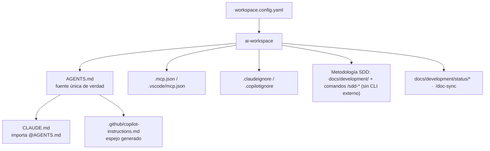

# Workspace de IA — qué se ha generado aquí

El workspace de IA de este proyecto fue creado y adaptado por **ai-workspace**. Este documento es tu
índice: qué existe, por qué y cómo usarlo. Vuelve a ejecutar `ai-workspace sync` para refrescarlo.

## Stack adaptado
- **Lenguajes:** typescript@latest
- **Frameworks:** _(ninguno)_
- **Targets:** claude

## Capas aplicadas
| Capa | Origen |
|------|--------|
| 0 · Núcleo universal | siempre activo |
| 1 · Lenguaje | typescript |
| 2 · Framework | — |
| 3 · Entornos | node-runtime |
| 4 · Overlay de empresa | `conventions:` en workspace.config.yaml |
| 5 · Negocio/dominio | `business:` en workspace.config.yaml |

## Índice de artefactos generados
- `AGENTS.md` — Fuente única de verdad para todos los agentes de IA.
- `CLAUDE.md` — Adaptador de Claude Code (importa @AGENTS.md).
- `.mcp.json` — Servidores MCP para Claude Code.
- `.claude/settings.json` — Ajustes de Claude Code (permisos, hooks, env).
- `.editorconfig` — Formato y codificación del editor (UTF-8/LF).
- `.gitattributes` — Normalización de fin de línea en Git.
- `.claudeignore` — Exclusiones de contexto IA / git (gestionadas).
- `.gitignore` — Exclusiones de contexto IA / git (gestionadas).
- `.claude/commands/sdd-explore.md` — Metodología SDD: comandos + almacén de specs (Markdown en el repo, sin CLI externo).
- `.claude/commands/sdd-propose.md` — Metodología SDD: comandos + almacén de specs (Markdown en el repo, sin CLI externo).
- `.claude/commands/sdd-clarify.md` — Metodología SDD: comandos + almacén de specs (Markdown en el repo, sin CLI externo).
- `.claude/commands/sdd-spec.md` — Metodología SDD: comandos + almacén de specs (Markdown en el repo, sin CLI externo).
- `.claude/commands/sdd-design.md` — Metodología SDD: comandos + almacén de specs (Markdown en el repo, sin CLI externo).
- `.claude/commands/sdd-tasks.md` — Metodología SDD: comandos + almacén de specs (Markdown en el repo, sin CLI externo).
- `.claude/commands/sdd-apply.md` — Metodología SDD: comandos + almacén de specs (Markdown en el repo, sin CLI externo).
- `.claude/commands/sdd-verify.md` — Metodología SDD: comandos + almacén de specs (Markdown en el repo, sin CLI externo).
- `.claude/commands/sdd-archive.md` — Metodología SDD: comandos + almacén de specs (Markdown en el repo, sin CLI externo).
- `docs/development/README.md` — Metodología SDD: comandos + almacén de specs (Markdown en el repo, sin CLI externo).
- `docs/development/specs/.gitkeep` — Metodología SDD: comandos + almacén de specs (Markdown en el repo, sin CLI externo).
- `docs/development/changes/.gitkeep` — Metodología SDD: comandos + almacén de specs (Markdown en el repo, sin CLI externo).
- `.claude/skills/sdd-explore/SKILL.md` — Skill vendorizada (.claude/skills/).
- `.claude/skills/sdd-propose/SKILL.md` — Skill vendorizada (.claude/skills/).
- `.claude/skills/sdd-clarify/SKILL.md` — Skill vendorizada (.claude/skills/).
- `.claude/skills/sdd-spec/SKILL.md` — Skill vendorizada (.claude/skills/).
- `.claude/skills/sdd-design/SKILL.md` — Skill vendorizada (.claude/skills/).
- `.claude/skills/sdd-tasks/SKILL.md` — Skill vendorizada (.claude/skills/).
- `.claude/skills/sdd-apply/SKILL.md` — Skill vendorizada (.claude/skills/).
- `.claude/skills/sdd-verify/SKILL.md` — Skill vendorizada (.claude/skills/).
- `.claude/skills/sdd-archive/SKILL.md` — Skill vendorizada (.claude/skills/).
- `.claude/skills/_shared/sdd-convention.md` — Skill vendorizada (.claude/skills/).
- `.claude/skills/living-docs/SKILL.md` — Skill vendorizada (.claude/skills/).
- `.claude/skills/find-skills/LICENSE.txt` — Skill vendorizada (.claude/skills/).
- `.claude/skills/find-skills/SKILL.md` — Skill vendorizada (.claude/skills/).
- `.claude/skills/mcp-builder/LICENSE.txt` — Skill vendorizada (.claude/skills/).
- `.claude/skills/mcp-builder/reference/evaluation.md` — Skill vendorizada (.claude/skills/).
- `.claude/skills/mcp-builder/reference/mcp_best_practices.md` — Skill vendorizada (.claude/skills/).
- `.claude/skills/mcp-builder/reference/node_mcp_server.md` — Skill vendorizada (.claude/skills/).
- `.claude/skills/mcp-builder/reference/python_mcp_server.md` — Skill vendorizada (.claude/skills/).
- `.claude/skills/mcp-builder/scripts/connections.py` — Skill vendorizada (.claude/skills/).
- `.claude/skills/mcp-builder/scripts/evaluation.py` — Skill vendorizada (.claude/skills/).
- `.claude/skills/mcp-builder/scripts/example_evaluation.xml` — Skill vendorizada (.claude/skills/).
- `.claude/skills/mcp-builder/scripts/requirements.txt` — Skill vendorizada (.claude/skills/).
- `.claude/skills/mcp-builder/SKILL.md` — Skill vendorizada (.claude/skills/).
- `.claude/skills/skill-creator/agents/analyzer.md` — Skill vendorizada (.claude/skills/).
- `.claude/skills/skill-creator/agents/comparator.md` — Skill vendorizada (.claude/skills/).
- `.claude/skills/skill-creator/agents/grader.md` — Skill vendorizada (.claude/skills/).
- `.claude/skills/skill-creator/assets/eval_review.html` — Skill vendorizada (.claude/skills/).
- `.claude/skills/skill-creator/eval-viewer/generate_review.py` — Skill vendorizada (.claude/skills/).
- `.claude/skills/skill-creator/eval-viewer/viewer.html` — Skill vendorizada (.claude/skills/).
- `.claude/skills/skill-creator/LICENSE.txt` — Skill vendorizada (.claude/skills/).
- `.claude/skills/skill-creator/references/schemas.md` — Skill vendorizada (.claude/skills/).
- `.claude/skills/skill-creator/scripts/aggregate_benchmark.py` — Skill vendorizada (.claude/skills/).
- `.claude/skills/skill-creator/scripts/generate_report.py` — Skill vendorizada (.claude/skills/).
- `.claude/skills/skill-creator/scripts/improve_description.py` — Skill vendorizada (.claude/skills/).
- `.claude/skills/skill-creator/scripts/package_skill.py` — Skill vendorizada (.claude/skills/).
- `.claude/skills/skill-creator/scripts/quick_validate.py` — Skill vendorizada (.claude/skills/).
- `.claude/skills/skill-creator/scripts/run_eval.py` — Skill vendorizada (.claude/skills/).
- `.claude/skills/skill-creator/scripts/run_loop.py` — Skill vendorizada (.claude/skills/).
- `.claude/skills/skill-creator/scripts/utils.py` — Skill vendorizada (.claude/skills/).
- `.claude/skills/skill-creator/scripts/__init__.py` — Skill vendorizada (.claude/skills/).
- `.claude/skills/skill-creator/SKILL.md` — Skill vendorizada (.claude/skills/).
- `.claude/commands/doc-sync.md` — Docs vivas: /doc-sync + estado del proyecto.
- `docs/development/status/PROJECT-STATE.md` — Docs vivas: /doc-sync + estado del proyecto.
- `docs/development/status/ARCHITECTURE.md` — Docs vivas: /doc-sync + estado del proyecto.
- `docs/README.md` — Índice de docs/: explica la estructura de la documentación.
- `.claude/skills/dependency-upgrade/SKILL.md` — Gobernanza: versiones, seguridad, commits.
- `.claude/skills/secure-commit/SKILL.md` — Gobernanza: versiones, seguridad, commits.
- `.claude/commands/commit.md` — Gobernanza: versiones, seguridad, commits.
- `.claude/commands/upgrade-deps.md` — Gobernanza: versiones, seguridad, commits.
- `.githooks/commit-msg` — Gobernanza: versiones, seguridad, commits.
- `.claude/skills/ai-workspace-guide/SKILL.md` — Skill vendorizada (.claude/skills/).
- `.claude/commands/aiws-guide.md` — Skill vendorizada (.claude/skills/).
- `.claude/skills/configure-workspace/SKILL.md` — Skill vendorizada (.claude/skills/).
- `.claude/commands/configure.md` — Skill vendorizada (.claude/skills/).
- `.vscode/extensions.json` — Extensiones recomendadas de VS Code.
- `.vscode/settings.json` — Extensiones recomendadas de VS Code.
- `.claude/skills/vscode-setup/SKILL.md` — Extensiones recomendadas de VS Code.

## Cómo encaja todo

## Uso diario

> **No necesitas memorizar comandos.** Solo describe en el chat lo que quieres — la IA detecta la
> intención y aplica el flujo correcto (SDD, evaluación de versiones, commit, docs…). Los comandos de
> abajo son atajos manuales opcionales.

- **Edita las reglas** en `AGENTS.md` y ejecuta `ai-workspace sync` (regenera adaptadores, preserva tus ediciones fuera de los marcadores).
- **Añade un módulo de stack:** `ai-workspace add <language|framework|mcp> <id>`.
- **Actualiza plantillas:** `ai-workspace upgrade` (muestra un diff primero).
- **Comprueba la salud:** `ai-workspace doctor` (presupuesto de tokens, referencias rotas).
- **Planifica un cambio:** `/sdd-explore` → `/sdd-propose` → `/sdd-clarify` → … → `/sdd-archive` (es una metodología — los artefactos son Markdown en `docs/development/`, sin CLI externo).
- **Refresca el estado del proyecto para la IA:** `/doc-sync`.
- **¿Empiezas con IA?** Pregunta por la skill `ai-workspace-guide` o usa `/aiws-guide`.

## Gobernanza y commits
- **Modo de proyecto:** existing — versiones conservadoras; sube solo tras evaluación.
- **Commits:** sin trailers de co-author; se commitea solo tras tu aprobación (usa /commit).
- **Barrera de seguridad:** la IA debe parar y preguntar antes de subir versiones, migrar, resolver conflictos o cambios arriesgados.
- **Refuerzo:** activa el hook de commit una vez → `git config core.hooksPath .githooks`

## Ámbito y exclusiones (scope & ignore)
- **Excluido del contexto de IA** (`.claudeignore` / `.copilotignore`): dist, node_modules, vendor, **/*.min.js
- **Ignorado por git (no compartido):** .claude/settings.local.json
- Todo lo demás bajo `.claude/`, `.github/`, `docs/development/`, `AGENTS.md`, `CLAUDE.md` y
  `workspace.config.yaml` se **versiona** para que todo el equipo comparta la misma configuración de IA.

