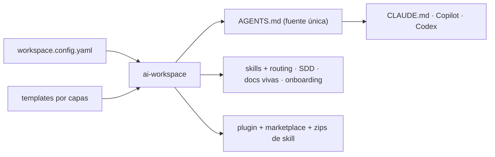

<!-- [🇬🇧 English](README.md) · 🇪🇸 Español (estás aquí) -->

# ai-workspace-generator

Genera y adapta un **workspace de IA** para cualquier proyecto —nuevo o existente— de modo que
**Claude Code**, **GitHub Copilot** (VS Code *y* Visual Studio) y **OpenAI Codex** sigan las mismas reglas,
convenciones y flujo de trabajo. Ejecutas un comando, respondes unas preguntas, y el proyecto recibe lo que
necesita: instrucciones, skills, un flujo seguro (SDD), documentación viva y más.

> **No memorizas comandos.** Tras la configuración hablas con la IA en lenguaje natural ("añade esta función",
> "actualiza esta librería", "guarda los cambios") y ella aplica el flujo correcto.

**Shared-first**, para developers individuales (aprender, preparar entrevistas, formarse, programar con
utilidades). Aplicable también a una **empresa** como punto de extensión opcional (`company`). Sin datos de
negocio reales.

---

## Instalación

**Requisitos:** Node.js ≥ 20, y al menos uno de: VS Code + Copilot · Claude Code · Visual Studio + Copilot · Codex.

```bash
git clone https://github.com/grojof/ai-workspace-generator.git
cd ai-workspace-generator
npm install && npm run build && npm link
```

> El paquete es **`ai-workspace-generator`**; el comando que instala es **`ai-workspace`**.

## Uso en 3 pasos

```bash
cd /ruta/a/tu-repo
ai-workspace init     # 1) asistente: autodetecta el stack y escribe workspace.config.yaml
                      # 2) abre el repo en tu editor/agente (VS Code, Visual Studio, Claude Code, Codex)
ai-workspace sync     # 3) tras editar AGENTS.md o la config, regenera (idempotente)
```

Tras `init`, lee **`AI-WORKSPACE.md`**: el índice de todo lo generado. ¿Proyecto existente? Deja que la IA lo
configure: ejecuta la skill **`/configure`** y propone tu `workspace.config.yaml` analizando el repo.

<details>
<summary><b>⚙️ Targets y opciones</b> — qué herramientas, <code>.vscode</code>, multi-repo</summary>

| `targets` | Genera | Notas |
|-----------|--------|-------|
| `claude` | `CLAUDE.md` + skills `.claude/` + `.mcp.json` | Claude Code |
| `copilot` | `.github/copilot-instructions.md` + `instructions/*` | **VS Code y Visual Studio** (activa el toggle en *Tools → Options → GitHub → Copilot*) |
| `codex` | **`AGENTS.md`** (instrucciones nativas) + `.codex/config.toml` | OpenAI Codex (CLI/IDE), multiplataforma |

- `AGENTS.md` se genera **siempre** (fuente única de verdad **y** adaptador de Codex).
- **`vscode: false`** omite la carpeta `.vscode/` (para Visual Studio o fuera de VS Code).
- **Multi-repo:** un `repos:` opcional gobierna varios repos enlazados (cada uno con su `path`/`stack`); el
  root es coordinador y cada hijo recibe su adaptador. `distribution.perRepo` reparte la distribución por repo.

Referencia completa: **[Guía de uso](docs/project/USAGE.es.md)**.
</details>

<details>
<summary><b>📦 Comandos</b></summary>

| Comando | Qué hace |
|---------|----------|
| `init` | Asistente → escribe la config → genera el workspace (`--simple` / `--advanced` / `--yes`) |
| `sync` | Regenera desde la config (preserva tus ediciones fuera de los marcadores) |
| `detect` | Detecta el stack (solo lectura); `--json` como semilla para la IA |
| `add` / `remove` | Añade o quita un lenguaje, framework, environment o MCP |
| `list` | Config actual + catálogo de módulos (activos vs disponibles) |
| `import` | Ingesta material existente y prepara su reconciliación |
| `upgrade` | Diff de plantillas y aplica la actualización (`--check` para previsualizar) |
| `doctor` | Lint del workspace (presupuesto de tokens, artefactos, ids de stack) |
| `package` | Empaqueta como plugin + marketplace privado + zips de skill |
| `skills sync` | Actualiza los skill-packs vendorizados desde el upstream |

Detalle: **[Guía de uso](docs/project/USAGE.es.md)**.
</details>

<details>
<summary><b>🚀 Distribuir e instalar como plugin</b> — para tu equipo / organización</summary>

`ai-workspace package` proyecta el workspace a un **plugin de Claude Code** servido desde el propio repo como
**marketplace privado**, y prepara **zips de skill** para subir a una organización de claude.ai. Tres
superficies (VS Code/CLI, Desktop/Cowork, claude.ai Team/Enterprise):

```
/plugin marketplace add <owner/repo o URL git>
/plugin install <plugin>@<marketplace>
```

Guía completa: **[Distribución](docs/project/DISTRIBUTION.md)** (en inglés).
</details>

<details>
<summary><b>🧩 Qué incluye y por qué</b> — <i>Harness Engineering</i></summary>

`Agente = Modelo + Harness`. El *harness* (instrucciones, skills, contexto, memoria, permisos, verificación)
es donde está la mayor parte de la diferencia entre un agente mediocre y uno fiable. **Este generador produce
harnesses.**



| Concepto | Qué significa |
|---|---|
| **Fuente única + idempotencia** | `AGENTS.md` es la verdad; regenerar es seguro y tus notas sobreviven |
| **Context engineering** | skills por *trigger*, docs just-in-time vía context7, estado en *living docs* |
| **Gobernanza en capas** | universal → lenguaje → framework → entorno → empresa → negocio (sin choques) |
| **Metodología (SDD/SPDD)** | intención antes que código; la verdad vive en el código (SDD) o en el prompt (SPDD) |
| **Ratchet principle** | una regla entra **solo** si previene un fallo real |

Desarrollo (en inglés): **[Harness Engineering](docs/project/harness-engineering.md)** · **[Metodologías SDD vs SPDD](docs/project/methodologies.md)**.
</details>

## Documentación

Toda la documentación vive en **[`docs/`](docs/README.md)**. Los **docs profundos están en inglés** (canónico,
repo público); el README y la guía de uso están en ambos idiomas. Índice:

- **[Guía de uso (ES)](docs/project/USAGE.es.md)** · [EN](docs/project/USAGE.md) — CLI, `workspace.config.yaml`, targets y multi-repo.
- **[Architecture](docs/project/ARCHITECTURE.md)** — config → componer → renderizar → escribir; capas, regiones gestionadas, i18n.
- **[Distribution](docs/project/DISTRIBUTION.md)** — `ai-workspace package`: plugin + marketplace + skills de organización.
- **[Extending](docs/project/EXTENDING.md)** · **[Maintaining](docs/project/MAINTAINING.md)** — recetas y mantenimiento del generador.
- **[Harness Engineering](docs/project/harness-engineering.md)** · **[Methodologies SDD vs SPDD](docs/project/methodologies.md)** · **[SDD upstream](docs/project/SDD-UPSTREAM.md)**.
- **Decisiones (ADR):** [0001 SDD mixto](docs/project/decisions/0001-mixed-sdd.md) · [0002 contratos de extensión](docs/project/decisions/0002-extension-contracts.md).
- **Proceso (mantenido con IA):** [especificación vigente](docs/development/specs/configuration.md) · [estado del proyecto](docs/development/status/PROJECT-STATE.md) · [cambios SDD](docs/development/changes/).
- **Repo:** [CHANGELOG](CHANGELOG.md) · [CONTRIBUTING](CONTRIBUTING.md) · [SECURITY](SECURITY.md).

## Licencia

Apache-2.0. Ver [LICENSE](LICENSE).
