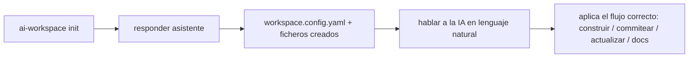
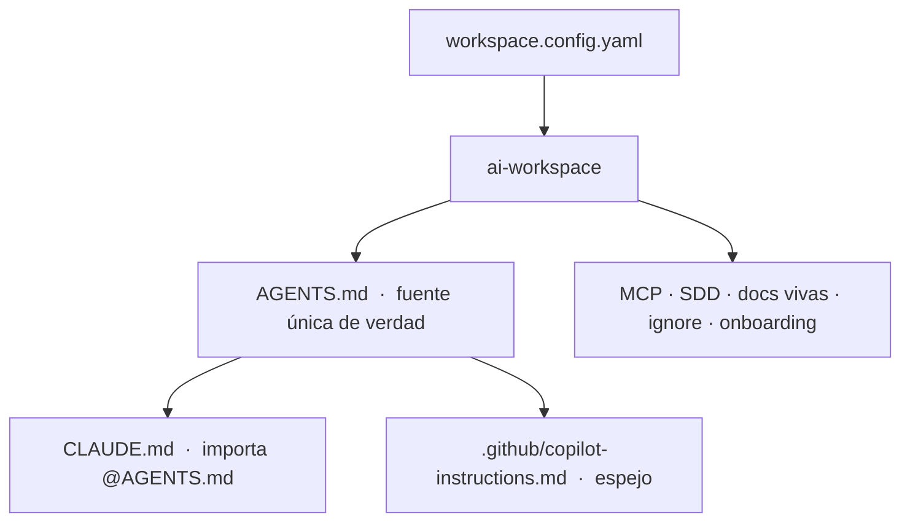
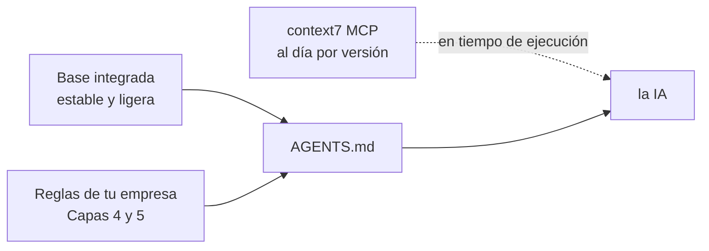
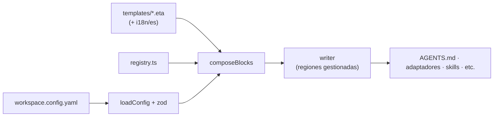

# ai-workspace

[English](README.md) · **Español**

Prepara un **entorno de trabajo con IA** para cualquier proyecto — nuevo o existente — de forma que
**Claude Code** y **GitHub Copilot** sigan las mismas reglas, convenciones y flujo de trabajo. Ejecutas
un comando, respondes unas preguntas, y el proyecto queda con todo lo necesario: instrucciones, skills,
un flujo de desarrollo seguro, documentación viva y más.

**No necesitas aprender comandos.** Tras la configuración, simplemente le hablas a la IA en lenguaje
natural ("añade esta feature", "actualiza esta librería", "guarda los cambios") y ella aplica el flujo
correcto automáticamente.

---

## ¿Para quién es?

- **Para todo el equipo**, desde perfiles senior hasta gente que empieza con IA. El workspace generado
  incluye una guía integrada (`/aiws-guide`) que te enseña sobre la marcha.
- **Proyectos nuevos** (greenfield) y **proyectos existentes** (brownfield) — se adapta a ambos.

## Instalación

**Requisitos:** Node.js ≥ 20, y VS Code con Copilot y/o Claude Code.

> ⚠️ **Aún no está publicado en npm.** De momento instálalo desde el código (esto te da el comando `ai-workspace`):

```bash
git clone https://github.com/grojof/ai-workspace-generator.git
cd ai-workspace-generator
npm install && npm run build && npm link
```

📦 **Más adelante (npm):** cuando se publique podrás usar `npx ai-workspace-generator init` sin instalar
nada. *(Todavía no disponible.)*

> **Nombres:** el proyecto/paquete es **`ai-workspace-generator`**; el comando que instala es
> **`ai-workspace`** (con `ai-workspace-generator` como alias).

## Úsalo en cualquier proyecto — 3 pasos

```bash
# 1) Desde la raíz de tu repo (nuevo o existente):
ai-workspace init

# 2) Responde el asistente (idioma, stack, etc.). Autodetecta lo que puede.

# 3) Abre el proyecto en VS Code (Copilot) o en Claude Code y empieza a trabajar.
#    Lee AI-WORKSPACE.md: es el índice de todo lo que se ha creado.
```

Y ya está. Si más tarde editas las reglas (en `AGENTS.md`) o cambias la config, ejecuta
`ai-workspace sync` para regenerar.



---

## Un ejemplo muy básico

Eres una persona junior en un proyecto React + TypeScript. Ejecutas `init` y aceptas los valores por
defecto. Ahora:

- Le dices a la IA: **"añade un botón de logout en la cabecera"**
  → Es un cambio pequeño: la IA lo implementa siguiendo las reglas de React/TypeScript de `AGENTS.md`
  y luego refresca la documentación.
- Le dices: **"vamos a añadir autenticación con login"**
  → Es un cambio grande: la IA arranca el **flujo SDD** — primero escribe un plan/spec corto, tú lo
  revisas y *después* implementa. Sin sorpresas.
- Le dices: **"actualiza React a la última versión"**
  → La IA **no** lo hace sin más. Primero evalúa viabilidad y seguridad, te dice qué se rompería,
  recomienda el camino más seguro y espera tu decisión.
- Le dices: **"guarda los cambios"**
  → Prepara un commit limpio (sin co-author de IA) y te pide confirmación antes de commitear.

No tuviste que recordar ni un solo comando. Los slash commands (`/sdd-explore`, `/commit`, …) existen
como atajos opcionales, pero no son obligatorios.

---

## Cómo funciona (y por qué las plantillas son pequeñas a propósito)

Todo se construye a partir de **un único fichero** (`workspace.config.yaml`) más una **librería de
plantillas por capas**, que se vuelca en `AGENTS.md` — la fuente única de verdad que leen Claude y Copilot.



### Las capas

| Capa | Qué contiene | Quién la rellena |
|------|--------------|------------------|
| 0 · Núcleo | codificación, commits, seguridad, flujo seguro, enrutado por intención | la herramienta |
| 1 · Lenguaje | formatters, idioms, testing (según versión) | la herramienta |
| 2 · Framework | estructura y patrones (fijados por versión) | la herramienta |
| 3 · Entornos | WSL, Docker, Node (nvm), Python (venv), bases de datos… | la herramienta |
| 4 · Empresa | tus prefijos, naming, librerías internas, patrones prohibidos | **tú** |
| 5 · Negocio | tu glosario de dominio, reglas e invariantes | **tú** |

### Por qué las reglas de lenguaje/framework son breves (es intencional)

Las reglas integradas de React, Go, Python… son una **base común y estable**, a propósito:

- **Eficiencia de tokens:** la IA lee `AGENTS.md` en cada sesión. Guías largas por tecnología inflarían
  cada conversación. Por eso guardamos lo esencial y duradero, y el detalle se carga bajo demanda.
- **Frescura vía context7:** el detalle específico de versión (APIs actuales exactas, deprecaciones)
  **no** se congela en un fichero. Las reglas apuntan a la IA al **MCP context7** para traer
  documentación al día y fijada por versión *en tu entorno* — así nunca se queda obsoleta.
- **Tus estándares son lo valioso:** la base genérica es solo el suelo. Las normas y patrones reales de
  tu equipo viven en las **capas 4 y 5**, y puedes traer tus ficheros de reglas existentes (siguiente apartado).



### ¿Ya tenéis estándares de código de empresa (ficheros `.md`)?

Tráelos — valen más que cualquier plantilla genérica:

```bash
ai-workspace import ../nuestros-estandares
```

Esto lee vuestros ficheros de reglas, los ordena en las capas correctas, los referencia en `AGENTS.md`
y deja una checklist para que la IA los reconcilie con las buenas prácticas actuales (vía context7).

---

## Qué se genera

- **`AGENTS.md`** + adaptadores (`CLAUDE.md`, `.github/copilot-instructions.md`) sincronizados.
- **SDD (desarrollo guiado por specs):** una **metodología** que combina las mejores ideas de **Spec-Kit**
  (constitución + clarify para arrancar de cero) y **OpenSpec** (cambios delta sobre una baseline viva).
  Son *conceptos*, no dependencias: los artefactos son Markdown en `openspec/` (versionado en git), sin
  CLI externo. Para proyectos nuevos arranca con la constitución; en existentes, cada feature es un delta.
- **Docs vivas:** `docs/ai/*` siempre al día para que la IA tenga contexto fresco del proyecto.
- **Gobernanza:** política de versiones (nuevo vs existente), una **barrera de seguridad** (la IA para y
  pregunta antes de cambios arriesgados) y una **política de commits** (sin co-author de IA, tú apruebas)
  reforzada por un hook de git `commit-msg`.
- **Entornos:** bloques para WSL, Docker, Node (nvm), Python (venv), PostgreSQL… con sus convenciones y gotchas.
- **Modo aprendizaje (opcional):** elige el propósito `learn` y obtienes una **skill tutor** (`/learn`)
  que enseña con explicaciones, ejercicios y casos — ideal para prepararse una entrevista o aprender bases.
- **Configuración del editor:** `.vscode/extensions.json` + `settings.json` para un formato consistente en el equipo.
- **`AI-WORKSPACE.md`:** un índice, generado en tu repo, que explica exactamente qué se ha configurado.

Re-ejecutar cualquier comando es **idempotente** — tus ediciones manuales fuera de los marcadores
`ai-workspace:begin/end` siempre se conservan.

---

## Guía paso a paso (para empezar)

¿Empiezas de cero? Este es el recorrido completo, con los detalles que el inicio rápido omite.

**El asistente `init` te pregunta:**
1. **Idioma** de la documentación generada (español o inglés).
2. Nombre y descripción del proyecto.
3. Herramientas objetivo (Claude, Copilot o ambas).
4. Lenguajes y frameworks — se **autodetectan** desde `package.json`, `tsconfig`, etc.
5. Si incluir **SDD** y con qué backend (recomendado: `openspec`).
6. Si incluir **docs vivas** y **context7**.

Al terminar, abre **`AI-WORKSPACE.md`**: el índice de todo lo que se ha creado y cómo usarlo.

**Activa el hook de commit seguro (una vez).** Los commits usan tu identidad de git, **sin
`Co-Authored-By`**, en formato Conventional, y solo tras tu aprobación. Un hook `commit-msg` generado lo
refuerza:

```bash
git config core.hooksPath .githooks
```

A partir de ahí, git rechaza commits con co-author o sin formato convencional, aunque algo intente colarlo.

**Configura VS Code.** Acepta las extensiones recomendadas (`.vscode/extensions.json`). Para no mezclar
entornos, crea un **perfil** de VS Code para este proyecto (Settings → Profiles) — la skill `vscode-setup`
te guía paso a paso.

---

## Referencia de comandos (opcional — rara vez los necesitas)

| Comando | Qué hace |
|---------|----------|
| `init` | Asistente: detecta el stack, crea la config y los ficheros. |
| `sync` | Regenera tras editar `AGENTS.md` o la config. |
| `list` | Muestra tu config y los módulos disponibles. |
| `add <tipo> <id>` | Añade lenguaje/framework/environment/mcp (p. ej. `add environment wsl`). |
| `remove <tipo> <id>` | Quita un módulo y limpia su bloque. |
| `import <ruta…>` | Ingiere estándares de empresa existentes. |
| `upgrade [--check]` | Previsualiza/aplica actualizaciones de plantillas (con diff). |
| `doctor` | Chequeo de salud: presupuesto de tokens, bloques rotos/huérfanos, etc. |

En Claude Code también puedes instalar este repo como **plugin** (`.claude-plugin/`) y usar `/aiws`.

## Más ayuda para usar la herramienta

- 🇬🇧 **[English version](README.md)** — the same guide in English.
- 🛠️ **[Documentación técnica](docs/es/)** — Arquitectura, Extender, Mantener.
- En cada proyecto generado tienes además `AI-WORKSPACE.md` (índice) y la skill `/aiws-guide`.

<br>

---
---

<br>

# 🛠️ Para desarrolladores de ai-workspace

> ⚠️ **Esta sección NO es necesaria para usar la herramienta.** Es solo para quien **mantiene o
> extiende** este generador (añadir lenguajes, frameworks, entornos, idiomas, etc.). Si solo quieres usar
> ai-workspace en tu proyecto, con lo de arriba te sobra.

## Cómo está construido

Es un CLI en Node/TypeScript. Una config (`workspace.config.yaml`) + una librería de plantillas por capas
se componen en `AGENTS.md` y sus adaptadores, escritos de forma idempotente mediante regiones gestionadas.



Puntos de entrada del código: [`src/cli.ts`](src/cli.ts) · [`src/generate/index.ts`](src/generate/index.ts) ·
[`src/generate/agents.ts`](src/generate/agents.ts) · [`src/modules/registry.ts`](src/modules/registry.ts) ·
[`templates/`](templates/). El detalle completo está en la documentación técnica de abajo.

## Documentación técnica

- 🇪🇸 **Castellano:** [Arquitectura](docs/es/ARCHITECTURE.md) · [Extender](docs/es/EXTENDING.md) ·
  [Mantener](docs/es/MAINTAINING.md)
- 🇬🇧 **English:** [Architecture](docs/ARCHITECTURE.md) · [Extending](docs/EXTENDING.md) ·
  [Maintaining](docs/MAINTAINING.md) · [Contributing](CONTRIBUTING.md)
- **SDD (metodología mixta):** [ADR 0001 — SDD mixto](docs/decisions/0001-mixed-sdd.md) ·
  [Procedencia upstream](docs/es/SDD-UPSTREAM.md)
- Convenciones del propio repo para agentes de IA: [`AGENTS.md`](AGENTS.md) (dogfooding).

## Entorno de desarrollo

```bash
npm install
npm run build         # tsc → dist/
npm run dev -- init   # ejecutar el CLI desde fuente (tsx)
npm test              # build + ejecutar la suite de tests
npm link              # exponer `ai-workspace` globalmente para pruebas
```

## Estado del proyecto

Pre-release, en desarrollo activo.
- **Lenguajes:** TypeScript, Go, Python.
- **Frameworks:** React, Next.js, Vue.
- **Entornos:** Node (nvm), Python (venv), WSL, Docker, PostgreSQL.
- **Targets:** Claude Code + GitHub Copilot. **Idiomas:** español, inglés.

Más bajo petición (Angular, NestJS, Java, C#, MySQL, MongoDB, Odoo…).

## Licencia

[Apache-2.0](LICENSE)
