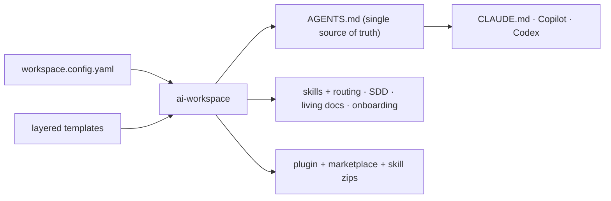

<!-- 🇬🇧 English (you are here) · [🇪🇸 Español](README.es.md) -->

# ai-workspace-generator

Generate and adapt an **AI workspace** for any project — new or existing — so that **Claude Code**,
**GitHub Copilot** (VS Code *and* Visual Studio) and **OpenAI Codex** follow the same rules, conventions and
workflow. Run one command, answer a few questions, and your project gets what it needs: instructions, skills,
a safe development flow (SDD), living documentation and more.

> **No commands to memorize.** After setup you talk to the AI in plain language ("add this feature", "update
> this library", "save the changes") and it applies the right flow.

**Shared-first**, aimed at individual developers (learning, interview prep, training, programming with
utilities). It can also target a **company** as an optional extension point (`company`). No real business data.

---

## Install

**Requirements:** Node.js ≥ 20, and at least one of: VS Code + Copilot · Claude Code · Visual Studio + Copilot · Codex.

```bash
git clone https://github.com/grojof/ai-workspace-generator.git
cd ai-workspace-generator
npm install && npm run build && npm link
```

> The package is **`ai-workspace-generator`**; the installed command is **`ai-workspace`**.

## Use in 3 steps

```bash
cd /path/to/your-repo
ai-workspace init     # 1) wizard: auto-detects your stack and writes workspace.config.yaml
                      # 2) open the repo in your editor/agent (VS Code, Visual Studio, Claude Code, Codex)
ai-workspace sync     # 3) after editing AGENTS.md or the config, regenerate (idempotent)
```

After `init`, read **`AI-WORKSPACE.md`**: the index of everything generated. Existing project? Let the AI
configure it: run the **`/configure`** skill and it proposes your `workspace.config.yaml` by analyzing the repo.

<details>
<summary><b>⚙️ Targets and options</b> — which tools, <code>.vscode</code>, multi-repo</summary>

| `targets` | Generates | Notes |
|-----------|-----------|-------|
| `claude` | `CLAUDE.md` + `.claude/` skills + `.mcp.json` | Claude Code |
| `copilot` | `.github/copilot-instructions.md` + `instructions/*` | **VS Code and Visual Studio** (enable the toggle in *Tools → Options → GitHub → Copilot*) |
| `codex` | **`AGENTS.md`** (native instructions) + `.codex/config.toml` | OpenAI Codex (CLI/IDE), cross-platform |

- `AGENTS.md` is **always** generated (single source of truth **and** Codex's adapter).
- **`vscode: false`** skips the `.vscode/` folder (for Visual Studio or non-VS-Code users).
- **Multi-repo:** an optional `repos:` list governs several linked repos (each with its `path`/`stack`); the
  root is the coordinator and each child gets its own adapter. `distribution.perRepo` splits distribution per repo.

Full reference: **[Usage guide](docs/project/USAGE.md)**.
</details>

<details>
<summary><b>📦 Commands</b></summary>

| Command | What it does |
|---------|--------------|
| `init` | Wizard → writes the config → generates the workspace (`--simple` / `--advanced` / `--yes`) |
| `sync` | Regenerate from the config (preserves your edits outside the markers) |
| `detect` | Detect the stack (read-only); `--json` as a seed for the AI |
| `add` / `remove` | Add or remove a language, framework, environment or MCP |
| `list` | Current config + module catalog (enabled vs available) |
| `import` | Ingest existing material and prepare its reconciliation |
| `upgrade` | Diff templates and apply the update (`--check` to preview) |
| `doctor` | Lint the workspace (token budget, key artifacts, stack ids) |
| `package` | Package as a plugin + private marketplace + per-skill zips |
| `skills sync` | Update the vendored skill-packs from upstream |

Detail: **[Usage guide](docs/project/USAGE.md)**.
</details>

<details>
<summary><b>🚀 Distribute and install as a plugin</b> — for your team / organization</summary>

`ai-workspace package` projects the workspace into a **Claude Code plugin** served from the repo itself as a
**private marketplace**, and stages **per-skill zips** to upload to a claude.ai organization. Three install
surfaces (VS Code/CLI, Desktop/Cowork, claude.ai Team/Enterprise):

```
/plugin marketplace add <owner/repo or git URL>
/plugin install <plugin>@<marketplace>
```

Full guide: **[Distribution](docs/project/DISTRIBUTION.md)**.
</details>

<details>
<summary><b>What it includes and why</b> — <i>Harness Engineering</i></summary>

`Agent = Model + Harness`. The *harness* (instructions, skills, context, memory, permissions, verification)
is where most of the difference between a mediocre agent and a reliable one lives. **This generator produces
harnesses.**



| Concept | What it means |
|---|---|
| **Single source + idempotency** | `AGENTS.md` is the truth; regenerating is safe and your notes survive |
| **Context engineering** | skills by *trigger*, library docs just-in-time via context7, state in *living docs* |
| **Layered governance** | universal → language → framework → environment → company → business (no clashes) |
| **Methodology (SDD/SPDD)** | intent before code; truth lives in the code (SDD) or in the prompt (SPDD) |
| **Ratchet principle** | a rule lands **only** if it prevents a real failure |

Deep dive: **[Harness Engineering](docs/project/harness-engineering.md)** · **[Methodologies SDD vs SPDD](docs/project/methodologies.md)**.
</details>

## Documentation

All documentation lives in **[`docs/`](docs/README.md)**. Index:

- **[Usage guide](docs/project/USAGE.md)** ([ES](docs/project/USAGE.es.md)) — CLI (every command), `workspace.config.yaml`, targets and multi-repo.
- **[Architecture](docs/project/ARCHITECTURE.md)** — config → compose → render → write; layers, managed regions, i18n.
- **[Distribution](docs/project/DISTRIBUTION.md)** — `ai-workspace package`: plugin + private marketplace + org skills.
- **[Extending](docs/project/EXTENDING.md)** · **[Maintaining](docs/project/MAINTAINING.md)** — recipes and maintenance of the generator.
- **[Harness Engineering](docs/project/harness-engineering.md)** · **[Methodologies SDD vs SPDD](docs/project/methodologies.md)** · **[SDD upstream](docs/project/SDD-UPSTREAM.md)**.
- **Decisions (ADR):** [0001 mixed SDD](docs/project/decisions/0001-mixed-sdd.md) · [0002 extension contracts](docs/project/decisions/0002-extension-contracts.md).
- **Process (AI-maintained):** [current spec](docs/development/specs/configuration.md) · [project state](docs/development/status/PROJECT-STATE.md) · [SDD changes](docs/development/changes/).
- **Repo:** [CHANGELOG](CHANGELOG.md) · [CONTRIBUTING](CONTRIBUTING.md) · [SECURITY](SECURITY.md).

## License

Apache-2.0. See [LICENSE](LICENSE).
