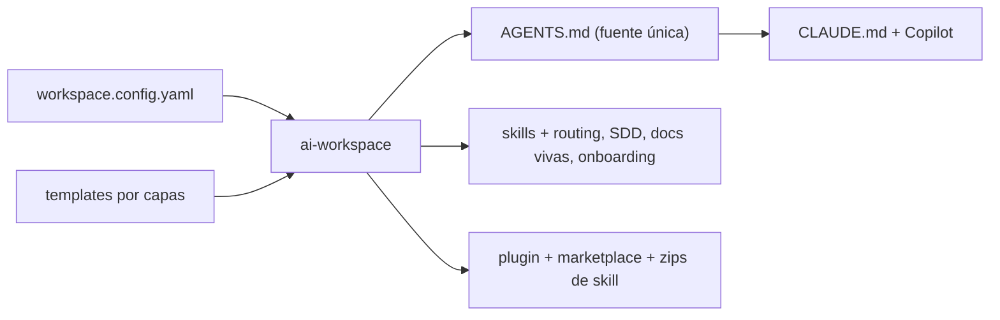

# ai-workspace-generator

Genera y adapta un **workspace de IA** para cualquier proyecto —nuevo o existente— de forma que
**Claude Code** y **GitHub Copilot** sigan las mismas reglas, convenciones y flujo de trabajo. Ejecutas
un comando, respondes unas preguntas y el proyecto recibe lo que necesita: instrucciones, skills, un
flujo de desarrollo seguro (SDD), documentación viva y más.

> **No necesitas memorizar comandos.** Tras la configuración hablas con la IA en lenguaje natural
> ("añade esta función", "actualiza esta librería", "guarda los cambios") y ella aplica el flujo correcto.

**Enfoque shared-first.** Pensado para developers individuales (aprender, preparar entrevistas, formarse y
programar con utilidades). Puede aplicarse también a una **empresa** como punto de extensión opcional
(`company`), pero el protagonista son las **herramientas compartidas**. Sin datos de negocio reales.

## Cómo funciona

Una sola entrada (`workspace.config.yaml`) + una librería de plantillas por capas → un `AGENTS.md`
canónico (la **fuente única de verdad**) → adaptadores idempotentes para cada herramienta. Y, al
distribuir, una proyección más: un **plugin instalable** + marketplace privado.



## Filosofía: esto es *Harness Engineering*

Un agente útil no es solo un buen modelo: **`Agente = Modelo + Harness`**. El *harness* (arnés) es todo lo
que rodea al modelo —instrucciones, skills, contexto, memoria, permisos, verificación— y ahí está la mayor
parte de la diferencia entre un agente mediocre y uno fiable. **Este generador produce harnesses:** convierte
una config en el entorno completo que hace que Claude Code y Copilot trabajen bien, y de la misma forma.

Los conceptos que aplica (detalle en [`docs/`](docs/)):

| Concepto | Qué significa | Ejemplo en un workspace generado |
|---|---|---|
| **Fuente única + idempotencia** | `AGENTS.md` es la verdad; regenerar es seguro y tus notas sobreviven | editas una regla **fuera** de los marcadores → `sync` la respeta; cambias la config → solo se regeneran los bloques afectados (0 ruido) |
| **Context engineering** | el contexto es finito: dale al modelo el menor conjunto de tokens de alta señal | las skills se cargan **por trigger**, no todas a la vez; las docs de librerías llegan **just-in-time** vía context7; el estado vive en *living docs*, no en el chat |
| **Gobernanza en capas** | reglas base (universal → lenguaje → empresa → negocio) que no chocan entre sí | un cambio de versión dispara el **Safety gate**: para y pregunta antes de actuar |
| **Metodología (SDD/SPDD)** | intención antes que código; la verdad vive en el **código** (SDD) o en el **prompt** (SPDD) | feature normal → flujo **SDD**; módulo regulado que regeneras desde una doc → **SPDD**. Ver [Metodologías: SDD vs SPDD](docs/project/methodologies.md) |
| **Ratchet principle** | una regla entra **solo** si previene un fallo real | mantiene `AGENTS.md` a la "altura justa" en vez de engordar con prosa con cada incidencia |

> En una frase: afinamos el **entorno** del agente como ingeniería — porque *un modelo decente con un gran
> harness le gana a un gran modelo con un mal harness*. Desarrollo extendido:
> **[Harness Engineering](docs/project/harness-engineering.md)** · contratos y decisiones: [ADR 0002](docs/project/decisions/0002-extension-contracts.md).

## Qué incluye

- **Gobernanza por perfil** — dos ejes ortogonales: tipo de usuario (`business`/`technical`) × experiencia
  (`beginner`/`standard`/`advanced`); `AGENTS.md` renderiza **solo** la combinación activa (eficiencia de tokens).
- **Catálogo de skills + routing** — tabla compacta que indica qué skill usar y cuándo, filtrada por perfil
  (carga progresiva: `always`/`suggested`/`on-demand`/`advanced-only`).
- **Capa de empresa (opcional)** — overlay de cultura (`company: example`, o tu propia org) como punto de
  extensión; puedes añadir tus propias **skills de negocio** (`corp-*`) gated por `company`. Ninguna se
  incluye aquí: este repo es público y sin datos de empresa. Ver [Extender](docs/project/EXTENDING.md).
- **SDD en dos modos** — `lean` (ligero, por defecto) o `reasons` (REASONS Canvas: esquema cerrado, perfiles
  A/B, controles, auditorías, ciclo `status` con sign-off, builder/reviewer). Una metodología, sin CLI externo.
- **Skills como datos (skill-packs)** — las skills ricas (stacks tipo `odoo-18.0` con guías de referencia,
  contenido de fusión) viven como **markdown** en `skill-packs/`, no en código; se copian al workspace por
  *stack binding* y perfil, con overlay de empresa. Se traen/actualizan de upstreams MIT con `ai-workspace skills sync`.
- **Distribución** — `ai-workspace package` empaqueta todo como plugin de Claude Code instalable en VS Code/CLI,
  Desktop/Cowork y la organización de claude.ai (Desktop + Workspace). Ver **[Distribución](docs/project/DISTRIBUTION.md)**.
- **Política de idioma** — todo lo que consume la IA en **inglés** (tokens); documentación humana en **español**.

## Instalación

**Requisitos:** Node.js ≥ 20, y VS Code con Copilot y/o Claude Code.

```bash
git clone https://github.com/grojof/ai-workspace-generator.git
cd ai-workspace-generator
npm install && npm run build && npm link
```

> El paquete es **`ai-workspace-generator`**; el comando que instala es **`ai-workspace`**.

## Uso en 3 pasos

```bash
ai-workspace init     # 1) en la raíz de tu repo: responde el asistente (autodetecta lo que puede)
                      # 2) abre el proyecto en VS Code (Copilot) o Claude Code
ai-workspace sync     # 3) tras editar AGENTS.md o la config, regenera (idempotente)
```

Tras `init`, lee `AI-WORKSPACE.md`: el índice de todo lo creado.

## Comandos

| Comando | Qué hace |
|---------|----------|
| `init` | Asistente → escribe la config → genera el workspace |
| `sync` | Regenera desde la config (preserva tus ediciones fuera de los marcadores) |
| `add` / `remove` | Añade o quita un lenguaje, framework, entorno o MCP |
| `list` | Muestra la config actual y el catálogo de módulos (activos vs disponibles) |
| `import` | Ingesta material existente y prepara su reconciliación |
| `upgrade` | Diff de plantillas y aplica la actualización |
| `doctor` | Lint del workspace (presupuesto de tokens, artefactos clave) |
| `package` | Empaqueta como plugin + marketplace privado + zips de skill para distribuir |
| `skills sync` | Actualiza los skill-packs vendorizados desde el upstream (diff + apply) |

## Documentación (en `docs/`)

- **[Arquitectura](docs/project/ARCHITECTURE.md)** — config → componer → renderizar → escribir; capas, regiones gestionadas, i18n.
- **[Harness Engineering](docs/project/harness-engineering.md)** — la filosofía: *Agente = Modelo + Harness*, context engineering y el ratchet principle.
- **[Metodologías: SDD vs SPDD](docs/project/methodologies.md)** — cuándo usar cada flujo, con ejemplo end-to-end.
- **[Distribución](docs/project/DISTRIBUTION.md)** — `ai-workspace package`: plugin + marketplace privado + skills de organización.
- **[Extender](docs/project/EXTENDING.md)** · **[Mantener](docs/project/MAINTAINING.md)** — recetas y mantenimiento.
- **[Registro de cambios](CHANGELOG.md)** — evolución del proyecto.
- Documentación técnica en inglés: [`docs/`](docs/).

## Licencia

Apache-2.0. Ver [LICENSE](LICENSE).
