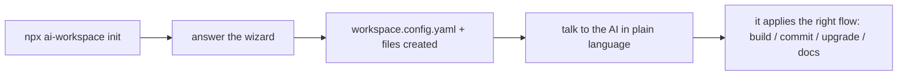
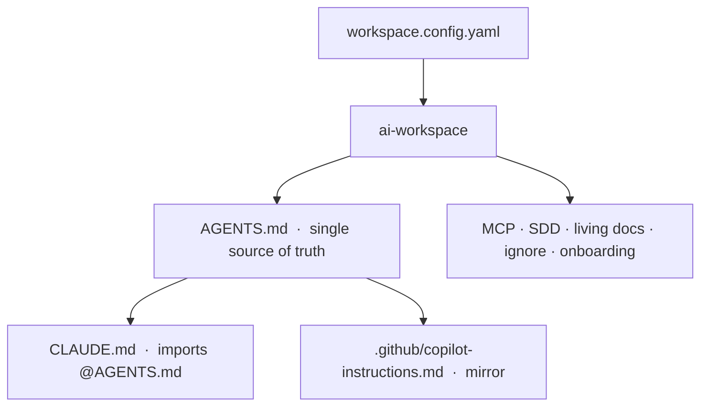
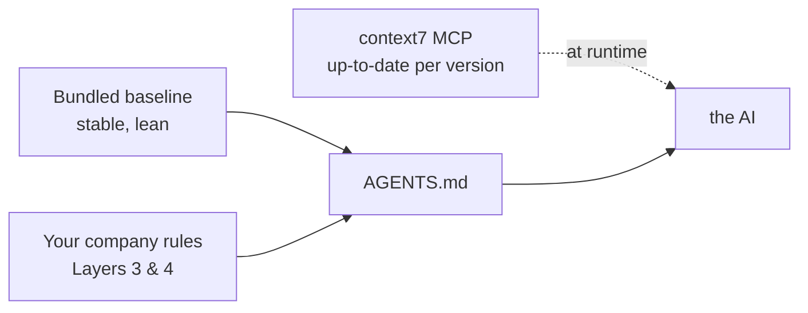
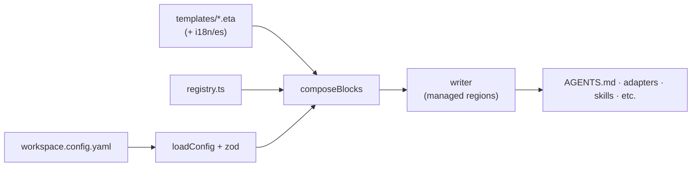

# ai-workspace

**English** · [Español](README.es.md)

Set up an **AI workspace** for any project — new or existing — so **Claude Code** and **GitHub Copilot**
follow the same rules, conventions and workflow. You run one command, answer a few questions, and the
project gets everything it needs: instructions, skills, a safe development flow, living docs and more.

**You don't need to learn commands.** After setup you just talk to the AI in plain language ("add this
feature", "update this library", "save my changes") and it applies the right flow automatically.

---

## Who is it for?

- **The whole team**, from seniors to people just starting with AI. The generated workspace ships a
  built-in guide (`/aiws-guide`) that teaches you as you go.
- **New projects** (greenfield) and **existing projects** (brownfield) — it adapts to both.

## Install

> ⚠️ **Not published to npm yet.** Install from source for now (this gives you the `ai-workspace` command):

```bash
git clone https://github.com/grojof/ai-workspace-generator.git
cd ai-workspace-generator
npm install && npm run build && npm link
```

📦 **Coming later (npm):** once published you'll be able to run `npx ai-workspace-generator init`
with no install. *(Not available yet.)*

> **Naming:** the project/package is **`ai-workspace-generator`**; the command it installs is
> **`ai-workspace`** (with `ai-workspace-generator` as an alias).

## Use it in any project — 3 steps

```bash
# 1) From the root of your repo (new or existing):
ai-workspace init

# 2) Answer the wizard (language, stack, etc.). It auto-detects what it can.

# 3) Open the project in VS Code (Copilot) or Claude Code and start working.
#    Read AI-WORKSPACE.md: the index of everything that was created.
```

That's it. If you later edit the rules (in `AGENTS.md`) or change the config, run `ai-workspace sync`
to regenerate.



---

## A very basic example

You're a junior dev on a React + TypeScript project. You run `init` and accept the defaults. Now:

- You tell the AI: **"add a logout button to the header"**
  → Small change: the AI implements it following the React/TypeScript rules in `AGENTS.md`, then
  refreshes the docs.
- You say: **"let's add login authentication"**
  → Big change: the AI starts the **SDD flow** — it first writes a short plan/spec, you review it, and
  *then* it implements. No surprises.
- You say: **"update React to the latest version"**
  → The AI does **not** just do it. It first checks feasibility and security, tells you what would break,
  recommends the safest path, and waits for your decision.
- You say: **"save my changes"**
  → It prepares a clean commit (no AI co-author) and asks you to confirm before committing.

You didn't have to remember a single command. The slash commands (`/sdd-explore`, `/commit`, …) exist as
optional shortcuts, but they're not required.

---

## How it works (and why the templates are small on purpose)

Everything is built from **one file** (`workspace.config.yaml`) plus a **layered template library**, all
written into `AGENTS.md` — the single source of truth that both Claude and Copilot read.



### The layers

| Layer | What it holds | Who fills it |
|------|---------------|--------------|
| 0 · Core | encoding, commits, security, the safe workflow, intent routing | the tool |
| 1 · Language | formatters, idioms, testing (version-aware) | the tool |
| 2 · Framework | structure & patterns (version-pinned) | the tool |
| · Environments | WSL, Docker, Node (nvm), Python (venv), databases… | the tool |
| 3 · Company | your prefixes, naming, internal libraries, banned patterns | **you** |
| 4 · Business | your domain glossary, rules and invariants | **you** |

### Why the bundled language/framework rules are short (this is intentional)

The built-in rules for React, Go, Python… are a **stable, common baseline** — on purpose:

- **Token efficiency:** the AI reads `AGENTS.md` every session. Long guides per technology would bloat
  every conversation. So we keep the durable essentials and load detail on demand.
- **Freshness via context7:** version-specific detail (exact current APIs, deprecations) is **not** frozen
  in a file. The rules point the AI to the **context7 MCP** to fetch up-to-date, version-pinned docs *at
  your runtime* — so guidance never goes stale.
- **Your standards are the real value:** the generic baseline is just the floor. Your team's actual norms
  and patterns live in **Layers 3/4**, and you can bring your existing rule files in (next section).



### Already have company coding standards (`.md` files)?

Bring them in — they're more valuable than any generic template:

```bash
ai-workspace import ../our-standards
```

This reads your existing rule files, sorts them into the right layers, references them in `AGENTS.md`,
and leaves a checklist so the AI can reconcile them against current best practices (via context7).

---

## What gets generated

- **`AGENTS.md`** + adapters (`CLAUDE.md`, `.github/copilot-instructions.md`) kept in sync.
- **SDD (Spec-Driven Development):** a **methodology** blending the best ideas of **Spec-Kit**
  (constitution + clarify to bootstrap from scratch) and **OpenSpec** (delta changes against a living
  baseline). These are *concepts, not dependencies*: artifacts are Markdown in `openspec/` (git-versioned),
  with no external CLI. New projects start with a constitution; existing ones treat each feature as a delta.
- **Living docs:** `docs/ai/*` kept current so the AI always has fresh project context.
- **Governance:** version policy (new vs existing), a **safety gate** (the AI stops and asks before risky
  changes), and a **commit policy** (no AI co-author, you approve) enforced by a `commit-msg` git hook.
- **Environments:** blocks for WSL, Docker, Node (nvm), Python (venv), PostgreSQL… with their conventions.
- **Learning mode (optional):** pick the `learn` purpose to get a **tutor skill** (`/learn`) that teaches
  with explanations, exercises and cases — great for interview prep or learning fundamentals.
- **Editor setup:** `.vscode/extensions.json` + `settings.json` for consistent team formatting.
- **`AI-WORKSPACE.md`:** an index, generated in your repo, explaining exactly what was set up.

Re-running any command is **idempotent** — your manual edits outside the `ai-workspace:begin/end` markers
always survive.

---

## Command reference (optional — you rarely need these)

| Command | What it does |
|---------|--------------|
| `init` | Wizard: detect stack, create config and files. |
| `sync` | Re-generate after editing `AGENTS.md` or the config. |
| `list` | Show your config and the available modules. |
| `add <type> <id>` | Add a language/framework/environment/mcp (e.g. `add environment wsl`). |
| `remove <type> <id>` | Remove a module and clean up its block. |
| `import <path…>` | Ingest existing company standards. |
| `upgrade [--check]` | Preview/apply template updates (with a diff). |
| `doctor` | Health check: token budget, broken/orphaned blocks, etc. |

Inside Claude Code you can also install this repo as a **plugin** (`.claude-plugin/`) and use `/aiws`.

## More help using the tool

- 🇬🇧 **[Documentation](docs/)** — Architecture, Extending, Maintaining.
- 🇪🇸 **[Guía rápida (español)](docs/es/QUICKSTART.md)** — the best starting point for beginners.
- Every generated project also ships `AI-WORKSPACE.md` (an index) and the `/aiws-guide` skill.

<br>

---
---

<br>

# 🛠️ For ai-workspace developers

> ⚠️ **This section is NOT needed to use the tool.** It's only for people who **maintain or extend** the
> generator (adding languages, frameworks, environments, languages, etc.). If you just want to use
> ai-workspace in your project, the sections above are all you need.

## How it's built

A Node/TypeScript CLI. One config (`workspace.config.yaml`) + a layered template library are composed
into `AGENTS.md` and its adapters, written idempotently via managed regions.



Entry points: [`src/cli.ts`](src/cli.ts) · [`src/generate/index.ts`](src/generate/index.ts) ·
[`src/generate/agents.ts`](src/generate/agents.ts) · [`src/modules/registry.ts`](src/modules/registry.ts) ·
[`templates/`](templates/). Full detail in the technical docs below.

## Technical documentation

- 🇬🇧 **English:** [Architecture](docs/ARCHITECTURE.md) · [Extending](docs/EXTENDING.md) ·
  [Maintaining](docs/MAINTAINING.md) · [Contributing](CONTRIBUTING.md)
- 🇪🇸 **Español:** [Arquitectura](docs/es/ARCHITECTURE.md) · [Extender](docs/es/EXTENDING.md) ·
  [Mantener](docs/es/MAINTAINING.md)
- **SDD (mixed methodology):** [ADR 0001 — Mixed SDD](docs/decisions/0001-mixed-sdd.md) ·
  [Upstream provenance](docs/SDD-UPSTREAM.md)
- Repo conventions for AI agents: [`AGENTS.md`](AGENTS.md) (dogfooding).

## Development

```bash
npm install
npm run build         # tsc → dist/
npm run dev -- init   # run the CLI from source (tsx)
npm test              # build + run the test suite
npm link              # expose `ai-workspace` globally for testing
```

## Status

Pre-release, in active development.
- **Languages:** TypeScript, Go, Python.
- **Frameworks:** React, Next.js, Vue.
- **Environments:** Node (nvm), Python (venv), WSL, Docker, PostgreSQL.
- **Targets:** Claude Code + GitHub Copilot. **Languages:** English, Spanish.

More on request (Angular, NestJS, Java, C#, MySQL, MongoDB, Odoo…).

## License

[Apache-2.0](LICENSE)
