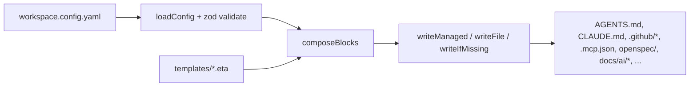
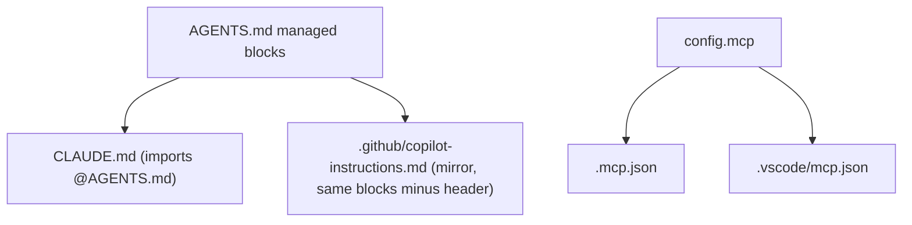

# Architecture

How `ai-workspace` turns one config file into a complete, idempotent AI workspace for any repo.

## Mental model

There is **one input** (`workspace.config.yaml`) and **many outputs** (AGENTS.md, CLAUDE.md, Copilot
files, MCP configs, SDD scaffold, living docs…). The CLI never invents state: every artifact is a pure
function of the config plus the **template library** under [`templates/`](../templates/). Re-running is
safe because writes are **idempotent** and user edits are preserved via **managed regions**.

## The pipeline, file by file

1. **Config** — [`src/config/schema.ts`](../src/config/schema.ts) defines `ConfigSchema` (zod). It is
   the contract: the wizard, `doctor`, and every generator read from it.
   [`src/config/loader.ts`](../src/config/loader.ts) loads/validates (`loadConfig`) and writes
   (`saveConfig`) `workspace.config.yaml`.
2. **Stack detection** — [`src/detect/stack.ts`](../src/detect/stack.ts) (`detectStack`) reads
   `package.json`, `tsconfig.json`, `go.mod`, etc. to pre-fill the wizard. Best-effort, read-only.
3. **Compose** — [`src/generate/agents.ts`](../src/generate/agents.ts) (`composeBlocks`) renders the
   ordered list of **managed blocks** that make up AGENTS.md, by pulling layer fragments from
   `templates/` via the Eta engine.
4. **Render** — [`src/render/engine.ts`](../src/render/engine.ts) wraps Eta. `templateExists` lets the
   composer fall back to a generic block when a module has no bundled template.
5. **Write** — [`src/render/writer.ts`](../src/render/writer.ts) writes files and reports
   `created | updated | unchanged`. Three strategies (see below).
6. **Orchestrate** — [`src/generate/index.ts`](../src/generate/index.ts) (`generate`) calls every
   sub-generator (Claude adapter, Copilot adapter, scope/ignore, SDD, skills, living docs, onboarding)
   and returns the list of `Artifact`s for reporting.

## The layer model

Instructions are composed from five layers so the common base never collides with company/business
rules. Layers map to template folders and to config sections:

| Layer | Template folder | Config source | Block id in AGENTS.md |
|------|-----------------|---------------|------------------------|
| 0 · Core | [`templates/core/`](../templates/core/) | always on | `header`, `core` |
| 1 · Language | [`templates/languages/<id>/`](../templates/languages/) | `stack.languages` | `lang-<id>` |
| 2 · Framework | [`templates/frameworks/<id>/`](../templates/frameworks/) | `stack.frameworks` | `fw-<id>` |
| 3 · Company | [`templates/company/`](../templates/company/) | `conventions` | `company` |
| 4 · Business | [`templates/business/`](../templates/business/) | `business` | `business` |

Plus feature blocks: `sdd` (when `sdd.enabled`), `living-docs` (when `livingDocs`), and `imported`
(appended by `ai-workspace import`).

Block **order** is fixed in `composeBlocks`: `header → core → languages → frameworks → company →
business → sdd → living-docs`.

## Managed regions — the idempotency contract

[`src/render/managed-region.ts`](../src/render/managed-region.ts) wraps generated content in markers so
`sync` only rewrites what it owns:

- Markdown/HTML files: `<!-- ai-workspace:begin:<id> -->` … `<!-- ai-workspace:end:<id> -->`
- Hash files (`.gitignore`, `.gitattributes`, `.claudeignore`): `# >>> ai-workspace:begin:<id>` …

`upsertBlock` replaces the inner content of an existing block, or appends the block if absent. **Text
outside the markers is never touched.** This is what lets a user add team notes to AGENTS.md and keep
them across regenerations.

> ⚠️ A block `id` is a **stable contract**. See [MAINTAINING](MAINTAINING.md#renaming-or-removing-a-block-id)
> for why renaming one leaves orphaned content in users' repos.

## Write strategies

[`src/render/writer.ts`](../src/render/writer.ts) exposes three, chosen per artifact:

| Function | Behavior | Used for |
|----------|----------|----------|
| `writeManaged` | upsert managed blocks, preserve the rest | AGENTS.md, CLAUDE.md, copilot-instructions, ignore files, .gitattributes |
| `writeFile` | full overwrite (deterministic content) | `.mcp.json`, `.vscode/mcp.json`, slash commands, skills, onboarding |
| `writeIfMissing` | create once, never overwrite (user-owned) | `.editorconfig`, `.claude/settings.json` seed, `openspec/` scaffold (incl. `constitution.md` for new projects), `docs/ai/*` seeds, imported copies |

There is also a **dry-run** mode (`setDryRun` / `getPlanned` / internal `commit`) used by
`upgrade --check` to compute changes without touching disk.

## Targets (adapters)

`AGENTS.md` is the single source of truth; the rest are generated adapters in
[`src/generate/index.ts`](../src/generate/index.ts):

Claude imports AGENTS.md via `@AGENTS.md`, so its adapter is thin. Copilot can't import, so the CLI
re-emits the same blocks into `copilot-instructions.md` (with a Copilot-specific header). That is the
core reason this is a CLI and not a one-time template copy: it keeps the mirror in sync deterministically.

## Modules registry

[`src/modules/registry.ts`](../src/modules/registry.ts) is the catalog of known
languages/frameworks/MCPs. `init`, `add`, and `doctor` all read it. A `bundled: true` entry means a
dedicated template fragment exists; otherwise the composer emits a generic block that points at
context7. See [EXTENDING](EXTENDING.md) to add entries.

## Commands

| Command | Source | What it does |
|---------|--------|--------------|
| `init` | [`commands/init.ts`](../src/commands/init.ts) | wizard → write config → `generate` |
| `sync` | [`commands/sync.ts`](../src/commands/sync.ts) | `generate` from existing config |
| `add` | [`commands/add.ts`](../src/commands/add.ts) | mutate config, re-`generate` |
| `import` | [`commands/import.ts`](../src/commands/import.ts) | ingest assets, write `imported` block + reconcile checklist |
| `upgrade` | [`commands/upgrade.ts`](../src/commands/upgrade.ts) | dry-run diff, then apply, bump `templatesVersion` |
| `doctor` | [`commands/doctor.ts`](../src/commands/doctor.ts) | lint: token budget, key artifacts |

CLI wiring (commander) is in [`src/cli.ts`](../src/cli.ts).

## Why context7 reconciliation lives in the AI, not the CLI

The CLI cannot call MCP servers — context7 is an MCP available to the *agent*. So `import` does the
deterministic work (scan, classify, copy, write an `imported` block) and emits
`docs/ai/INGEST-RECONCILE.md`, a checklist the AI executes with context7. Keep this boundary in mind
when extending: anything needing live library docs belongs in a generated prompt/skill, not in CLI code.
