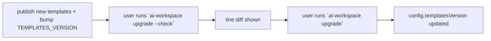

# Maintaining

How to evolve the generator safely and ship updates that reach downstream projects cleanly.

## Versioning: `TEMPLATES_VERSION`

[`src/version.ts`](../src/version.ts) holds two numbers:

- `CLI_VERSION` — the npm package version (also in `package.json`).
- `TEMPLATES_VERSION` — the version of the **template set**. Each generated `workspace.config.yaml`
  records the `templatesVersion` it was rendered with.

**Bump `TEMPLATES_VERSION` whenever you change anything that alters generated output**: a `.eta`
template, `composeBlocks`, a `generate*` helper, the skills/SDD content, etc. `upgrade` compares the
config's `templatesVersion` against this constant to tell users an update is available.

Suggested semver discipline for templates:
- **patch** — wording tweaks, new optional module templates (additive, safe).
- **minor** — new blocks/sections, new commands (additive, but users see new content on `sync`).
- **major** — renamed/removed block ids, changed marker format, restructured outputs (see migration note).

## The update flow for downstream users



`upgrade` ([`src/commands/upgrade.ts`](../src/commands/upgrade.ts)) renders in **dry-run** mode
(`setDryRun` in [`src/render/writer.ts`](../src/render/writer.ts)), diffs against disk with `lineDiff`
([`src/render/diff.ts`](../src/render/diff.ts)), prints, and only writes on a real run. Because writes
are idempotent and managed regions preserve user text, applying an upgrade is non-destructive to content
outside the markers.

## Renaming or removing a block id

This is the single most important gotcha. `writeManaged` / `upsertBlocks`
([`src/render/managed-region.ts`](../src/render/managed-region.ts)) **only upsert the ids they are
given** — they never delete unknown blocks. Consequences:

- **Rename `core` → `conventions`**: users keep an orphaned `core` block *and* gain a new `conventions`
  block. Duplicated content.
- **Remove a block**: the old block lingers in every repo that already has it.

Therefore:
- Treat block ids as a permanent public API. Prefer changing *content* over *ids*.
- If you must rename/remove, ship a **migration** (a small `migrate` step or documented manual edit) and
  call it out in the changelog as a major bump.

Files written with `writeIfMissing` (`.editorconfig`, `.claude/settings.json`, `openspec/` scaffolds,
`docs/ai/*` seeds, imported copies) have the opposite trait: editing their templates **does not** reach
users who already have the file. Those are user-owned by design.

## Local development & testing

```bash
npm install
npm run build        # tsc → dist/
npm run typecheck    # tsc --noEmit
npm run dev -- sync  # run from source via tsx (no build)
npm link             # expose `ai-workspace` globally
```

There is no automated test suite yet. Smoke-test against a throwaway repo:

```bash
mkdir /tmp/aiws && cd /tmp/aiws
node /path/to/dist/cli.js init      # or write a workspace.config.yaml and run `sync`
node /path/to/dist/cli.js sync      # re-run: everything should report "unchanged"
# add a manual note outside the markers in AGENTS.md, sync again, confirm it survives
node /path/to/dist/cli.js add language go
node /path/to/dist/cli.js upgrade --check
node /path/to/dist/cli.js doctor
```

Invariants to verify after any change:
- A second `sync` reports **0 created, 0 updated** (idempotent).
- Manual text outside `ai-workspace:begin/end` markers is preserved.
- `doctor` stays green and AGENTS.md is under the token budget.
- `npm run build` is clean.

## Release checklist

1. Bump `version` in `package.json`, and `CLI_VERSION` / `TEMPLATES_VERSION` in `src/version.ts`.
2. `npm run build` and smoke-test the commands above.
3. Update the root `README.md` roadmap and any new commands; note changes in a changelog entry.
4. If you added/renamed block ids, document the migration.
5. Publish: `npm publish --access public` (the package ships `dist/` and `templates/` per the `files`
   field in `package.json`).

## Plugin packaging

The repo doubles as a Claude Code plugin: [`.claude-plugin/plugin.json`](../.claude-plugin/plugin.json),
[`.claude-plugin/marketplace.json`](../.claude-plugin/marketplace.json), and the `/aiws` command in
[`commands/`](../commands/). When you add a user-facing CLI command, consider updating
`commands/aiws.md` so the in-editor helper mentions it.

## Performance & token budget

- Keep AGENTS.md **lean**: detail belongs in skills/scoped instructions loaded on demand. `doctor`
  warns when AGENTS.md exceeds `tokenBudget.agentsMd`.
- New always-on core sections cost tokens for *every* user — justify them or make them opt-in.
