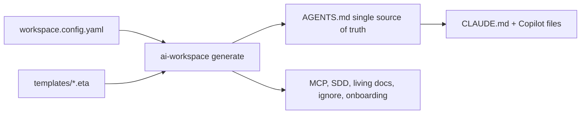

# Documentation

Guides for **using, maintaining and extending** the `ai-workspace` generator.

> 🇪🇸 **¿Prefieres español?** La documentación está también en castellano: **[docs/es/](es/)**
> (empieza por la [Guía rápida](es/QUICKSTART.md)).

## For users (consuming the generator in a project)
- Start with the root [README](../README.md) — install, quick start, what gets generated.
- After running `init`, every generated repo also gets an `AI-WORKSPACE.md` explaining its own setup.

## For maintainers & contributors
- **[ARCHITECTURE](ARCHITECTURE.md)** — how it works end to end: config → compose → render → write,
  the layer model, managed regions, write strategies, targets, and why context7 reconciliation lives in
  the AI rather than the CLI.
- **[EXTENDING](EXTENDING.md)** — step-by-step recipes (add a language, framework, MCP, skill, target,
  command) with the **implications** for existing users.
- **[MAINTAINING](MAINTAINING.md)** — `TEMPLATES_VERSION`, the upgrade flow, the block-id rename gotcha,
  testing invariants, the release checklist, and the token budget.

## The 60-second model

One config + a layered template library → one canonical `AGENTS.md` → tool adapters and supporting
files, all written idempotently so re-running never clobbers human edits.

## Conventions for docs in this folder
- Reference real code with relative links (e.g. `../src/generate/index.ts`) so they stay clickable.
- Use Mermaid for flows and relationships.
- When you change behavior, update the doc in the same change — these files are the contract for
  contributors.
