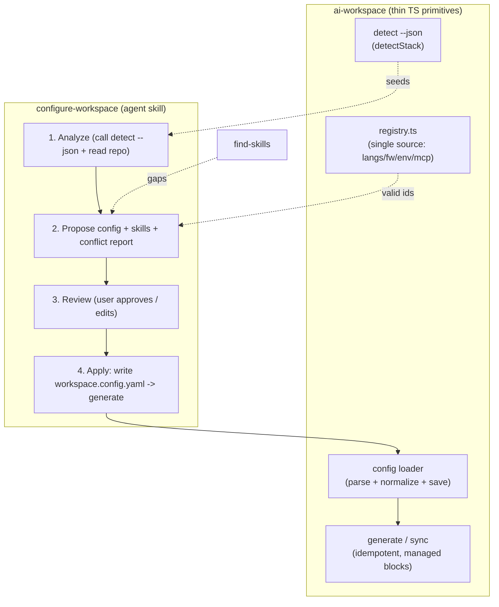
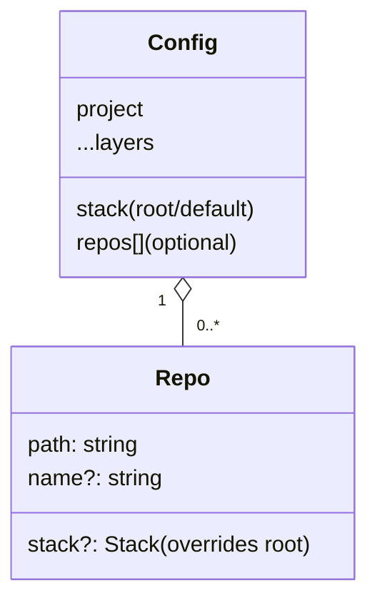

# Design — Guided configuration UX (Phase 1 + multi-repo schema)

Covers HOW for the spec's R1–R6. Principle: **keep the CLI thin, lean on the agent.** Deterministic logic
(detection, schema, writing, generation) stays in TS as reliable primitives; judgment (gap resolution,
conflict/reorg proposals, asking good questions) lives in the skill.

## Components

## R1 — Registry as single source (de-hardcode)
- `src/commands/init.ts` drops its local `KNOWN_LANGUAGES`/`KNOWN_FRAMEWORKS` (and inline env/profile lists
  where applicable) and builds prompt options from `catalog("language" | "framework" | "environment" | "mcp")`
  in `src/modules/registry.ts`.
- Wizard option = `{ value: entry.id, label: entry.label }`. No behavior change; one source.
- The skill validates any proposed id against `catalog(...)`; an unknown id is flagged as "needs a new
  registry module or a vendored pack" (links to EXTENDING.md), never silently accepted.

## R2–R5 — `configure-workspace` skill contract
Lives in `.claude/skills/configure-workspace/SKILL.md` (Claude) and is mirrored as a routed skill in the
generated workspace. It is **model-invoked** and orchestrates the existing primitives:

1. **Analyze.** Run `ai-workspace detect --json` (new thin command that prints `DetectedStack` from
   `detect/stack.ts`) for a deterministic seed; then read the repo (manifests, folder layout, existing docs)
   to enrich and spot what the detector misses. If nothing is detected, ask targeted questions (R2).
2. **Propose.** Compose a candidate `workspace.config.yaml` and a skill set. Validate ids against the
   registry; for gaps, propose a registry module or a `find-skills` discovery (R3). Produce a **conflict
   report**: existing paths/docs that collide with generated structure, plus an optional folder-alignment
   plan (R4).
3. **Review.** Present config (as a preview/diff), rationale per section, the skill set, and the conflict
   report. Nothing is written yet. The user approves or edits.
4. **Apply.** On approval: write `workspace.config.yaml` via the config loader (`saveConfig`, schema-
   normalized) and run `generate`. Folder moves (if any) are applied only as approved, never automatically
   (Safety gate). Idempotent by construction (R5).

New CLI surface (thin): `ai-workspace detect [--json]`. Everything else reuses `loadConfig`/`saveConfig`/
`generate`. The skill never bypasses the schema.

## R6 — Multi-repo schema (additive, normalized)

- Add `RepoSchema = z.object({ path: z.string(), name: z.string().optional(), stack: StackSchema.optional() })`
  and `repos: z.array(RepoSchema).default([])` on the base config. **Optional/additive** → existing
  single-repo configs validate unchanged (R6.1).
- **Normalization helper** `resolveRepos(config): { path, name, stack }[]`:
  - `repos` empty → `[{ path: ".", name: project.name, stack: config.stack }]` (single-repo as one repo).
  - `repos` present → each entry's effective `stack = repo.stack ?? config.stack` (root is the shared
    default); `path` resolved relative to the workspace root.
  - Downstream code (future per-repo generation) iterates `resolveRepos()` so single- and multi-repo share
    one code path (R6.2/R6.3).
- This change only lands the schema + `resolveRepos` + tests. Per-repo `generate`/`package` wiring is later.

## R7 — Modes (principle only here)
Phase 1 adds the skill without removing the manual wizard, so the manual path remains a complete fallback.
The simple/advanced split (Phase 3) will also read the registry, so no rework is implied.

## Decisions & rationale
- **`detect --json` as the agent's seed** keeps detection deterministic and testable while letting the agent
  handle ambiguity — avoids duplicating detection logic in prose.
- **Propose-and-review everywhere**: config write, skill wiring, and folder moves are all gated on approval,
  consistent with the Safety gate and idempotent generation.
- **Additive schema** (`repos[]` optional + `resolveRepos` normalization) avoids a breaking migration and
  unifies single/multi-repo handling from day one.
- **Registry as single source** removes drift between wizard, skill, and docs (enables R1 and Phase 3).

## Test impact (for tasks/apply)
- Registry-driven wizard: assert options derive from `catalog(...)` (no hardcoded list).
- `detect --json`: snapshot/contract test of the JSON shape.
- Schema: single-repo config unchanged; `repos[]` validates; `resolveRepos` normalization (empty → `.`;
  per-repo stack override; root default fallback).
- Skill: presence + routed; behavioral correctness is exercised via the agent, not unit tests.
