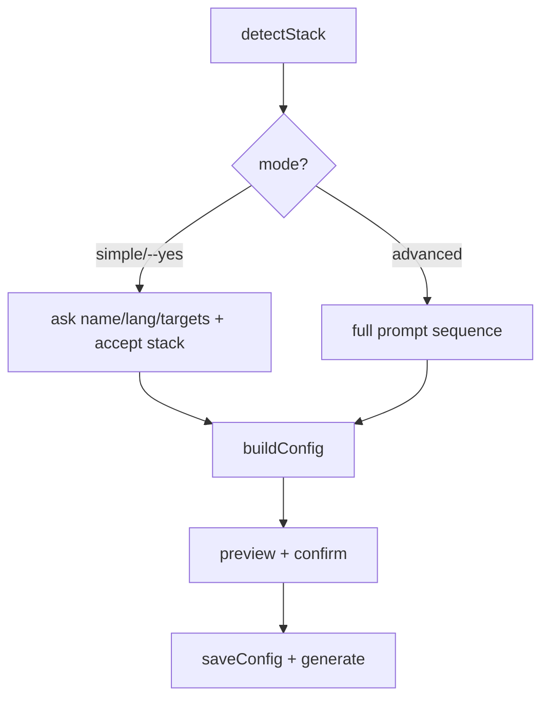

# Design — Simple/Advanced wizard modes

## Approach
Extract the wizard's config assembly into a **pure module** and branch the interactive flow by mode.

### New: `src/commands/wizard.ts` (pure, testable)
```ts
export interface WizardInputs {
  name; description; language;            // basics
  mode; purpose; userType; experience;    // project + profile
  company; targets;                       // overlay + targets
  langIds; fwIds; envIds;                 // stack ids (versions resolved from `detected`)
  sddEnabled; sddBackend; sddMethodology; // SDD
  livingDocs; useContext7; safetyGuard;   // toggles
  skills; from?;                          // library selection + ingest
}
export function buildConfig(inputs: WizardInputs, detected: DetectedStack): Config  // = today's normalizeConfig({...})
export function simpleDefaults(detected, basics): WizardInputs                       // fills documented Simple defaults
```
- `buildConfig` is exactly the current `normalizeConfig({...})` object, moved verbatim (no behavior change).
- `simpleDefaults` derives Simple-mode inputs from `detected` + the three basics (name, language, targets):
  mode = detected? "existing" : "new"; userType = detected? "technical" : "business"; experience="standard";
  purpose="build"; company="none"; sddEnabled=true; backend="files"; methodology="sdd"; livingDocs=true;
  useContext7=true; safetyGuard = mode==="new"?"warn":"off"; langs/fws/envs = detected ids; skills=[].

### `src/commands/init.ts`
- After `detectStack`, resolve **mode**: `--advanced` → advanced; `--simple`/`--yes` → simple; else prompt
  (Simple preselected) with a note that the richest path is the `/configure` AI skill.
- **Simple:** prompt name, language, targets; show detected stack + confirm; `simpleDefaults` → `buildConfig`
  → preview skills → confirm → `saveConfig` + `generate`.
- **Advanced:** the existing prompt sequence, then `buildConfig` (same inputs as before).
- Both share the preview/confirm/write/generate tail.

### `src/cli.ts`
- `init` gains `--simple` and `--advanced` boolean options (mutually exclusive; `--advanced` wins if both).



## Tests
- `wizard.test.js`: `simpleDefaults` (detected vs empty) → expected inputs; `buildConfig` produces a valid
  Config with the documented Simple defaults; an advanced-like input yields the expected stack/sdd/company.
- Existing suite stays green (advanced assembly unchanged → golden fixtures unaffected).

## Risks / mitigations
- No tests on the interactive prompts → cover `buildConfig`/`simpleDefaults` (the logic); keep prompt wiring
  thin. Advanced assembly moved verbatim to avoid drift.
