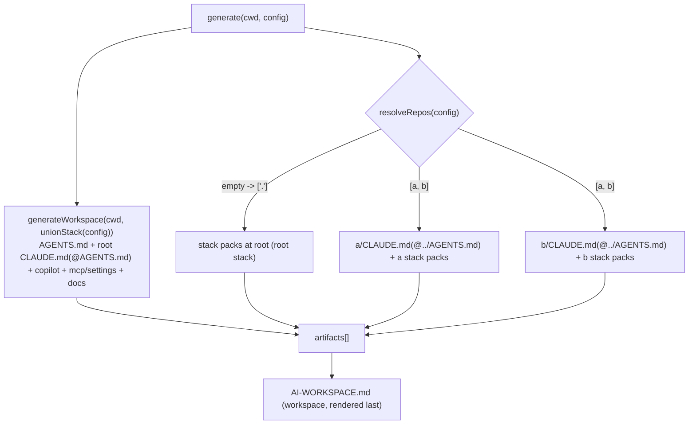

# Design — Per-repo generation

## Approach
Refactor `generate()` from a single cwd-bound pass into **two phases**, both driven by data that already
exists:

1. **Workspace phase** — emits the canonical, shared artifacts once at the root, composed over the
   **union** of all repos' stacks (`AGENTS.md`, root `CLAUDE.md` bridge, Copilot, MCP/settings, SDD, docs…).
2. **Repo phase** — iterates `resolveRepos(config)`; for each `ResolvedRepo`, derives a `repoConfig`
   (root config with `stack` replaced by the repo's effective stack) and emits the per-repo Claude pieces
   (child `CLAUDE.md` when `path !== "."`, plus stack-bound packs) under the repo's `path`.

The backward-compatibility guarantee falls straight out of `resolveRepos`: with empty `repos[]` it returns
`[{ path: ".", stack: config.stack }]`, so the repo phase adds the stack packs at the root with the root
stack — and the union stack equals the root stack — yielding the exact set of files produced today. With
populated `repos[]` it returns the **children only** (root `"."` is not in the list), so the root carries no
stack skills — matching the "root = coordinator" decision.



## Artifact partition

The split follows each tool's real discovery model (verified vs the Claude Code docs): **Claude** discovers
`CLAUDE.md` hierarchically and `.claude/skills/` nested under the cwd → its adapter + stack skills are
per-repo. **Copilot** reads one workspace-root `.github/copilot-instructions.md` (no nested discovery) and
**MCP/settings** are project-root scoped → those are workspace-level, composed over the **union** stack.
Claude Code reads `CLAUDE.md` (not `AGENTS.md`), so the **root also needs a `CLAUDE.md` bridge**.

| Phase | Artifacts | Driven by |
|-------|-----------|-----------|
| **Workspace** (root once) | `AGENTS.md` (union stack); root `CLAUDE.md` bridge (`@AGENTS.md`); `.github/copilot-instructions.md` (union) + TS instruction; `.mcp.json`; `.vscode/mcp.json`; `.claude/settings.json` + safety hook; SDD module; vendored workflow skills (`generateSkills`); **non-stack** packs; living docs; docs index; governance; guides/learning/VS Code; scope; `.editorconfig`; `.gitattributes`; `AI-WORKSPACE.md` | union-stack `config` |
| **Repo** (per `ResolvedRepo`) | child `CLAUDE.md` (import-parametrized, **only when `path !== "."`**); **stack-bound** packs | `repoConfig` (= config with repo's stack) |

> **No double-write for single-repo.** With empty `repos[]`, `resolveRepos` yields one entry at `.`; the
> repo phase adds only stack packs at the root (the root `CLAUDE.md` already came from the workspace phase
> with `@AGENTS.md`). Every path is written in exactly one phase → byte-identical to today.

## Key changes

### `src/generate/index.ts`
Split `generate` into `generateWorkspace(cwd, config, add)` (root canonical set, union stack) and
`generateRepoPacks(repoDir, repoConfig, add)` + a child-`CLAUDE.md` write; `generate` orchestrates:

```ts
export function generate(cwd: string, config: Config): GenerateResult {
  setLocale(config.language);
  const artifacts: Artifact[] = [];
  const add = (r, desc) => artifacts.push({ path: rel(cwd, r.path), desc, status: r.status });

  generateWorkspace(cwd, config, add);          // AGENTS.md(union) + root CLAUDE.md(@AGENTS.md) + copilot(union)
                                                // + mcp/settings/hooks + SDD + workflow skills + non-stack packs + docs…

  for (const repo of resolveRepos(config)) {
    const repoConfig = { ...config, stack: repo.stack };
    const repoDir = resolve(cwd, repo.path);
    if (repo.path !== "." && config.targets.includes("claude")) {
      add(writeManaged(resolve(repoDir, "CLAUDE.md"), "html", [
        { id: "claude", content: renderTemplate("targets/claude/CLAUDE.md.eta", { ...repoConfig, agentsImport: agentsImportPath(repo.path) }) },
      ]), t.desc.claudeAdapter);
    }
    for (const r of generateStackPacks(repoDir, repoConfig, "repo")) add(r, t.desc.skill);
  }

  // AI-WORKSPACE.md rendered last (workspace-level): lists every artifact across all repos.
  const onboarding = renderTemplate("shared/ai-workspace.md.eta", { ...config, paths: docsPaths(config), artifacts });
  add(writeFile(resolve(cwd, "AI-WORKSPACE.md"), onboarding), t.desc.onboarding);
  return { artifacts };
}
```

- `agentsImportPath(repoPath)`: `"."` → `"AGENTS.md"`; otherwise the POSIX relative path from the repo dir
  back to the root `AGENTS.md` (e.g. `a` → `"../AGENTS.md"`, `nested/a` → `"../../AGENTS.md"`).
- The root `CLAUDE.md` (bridge, `@AGENTS.md`) is written in `generateWorkspace`, so the `"."` single-repo
  entry only adds stack packs — no double-write.
- Copilot stays workspace-level (its child file has no nested discovery); per-repo Copilot path-scoping via
  `applyTo` globs is a future refinement (out of scope for 0003).

### `src/generate/index.ts` — CLAUDE.md import
Pass the import path into the template context instead of the hardcoded `@AGENTS.md`:

```ts
writeManaged(resolve(repoDir, "CLAUDE.md"), "html", [
  { id: "claude", content: renderTemplate("targets/claude/CLAUDE.md.eta", { ...repoConfig, agentsImport }) },
])
```

### `templates/targets/claude/CLAUDE.md.eta`
Replace the literal `@AGENTS.md` with `@<%= it.agentsImport %>`, defaulting to `AGENTS.md` when unset so any
direct render keeps today's output:

```eta
@<%= it.agentsImport || "AGENTS.md" %>
```

Confirmed against the Claude Code docs: relative imports resolve relative to the importing file and may
traverse parents; external imports prompt once for approval.

### `src/generate/stackPacks.ts` — scope split
`generateStackPacks` gains a scope filter so non-stack packs (no `stackBinding`) and stack-bound packs are
emitted in different phases:

```ts
export type PackScope = "workspace" | "repo";
function hasStackBinding(m: PackManifest): boolean {
  const b = m.stackBinding;
  return b.environments.length > 0 || b.languages.length > 0 || b.frameworks.length > 0;
}
export function generateStackPacks(cwd, config, scope: PackScope = "repo"): WriteResult[] { /* filter by scope */ }
```

- Workspace phase calls `generateStackPacks(cwd, config, "workspace")` (sdd-*/corp-* → root).
- Repo phase calls `generateStackPacks(repoDir, repoConfig, "repo")` (stack packs → repo).
- **Single-repo invariant:** with empty `repos[]`, root gets workspace packs and the `.`-repo gets stack
  packs → the same union of files at the root as today. Goldens unaffected.

### `src/config/schema.ts` — `unionStack`
The root `AGENTS.md` (and Copilot mirror + TS instruction + routing) must reflect every stack present across
repos. Add a pure helper next to `resolveRepos`:

```ts
export function unionStack(config: Config): Config {
  const merged = { languages: [], frameworks: [], environments: [] };
  for (const r of resolveRepos(config)) { /* concat + de-dupe by id, keeping first */ }
  return { ...config, stack: merged };
}
```

`generateWorkspace` composes everything via `composeBlocks(unionStack(config))`, so the existing
`skillRouting.ts` needs **no change** — routing flows from the config it is given. For a single repo the
union equals the root stack → byte-identical output.

### `src/commands/doctor.ts`
Keep the `AGENTS.md` checks (token budget, orphaned blocks, MCP, SDD, hooks) at the root, using
`composeBlocks(unionStack(config))` for the orphaned-block expectation so ids match the root `AGENTS.md`.
Loop `resolveRepos(config)` for the per-repo `CLAUDE.md` presence check (children) and keep the root
Copilot/CLAUDE.md checks once. With empty `repos[]` the loop runs once at `.` → today's behavior.

## Tests
- `multi-repo.test.js`: a config with two repos (distinct stacks, e.g. `a`→python, `b`→typescript) generates
  the root `AGENTS.md` + root `CLAUDE.md` bridge (`@AGENTS.md`); per-child `CLAUDE.md` importing
  `@../AGENTS.md`; stack packs landing under the correct repo (and **not** at the root); union routing in the
  root `AGENTS.md` (both stacks listed).
- `agentsImportPath`/`unionStack` units: `"."`→`AGENTS.md`, `"a"`→`../AGENTS.md`, `"x/y"`→`../../AGENTS.md`;
  union merges + de-dupes stacks across repos.
- **Idempotency / backward-compat:** existing golden fixtures stay byte-identical (empty `repos[]`); the
  second-`sync` 0/0 invariant test still passes; add a multi-repo idempotency assertion.

## Risks / mitigations
- *Single-repo drift* — the highest risk. Mitigated because the single-repo path is the same code path
  (union == root stack; the `"."` entry adds the same packs at the root) and is gated by the existing tests +
  the new idempotency assertion.
- *External import approval / standalone clone* — a child `CLAUDE.md` importing `@../AGENTS.md` is an external
  import (one-time approval) and breaks if cloned outside the workspace. Documented as a **workspace** model
  (open the workspace root, where the root `CLAUDE.md`/skills also load). No code mitigation for 0003.
- *Copilot has no nested discovery* — per-repo Copilot guidance is deferred; the root Copilot file covers the
  union. Per-repo `applyTo` path-scoped Copilot instructions are a future refinement.
- *Order of `add()`* — `AI-WORKSPACE.md` must be rendered last so it lists every repo's artifacts; keep it in
  `generate`, after the repo loop.
