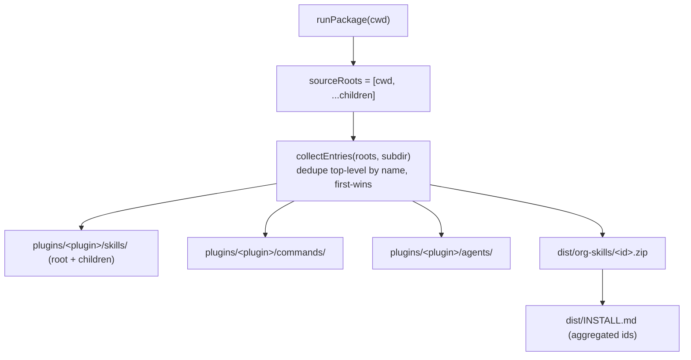

# Design — Per-repo distribution

## Approach
Generalize `runPackage` from reading a single root `.claude/` to reading an **ordered list of source roots**:
the workspace root, then each `resolveRepos()` child (`path !== "."`). A small deduping collector returns the
top-level entries (skill dirs, command files, agent files) under a given subdir across those roots,
**first-root-wins**. Every projection step (plugin skills/commands/agents, org zips, install guide) iterates
the collector instead of one directory.

Backward compatibility is structural: with empty `repos[]` the source list is `[cwd]`, so the collector
yields exactly today's root entries in today's order → byte-identical single-repo output.



## Key changes — `src/commands/package.ts`

### Ordered source roots + deduping collector
```ts
import { resolveRepos } from "../config/schema.js";

/** Distribution source roots: the workspace root, then each child repo (path !== "."). */
function sourceRoots(cwd: string, config: Config): string[] {
  return [cwd, ...resolveRepos(config).filter((r) => r.path !== ".").map((r) => resolve(cwd, r.path))];
}

/** Top-level entries (dir or file) under <root>/<subdir> across roots, de-duped by name (first-wins). */
function collectEntries(roots: string[], subdir: string): Array<{ name: string; path: string }> {
  const seen = new Set<string>();
  const out: Array<{ name: string; path: string }> = [];
  for (const root of roots) {
    const base = resolve(root, subdir);
    if (!existsSync(base)) continue;
    for (const e of readdirSync(base, { withFileTypes: true })) {
      if (seen.has(e.name)) continue;
      seen.add(e.name);
      out.push({ name: e.name, path: join(base, e.name) });
    }
  }
  return out;
}
```

### Project a deduped tree into the plugin
A shared helper replaces the three `listFiles(<root subdir>)` loops:
```ts
function projectTree(cwd, roots, subdir, destBase, desc, out): void {
  for (const { name, path } of collectEntries(roots, subdir)) {
    const files = lstatSync(path).isDirectory() ? listFiles(path) : [path];
    for (const f of files) {
      const rel = f === path ? name : join(name, relative(path, f));
      const dest = resolve(destBase, rel);
      out.push(BINARY_ASSET.test(f)
        ? writeBytes(cwd, dest, readFileSync(f), `${desc} asset`)
        : writeText(cwd, dest, readFileSync(f, "utf8"), desc));
    }
  }
}
```
- Skills → `projectTree(cwd, roots, ".claude/skills", resolve(pluginDir, "skills"), "plugin skill", out)`.
- Commands → `".claude/commands"` → `plugin command`.
- Agents → `".claude/agents"` → `plugin agent`.

### Org zips from the aggregated skill set
```ts
for (const { name, path } of collectEntries(roots, ".claude/skills")) {
  if (name.startsWith("_") || !lstatSync(path).isDirectory() || !existsSync(join(path, "SKILL.md"))) continue;
  skillIds.push(name);
  const entries = listFiles(path).map((f) => ({ name: relative(path, f).split(/[\\/]/).join("/"), data: readFileSync(f) }));
  entries.sort((a, b) => (a.name === "SKILL.md" ? -1 : b.name === "SKILL.md" ? 1 : a.name.localeCompare(b.name)));
  out.push(writeBytes(cwd, resolve(cwd, "dist/org-skills", `${name}.zip`), zipSync(entries), "org skill zip"));
}
```

`generate(cwd, config)` is still called first (it already produces the per-repo `.claude/` via 0003), so the
child dirs exist before packaging reads them.

## Why single-repo stays byte-identical
- `sourceRoots` = `[cwd]` when `repos[]` is empty → `collectEntries` walks only `cwd/.claude/<subdir>` in
  `readdir` order, the same files `listFiles` produced before, in the same order → identical `out[]` and
  identical files on disk.
- The org-zip filter (`_`-prefix, dir + `SKILL.md`) and sort are unchanged.

## Tests — `test/generate.test.js` (package suite)
- Multi-repo: a config with `app-a`→odoo, `app-b`→react; `runPackage` → plugin `skills/` has a root workflow
  skill (e.g. `living-docs`) **and** `odoo-18.0` **and** `frontend-ui-dark-ts`; odoo companion agents under
  `plugins/<plugin>/agents/`; `dist/org-skills/odoo-18.0.zip` + `frontend-ui-dark-ts.zip` exist; `INSTALL.md`
  lists them; a second `runPackage` is a no-op.
- The existing single-repo package tests stay green (byte-identical projection).

## Risks / mitigations
- *Single-repo drift* — mitigated by the `[cwd]` source list + the existing package tests.
- *Id shadowing (first-wins)* — documented; stack-pack ids are stack-specific, so real collisions are
  unlikely. A future enhancement could warn on same-id/different-content.
