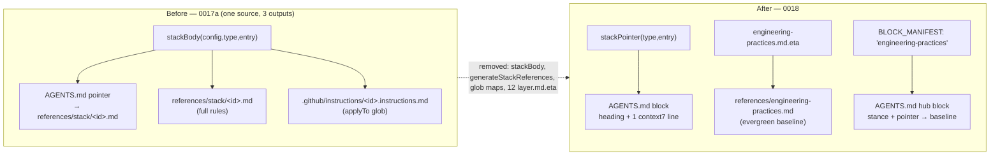

# Design — 0018 · Engineering-practices baseline (replace per-stack prose)

> Phase: design (HOW). Implements `spec.md` against the current 0017a two-tier rendering. Grounded in
> `src/generate/{references.ts,blockManifest.ts,index.ts}` and `templates/`. Honors the architecture rules:
> stable managed-block ids, idempotency, English-only AI-facing content, no destructive `sync`.

## Approach

The 0017a stack path has three coupled outputs from one source (`stackBody`): the AGENTS.md pointer
(`stackPointer`), the `references/stack/<id>.md` body (`generateStackReferences`), and the Copilot
`.github/instructions/<id>.instructions.md` projection. This change **collapses that path to a single inline
pointer** and **relocates the durable value** into one new evergreen reference reached from a lean hub block.

Four moves, each tracing to a spec requirement:

1. **Add** `references/engineering-practices.md` (rendered from a new template) + a lean hub block in
   `BLOCK_MANIFEST`. *(ADDED: Engineering-practices baseline)*
2. **Rewrite** `stackPointer()` to emit `heading + one context7 line`; drop the file link and the glob
   "applies to" note. *(MODIFIED: Per-stack block content)*
3. **Delete** `stackBody`, `generateStackReferences`, the glob maps/`stackGlob`, the 12 `layer.md.eta`
   templates, and the index.ts call site that wrote bodies + Copilot projections. *(REMOVED ×2)*
4. **Document** the skill-pack path (`EXTENDING.md`, `PROJECT-STATE.md`) and the non-destructive file
   migration (`MAINTAINING.md` + this folder). No code deletes user files. *(ADDED ×2)*

Then the mechanical invariants: bump `TEMPLATES_VERSION`, regenerate byte fixtures, re-hash the integrity
manifest, update `test/`.

## Architecture decisions

**AD1 — Baseline as a referenced file + lean hub block (not inlined into Layer-0).**
Render `references/engineering-practices.md` once at workspace level (neutral, target-agnostic, all targets
reach it via the hub pointer); the hub block carries a one-paragraph stance + the link.
*Rejected:* inlining the depth into a Layer-0 block — it re-bloats the AGENTS.md spine, the exact problem 0017
solved, and would blow the token budget `doctor` guards.

**AD2 — Keep `lang-*/fw-*/env-*` block ids; change only their content.**
The blocks are `expand` entries keyed by configured stack, so the id contract is preserved with zero
migration; content becomes a single context7 line (version facts stay reachable — confirmed clarify Decision 2).
*Rejected:* removing the per-stack blocks — orphans managed blocks in user repos and drops version reachability.

**AD3 — Non-destructive, document-only migration of orphaned 0017 files.**
`sync`/`generate` only ever *write*; removing `generateStackReferences` means the old `references/stack/<id>.md`
and `.github/instructions/<id>.instructions.md` simply stop regenerating and remain on disk. We document that
they are safe to delete. A `doctor` advisory is **optional** (MAY) — implement only if it folds trivially into
the existing orphan-docs check; otherwise document-only.
*Rejected:* active deletion in `sync` — introduces destructive behavior, breaks the "sync never deletes"
invariant, and is Safety-gate-adjacent.

**AD4 — Insert the hub block after `harness-engineering`, before `routing`.**
Both are "how we work" stance blocks; the craft baseline sits naturally between the harness stance and intent
routing. This is a deliberate shift of the block-order golden (a stable contract pinned by tests).
*Rejected:* placing it among the per-stack layers (it is language-agnostic, not a stack layer).

## Diagrams

## Data / contracts

**`src/generate/references.ts`** (shrinks to the pointer + types):
- `stackPointer(type, entry)` — new body: `"## <heading>\n> Query **context7** for \`<id>[@<ver>]\` best practices."`
  (environments omit `@<ver>`). No file link, no `applies to` note.
- **Removed exports:** `stackBody`, `generateStackReferences`, `stackGlob`, `LANGUAGE_GLOB`, `FRAMEWORK_GLOB`.
  Keep `StackType`, `StackItem`, `LAYER`, the heading construction.
- **New:** `generateEngineeringBaseline(cwd, config): WriteResult` → `writeFile(references/engineering-practices.md,
  renderTemplate("references/engineering-practices.md.eta", config))`. Workspace-level, one file.

**`src/generate/blockManifest.ts`:**
- New entry `{ kind: "template", id: "engineering-practices", template: "core/engineering-practices.md.eta" }`
  inserted after `harness-engineering`. The lean `.eta` = one-paragraph stance + `Rules →
  [references/engineering-practices.md](references/engineering-practices.md)`.
- The three `expand` entries are unchanged (still call the rewritten `stackPointer`).

**`src/generate/index.ts`:**
- Replace the `generateStackReferences(cwd, config, wsConfig.stack)` loop (lines ~182–188) and its import with a
  single `generateEngineeringBaseline(cwd, config)` write. The `stackRefDesc` string is repurposed/renamed for
  the baseline file.

**Templates:**
- **New:** `templates/references/engineering-practices.md.eta` (the comprehensive baseline — domains per
  spec ADDED R1) + `templates/i18n/es/...` only for human-facing parts (this is AI-facing → English-only, no
  ES mirror). `templates/core/engineering-practices.md.eta` (hub stance + pointer).
- **Deleted:** `templates/{languages,frameworks,environments}/*/layer.md.eta` (the 12 bundled).

**Docs:** `docs/project/EXTENDING.md` + `docs/development/status/PROJECT-STATE.md` (skill-pack/group path);
`docs/project/MAINTAINING.md` (orphaned-file migration); `docs/project/ARCHITECTURE.md` (the 0017a
progressive-disclosure paragraph + the layer table — `stackBody` is gone, per-stack block is a context7 line,
new `engineering-practices` block).

**Mechanical:** `src/version.ts` `TEMPLATES_VERSION++`; regenerate the repo's own `references/stack/*.md` →
now stale (this repo dogfoods — they become orphans here too and are deleted **in this PR** as authored repo
content, distinct from the user-repo invariant); re-hash `.ai-workspace/manifest.json`; update fixtures.

## Trade-offs & complexity

- **Test churn (largest cost).** `invariants.test.js` / `block-manifest.test.js` goldens shift (new block, new
  per-stack content); `generate.test.js` assertions that pin stack-body text or the Copilot instruction files
  must flip to "not emitted"; any `references.test.js` for `stackBody`/`stackGlob` is deleted. Update in lockstep.
- **This repo's own orphans.** Dogfooding means our own `references/stack/*.md` and
  `.github/instructions/*.instructions.md` become stale; we delete them in this PR. That is authored-repo
  cleanup, **not** a `sync`-time deletion — the user-facing invariant (AD3) stands.
- **Glob removal is safe** *iff* `stackGlob`/glob maps have no other consumer; the per-repo `applyTo` summary
  (change 0005) is a separate code path. Verify with a grep in `tasks` before deleting.
- **No gold-plating:** no Copilot projection for the baseline (language-agnostic, no glob); `doctor` advisory
  stays optional; the registry catalog, MCP, wizard and SDD are untouched.

## Coverage check (spec → design)
- ADDED baseline → AD1 + `generateEngineeringBaseline` + 2 new templates + hub block.
- ADDED skill-pack path → docs (`EXTENDING.md`, `PROJECT-STATE.md`).
- ADDED non-destructive migration → AD3 (no delete code) + `MAINTAINING.md`.
- MODIFIED per-stack block → rewritten `stackPointer` (AD2), ids stable.
- REMOVED prose/bodies + Copilot projection → delete `stackBody`/`generateStackReferences`/globs/12 templates +
  index.ts call site.
- SC-005 invariants → `TEMPLATES_VERSION`, manifest re-hash, idempotency, `doctor`/`verify`, tests.
