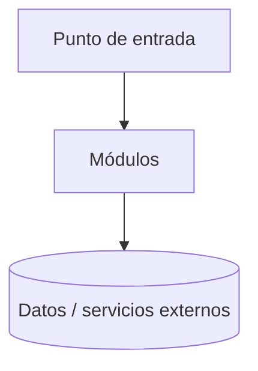

# Arquitectura — ai-workspace-generator

> Maintenido con `/doc-sync`. Usa Mermaid para los diagramas.

<!-- ai-workspace:begin:diagram -->

_Reemplázalo con la arquitectura real vía `/doc-sync`._
<!-- ai-workspace:end:diagram -->
