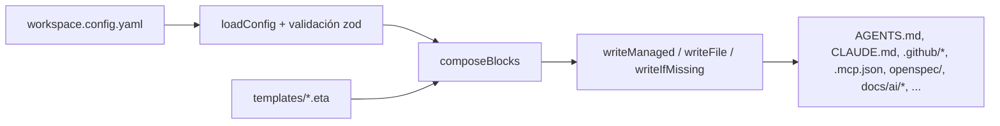
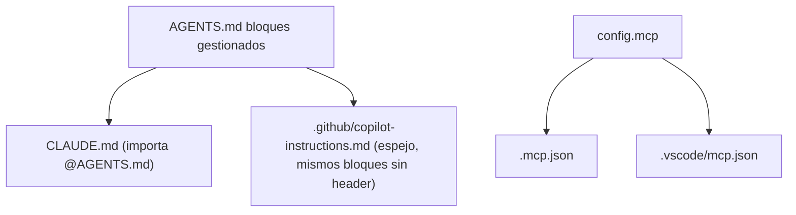

# Arquitectura

Cómo `ai-workspace` convierte un único fichero de configuración en un workspace de IA completo e
idempotente para cualquier repo.

## Modelo mental

Hay **una entrada** (`workspace.config.yaml`) y **muchas salidas** (AGENTS.md, CLAUDE.md, ficheros de
Copilot, configs MCP, scaffold SDD, docs vivas…). El CLI no inventa estado: cada artefacto es una
función pura de la config más la **librería de plantillas** en [`templates/`](../../templates/).
Re-ejecutar es seguro porque las escrituras son **idempotentes** y las ediciones del usuario se
preservan mediante **regiones gestionadas**.

## El pipeline, fichero a fichero

1. **Config** — [`src/config/schema.ts`](../../src/config/schema.ts) define `ConfigSchema` (zod). Es el
   contrato: el wizard, `doctor` y todos los generadores leen de él.
   [`src/config/loader.ts`](../../src/config/loader.ts) carga/valida (`loadConfig`) y escribe (`saveConfig`).
2. **Detección de stack** — [`src/detect/stack.ts`](../../src/detect/stack.ts) (`detectStack`) lee
   `package.json`, `tsconfig.json`, `go.mod`, etc. para precargar el wizard. Solo lectura.
3. **Componer** — [`src/generate/agents.ts`](../../src/generate/agents.ts) (`composeBlocks`) renderiza la
   lista ordenada de **bloques gestionados** de AGENTS.md, tomando fragmentos de capa de `templates/`.
4. **Renderizar** — [`src/render/engine.ts`](../../src/render/engine.ts) envuelve Eta. `templateExists`
   permite al compositor usar un bloque genérico cuando un módulo no tiene plantilla. `setLocale` elige
   la variante de idioma (ver i18n abajo).
5. **Escribir** — [`src/render/writer.ts`](../../src/render/writer.ts) escribe y reporta
   `created | updated | unchanged`. Tres estrategias (abajo).
6. **Orquestar** — [`src/generate/index.ts`](../../src/generate/index.ts) (`generate`) llama a cada
   sub-generador y devuelve la lista de `Artifact` para el informe.

## El modelo de capas

Las instrucciones se componen en cinco capas, para que la base común no choque con las reglas de
empresa/negocio. Las capas mapean a carpetas de plantillas y a secciones de config:

| Capa | Carpeta de plantillas | Origen en config | Id de bloque en AGENTS.md |
|------|----------------------|------------------|----------------------------|
| 0 · Núcleo | [`templates/core/`](../../templates/core/) | siempre activo | `header`, `core` |
| 1 · Lenguaje | [`templates/languages/<id>/`](../../templates/languages/) | `stack.languages` | `lang-<id>` |
| 2 · Framework | [`templates/frameworks/<id>/`](../../templates/frameworks/) | `stack.frameworks` | `fw-<id>` |
| 3 · Empresa | [`templates/company/`](../../templates/company/) | `conventions` | `company` |
| 4 · Negocio | [`templates/business/`](../../templates/business/) | `business` | `business` |

Más bloques de funcionalidad: `sdd` (si `sdd.enabled`), `living-docs` (si `livingDocs`), e `imported`
(añadido por `ai-workspace import`).

El **orden** de bloques está fijado en `composeBlocks`: `header → core → lenguajes → frameworks →
company → business → sdd → living-docs`.

## Regiones gestionadas — el contrato de idempotencia

[`src/render/managed-region.ts`](../../src/render/managed-region.ts) envuelve el contenido generado en
marcadores para que `sync` solo reescriba lo que le pertenece:

- Ficheros Markdown/HTML: `<!-- ai-workspace:begin:<id> -->` … `<!-- ai-workspace:end:<id> -->`
- Ficheros hash (`.gitignore`, `.gitattributes`, `.claudeignore`): `# >>> ai-workspace:begin:<id>` …

`upsertBlock` reemplaza el contenido interno de un bloque existente, o lo añade si no existe. **El texto
fuera de los marcadores nunca se toca.** Esto permite que el usuario añada notas a AGENTS.md y se
conserven entre regeneraciones.

> ⚠️ Un `id` de bloque es un **contrato estable**. Ver
> [MANTENER](MAINTAINING.md#renombrar-o-eliminar-un-id-de-bloque) para entender por qué renombrarlo deja
> contenido huérfano en los repos de los usuarios.

## Estrategias de escritura

[`src/render/writer.ts`](../../src/render/writer.ts) expone tres, elegidas por artefacto:

| Función | Comportamiento | Se usa para |
|---------|----------------|-------------|
| `writeManaged` | upsert de bloques, preserva el resto | AGENTS.md, CLAUDE.md, copilot-instructions, ignore, .gitattributes |
| `writeFile` | sobrescritura completa (contenido determinista) | `.mcp.json`, `.vscode/mcp.json`, comandos, skills, onboarding |
| `writeIfMissing` | crea una vez, nunca sobrescribe (del usuario) | `.editorconfig`, seed de `settings.json`, scaffold `openspec/` (incl. `constitution.md` en proyectos nuevos), seeds `docs/ai/*`, copias importadas |

También hay un modo **dry-run** (`setDryRun` / `getPlanned`) que usa `upgrade --check` para calcular
cambios sin tocar el disco.

## Targets (adaptadores)

`AGENTS.md` es la fuente única de verdad; el resto son adaptadores generados en
[`src/generate/index.ts`](../../src/generate/index.ts):

Claude importa AGENTS.md con `@AGENTS.md`, así que su adaptador es fino. Copilot no puede importar, así
que el CLI vuelca los mismos bloques en `copilot-instructions.md`. Por eso esto es un CLI y no una
copia única de plantilla: mantiene el espejo sincronizado de forma determinista.

## Internacionalización (i18n)

`config.language` (`es` por defecto) controla el idioma del contenido generado:

- **Plantillas**: `renderTemplate` busca primero `templates/i18n/<locale>/<ruta>` y cae a la base (en).
  Las traducciones viven en [`templates/i18n/es/`](../../templates/i18n/es/).
- **Textos cortos** embebidos en código (descripciones, cabeceras): [`src/i18n/strings.ts`](../../src/i18n/strings.ts).
- **Prosa media** (comandos/skills SDD, docs vivas): localizada en sus generadores según `config.language`.

Para añadir un idioma: crea `templates/i18n/<locale>/` con las plantillas a traducir y añade su entrada
en `strings.ts`. La base en inglés siempre actúa como fallback.

## Registro de módulos

[`src/modules/registry.ts`](../../src/modules/registry.ts) es el catálogo de lenguajes/frameworks/MCPs
conocidos. `init`, `add` y `doctor` leen de él. `bundled: true` indica que existe una plantilla
dedicada; si no, el compositor emite un bloque genérico que apunta a context7. Ver [EXTENDER](EXTENDING.md).

## Comandos

| Comando | Fuente | Qué hace |
|---------|--------|----------|
| `init` | [`commands/init.ts`](../../src/commands/init.ts) | wizard → escribe config → `generate` |
| `sync` | [`commands/sync.ts`](../../src/commands/sync.ts) | `generate` desde la config existente |
| `add` | [`commands/add.ts`](../../src/commands/add.ts) | muta la config, re-`generate` |
| `import` | [`commands/import.ts`](../../src/commands/import.ts) | ingiere activos, escribe bloque `imported` + checklist |
| `upgrade` | [`commands/upgrade.ts`](../../src/commands/upgrade.ts) | diff en dry-run, aplica, sube `templatesVersion` |
| `doctor` | [`commands/doctor.ts`](../../src/commands/doctor.ts) | lint: presupuesto de tokens, artefactos clave |

El cableado del CLI (commander) está en [`src/cli.ts`](../../src/cli.ts).

## Por qué la reconciliación con context7 vive en la IA, no en el CLI

El CLI no puede llamar a servidores MCP — context7 es un MCP disponible para el *agente*. Por eso
`import` hace el trabajo determinista (escanear, clasificar, copiar, escribir un bloque `imported`) y
emite `docs/ai/INGEST-RECONCILE.md`, una checklist que la IA ejecuta con context7. Tenlo en cuenta al
extender: todo lo que necesite docs de librerías en vivo va en un prompt/skill generado, no en el CLI.
