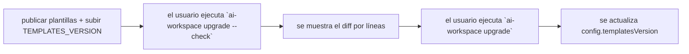

# Mantener

Cómo evolucionar el generador con seguridad y publicar actualizaciones que lleguen limpias a los
proyectos que lo usan.

## Versionado: `TEMPLATES_VERSION`

[`src/version.ts`](../../src/version.ts) tiene dos números:

- `CLI_VERSION` — la versión del paquete npm (también en `package.json`).
- `TEMPLATES_VERSION` — la versión del **conjunto de plantillas**. Cada `workspace.config.yaml` generado
  registra el `templatesVersion` con el que se renderizó.

**Sube `TEMPLATES_VERSION` siempre que cambies algo que altere la salida generada**: una plantilla
`.eta`, `composeBlocks`, un helper `generate*`, el contenido de skills/SDD, etc. `upgrade` compara el
`templatesVersion` de la config con esta constante para avisar de que hay actualización.

Disciplina semver sugerida para plantillas:
- **patch** — retoques de texto, nuevas plantillas opcionales (aditivo, seguro).
- **minor** — nuevos bloques/secciones, nuevos comandos (aditivo; los usuarios ven contenido nuevo en `sync`).
- **major** — ids de bloque renombrados/eliminados, formato de marcadores cambiado (ver nota de migración).

## El flujo de actualización para usuarios



`upgrade` ([`src/commands/upgrade.ts`](../../src/commands/upgrade.ts)) renderiza en **dry-run**
(`setDryRun` en [`src/render/writer.ts`](../../src/render/writer.ts)), compara con el disco usando
`lineDiff` ([`src/render/diff.ts`](../../src/render/diff.ts)), lo imprime, y solo escribe en una
ejecución real. Como las escrituras son idempotentes y las regiones gestionadas preservan el texto del
usuario, aplicar un upgrade no destruye el contenido fuera de los marcadores.

## Renombrar o eliminar un id de bloque

Es el gotcha más importante. `writeManaged` / `upsertBlocks`
([`src/render/managed-region.ts`](../../src/render/managed-region.ts)) **solo hacen upsert de los ids que
reciben** — nunca borran bloques desconocidos. Consecuencias:

- **Renombrar `core` → `conventions`**: el usuario conserva un bloque `core` huérfano *y* gana un bloque
  `conventions` nuevo. Contenido duplicado.
- **Eliminar un bloque**: el bloque viejo persiste en todos los repos que ya lo tienen.

Por tanto:
- Trata los ids de bloque como API pública permanente. Prefiere cambiar *contenido* a cambiar *ids*.
- Si debes renombrar/eliminar, publica una **migración** y márcalo como cambio mayor en el changelog.

Los ficheros escritos con `writeIfMissing` (`.editorconfig`, `.claude/settings.json`, scaffold
`openspec/`, seeds `docs/ai/*`, `.vscode/extensions.json`, copias importadas) tienen el rasgo opuesto:
editar su plantilla **no** llega a los usuarios que ya tienen el fichero. Son del usuario por diseño.

## Desarrollo y pruebas locales

```bash
npm install
npm run build        # tsc → dist/
npm run typecheck    # tsc --noEmit
npm run dev -- sync  # ejecutar desde fuente vía tsx (sin build)
npm link             # exponer `ai-workspace` globalmente
```

No hay suite de tests automatizada todavía. Haz smoke-test contra un repo desechable:

```bash
mkdir /tmp/aiws && cd /tmp/aiws
node /ruta/a/dist/cli.js init      # o escribe un workspace.config.yaml y ejecuta `sync`
node /ruta/a/dist/cli.js sync      # re-ejecuta: todo debe reportar "unchanged"
# añade una nota manual fuera de los marcadores en AGENTS.md, sync de nuevo, confirma que sobrevive
node /ruta/a/dist/cli.js add language go
node /ruta/a/dist/cli.js upgrade --check
node /ruta/a/dist/cli.js doctor
```

Invariantes a verificar tras cualquier cambio:
- Un segundo `sync` reporta **0 created, 0 updated** (idempotente).
- El texto manual fuera de los marcadores `ai-workspace:begin/end` se preserva.
- `doctor` sigue en verde y AGENTS.md está bajo el presupuesto de tokens.
- `npm run build` está limpio.
- Probar ambos idiomas: generar con `language: es` y `language: en`.

## Checklist de release

1. Sube `version` en `package.json`, y `CLI_VERSION` / `TEMPLATES_VERSION` en `src/version.ts`.
2. `npm run build` y smoke-test de los comandos de arriba.
3. Actualiza el `README.md` (roadmap, comandos nuevos) y anota cambios en un changelog.
4. Si añadiste/renombraste ids de bloque, documenta la migración.
5. Publica: `npm publish --access public` (el paquete envía `dist/` y `templates/` según `files` en `package.json`).

## Empaquetado como plugin

El repo es también un plugin de Claude Code: [`.claude-plugin/plugin.json`](../../.claude-plugin/plugin.json),
[`.claude-plugin/marketplace.json`](../../.claude-plugin/marketplace.json) y el comando `/aiws` en
[`commands/`](../../commands/). Al añadir un comando de cara al usuario, actualiza `commands/aiws.md`.

## Rendimiento y presupuesto de tokens

- Mantén AGENTS.md **ligero**: el detalle va en skills/instrucciones con ámbito cargadas bajo demanda.
  `doctor` avisa cuando AGENTS.md supera `tokenBudget.agentsMd`.
- Las nuevas secciones de núcleo cuestan tokens a *cada* usuario — justifícalas o hazlas opcionales.
