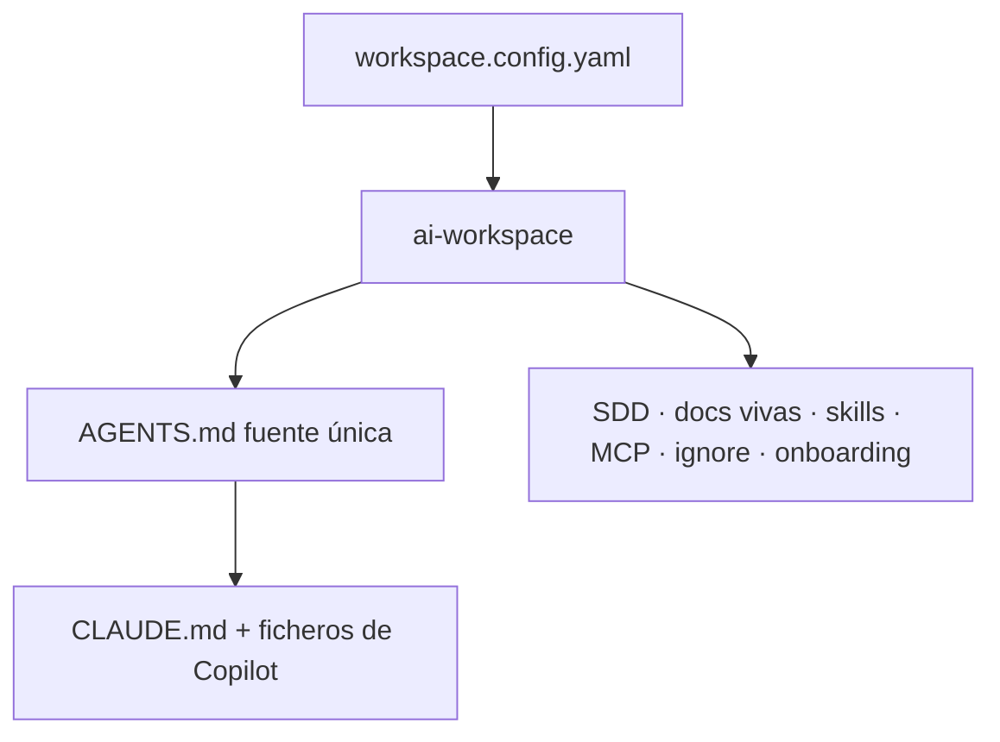
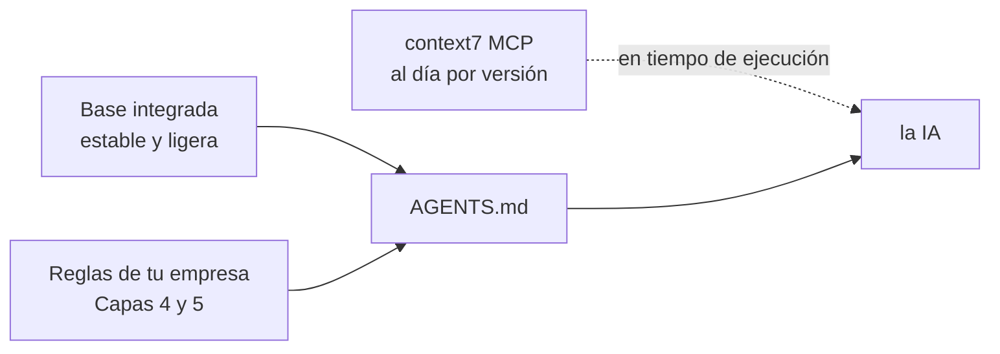
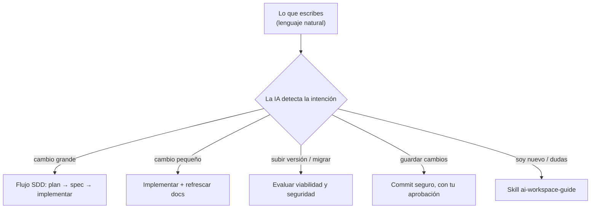

# Guía rápida (Quickstart)

Todo lo que necesitas para empezar a usar `ai-workspace`, tanto si eres experto como si te estás
iniciando en la IA.

## ¿Qué es?

`ai-workspace` es una herramienta de línea de comandos que **prepara y adapta** la configuración de IA
de un proyecto (nuevo o existente) para **Claude Code** y **GitHub Copilot**. En vez de configurar la IA
a mano en cada repo, ejecutas un comando y obtienes:

- `AGENTS.md` — las reglas del proyecto (la **fuente única de verdad**).
- Adaptadores para cada herramienta (`CLAUDE.md`, `.github/copilot-instructions.md`).
- **SDD** (planificar con specs), **docs vivas**, **skills**, **MCP (context7)** y configuración de
  formato/codificación.
- Una **skill-guía** para quien empieza (`ai-workspace-guide`) y ayuda para configurar **VS Code**.

Todo se genera desde un único fichero, `workspace.config.yaml`, y se puede regenerar sin pisar tus
ediciones manuales.

## ¿Qué ofrece? (de un vistazo)



### ¿Por qué las reglas integradas son breves?

La base de cada lenguaje/framework es **estable y ligera** a propósito: lo que cambia con la versión lo
trae **context7** en tiempo de ejecución, y lo realmente vuestro (normas de empresa) va en las **capas 3
y 4**. Así nada se queda obsoleto y el contexto no se infla.



## Empezar

### Requisitos
- Node.js ≥ 20.
- VS Code con Copilot, y/o Claude Code.

### Instalación
> ⚠️ **Aún no está en npm.** De momento se instala desde el código (te da el comando `ai-workspace`):
> ```bash
> git clone https://github.com/grojof/ai-workspace-generator.git
> cd ai-workspace-generator && npm install && npm run build && npm link
> ```
> 📦 En el futuro, cuando se publique en npm: `npx ai-workspace-generator init` (todavía no disponible).

### En un proyecto NUEVO o EXISTENTE
Desde la raíz del repo:

```bash
ai-workspace init
```

El asistente te preguntará:
1. **Idioma** de la documentación generada (español por defecto).
2. Nombre y descripción del proyecto.
3. Herramientas objetivo (Claude, Copilot o ambas).
4. Lenguajes y frameworks (se **autodetectan** si hay `package.json`, `tsconfig`, etc.).
5. Si incluir **SDD** y con qué backend (recomendado: `openspec`).
6. Si incluir **docs vivas** y **context7**.

Al terminar, abre **`AI-WORKSPACE.md`**: es el índice de todo lo que se ha creado y cómo usarlo.

### Si ya tenéis estándares de empresa
Puedes ingerirlos para no empezar de cero:

```bash
ai-workspace import ../carpeta-con-estandares
```

Esto clasifica vuestros activos por capas y deja una checklist (`docs/ai/INGEST-RECONCILE.md`) para que
la IA los contraste con las buenas prácticas actuales usando context7.

## El día a día

> **No necesitas memorizar comandos.** Habla con la IA en lenguaje natural ("añade esta feature",
> "actualiza esta librería", "guarda los cambios") y ella aplica el flujo correcto automáticamente
> (SDD, evaluación de versiones, commit seguro, docs…). Los comandos de abajo son atajos opcionales.



| Quiero… | Comando (opcional) |
|---------|---------|
| Cambiar reglas | edita `AGENTS.md` y ejecuta `ai-workspace sync` |
| Añadir una tecnología | `ai-workspace add language go` |
| Ver cambios de plantillas | `ai-workspace upgrade --check` |
| Comprobar que todo está bien | `ai-workspace doctor` |

## SDD explicado para aprender

**SDD (Spec-Driven Development)** = planificar un cambio con documentos cortos *antes* de programar.
Sirve para cambios no triviales y para que tanto tú como la IA tengáis claro el objetivo.

> 💡 **Es una metodología, no una herramienta.** Combinamos las mejores ideas de dos proyectos pero **no
> dependemos de sus CLIs**: todo son ficheros Markdown en `openspec/`.
> - De **Spec-Kit** tomamos el *arranque* de un proyecto nuevo: una **constitución** (principios) y un
>   paso de **clarify** para resolver dudas antes de la spec.
> - De **OpenSpec** tomamos el día a día: cada feature es un **cambio delta** sobre una baseline viva de
>   specs, que al terminar se **archiva** e integra. Esto vale igual para features nuevas dentro de un
>   proyecto **ya existente** (su caso fuerte).

Cada paso genera un fichero en `openspec/changes/<tu-cambio>/`:

```mermaid
flowchart LR
  C[/sdd-constitution/ una vez, proyecto nuevo] -.-> E
  E[/sdd-explore/] --> P[/sdd-propose/]
  P --> CL[/sdd-clarify/]
  CL --> S[/sdd-spec/]
  P --> D[/sdd-design/]
  S --> T[/sdd-tasks/]
  D --> T
  T --> A[/sdd-apply/]
  A --> V[/sdd-verify/]
  V --> R[/sdd-archive/]
```

0. **constitution** — _(solo proyectos nuevos, una vez)_ los principios no-negociables del proyecto.
1. **explore** — entiende el problema y las opciones.
2. **propose** — qué vas a hacer y por qué.
3. **clarify** — resuelve ambigüedades antes de cerrar la spec.
4. **spec** — QUÉ debe cumplirse (requisitos + escenarios de aceptación).
5. **design** — CÓMO lo harás (diseño técnico, diagramas).
6. **tasks** — la checklist de implementación.
7. **apply** — programas marcando tareas.
8. **verify** — compruebas contra la spec.
9. **archive** — integras el delta en `openspec/specs/` y cierras el cambio.

> Para cambios pequeños puedes saltarte SDD, pero ejecuta `/doc-sync` al terminar para que la IA
> mantenga el contexto del proyecto al día.

### ¿Empiezas con IA?
En Claude Code escribe `/aiws-guide`, o pídele: *"guíame para configurar este workspace"* o
*"explícame SDD con un ejemplo"*. La skill `ai-workspace-guide` está pensada para acompañarte.

## Gobernanza: versiones, seguridad y commits

El workspace impone un flujo de trabajo para que la IA **no desvaríe**:

- **Modo de proyecto** (`project.mode`): *nuevo* → usa versiones estables actuales y compatibles;
  *existente* → conserva las versiones actuales y **solo** sube tras una evaluación aprobada.
- **Barrera de seguridad:** ante subir versiones, migrar, resolver conflictos o cambios irreversibles,
  la IA **para, verifica la viabilidad (con context7), propone opciones, recomienda la mejor a largo
  plazo y espera tu decisión**. La seguridad nunca se negocia.
- **Evaluar una migración/subida:** usa `/upgrade-deps` (skill `dependency-upgrade`) — investiga sin tocar nada.
- **Commits:** con tu identidad de git, **sin `Co-Authored-By`**, en formato Conventional, y solo tras tu
  aprobación. Usa `/commit`.
- **Refuerzo real:** se genera un hook de git `commit-msg`. Actívalo una vez:
  ```bash
  git config core.hooksPath .githooks
  ```
  A partir de ahí, git rechaza commits con co-author o sin formato convencional, aunque alguien lo intente.

Puedes ajustar todo esto en `workspace.config.yaml` (`project.mode`, `workflow.commits`, `workflow.safetyGate`).

## Configurar VS Code
Al abrir el repo, VS Code te ofrecerá las **extensiones recomendadas** (`.vscode/extensions.json`).
Acéptalas. Para no mezclar entornos, crea un **perfil** de VS Code para este proyecto (Settings →
Profiles). La skill `vscode-setup` lo explica paso a paso.

## Más documentación
- [Arquitectura](ARCHITECTURE.md) · [Extender](EXTENDING.md) · [Mantener](MAINTAINING.md)
- En inglés: [`docs/`](../)
