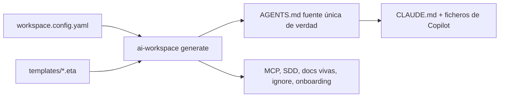

# Documentación (español)

Guías para **usar, mantener y extender** el generador `ai-workspace`.

## Para usuarios
- **[Guía rápida (Quickstart)](QUICKSTART.md)** — qué es, cómo empezar (proyecto nuevo o existente), qué
  ofrece y **SDD explicado para aprender**. Empieza por aquí.
- Tras ejecutar `init`, cada repo generado incluye además un `AI-WORKSPACE.md` que explica su propia configuración.

## Para mantenedores y colaboradores
- **[Arquitectura](ARCHITECTURE.md)** — cómo funciona de punta a punta: config → componer → renderizar →
  escribir, el modelo de capas, regiones gestionadas, i18n y por qué la reconciliación context7 vive en la IA.
- **[Extender](EXTENDING.md)** — recetas paso a paso (añadir lenguaje, framework, MCP, skill, idioma,
  target, comando) con las **implicaciones** para los usuarios existentes.
- **[Mantener](MAINTAINING.md)** — `TEMPLATES_VERSION`, el flujo de upgrade, el gotcha de renombrar ids
  de bloque, invariantes de prueba, checklist de release y presupuesto de tokens.

## El modelo en 60 segundos

Una config + una librería de plantillas por capas → un `AGENTS.md` canónico → adaptadores de cada
herramienta y ficheros de apoyo, escritos de forma idempotente para no pisar nunca las ediciones humanas.

> Documentación en inglés: [`docs/`](../).
