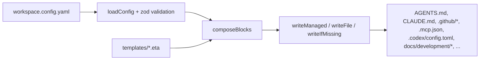
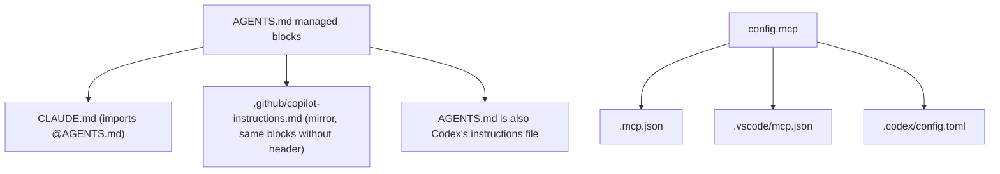

# Architecture

How `ai-workspace` turns a single configuration file into a complete, idempotent AI workspace for any repo.

## Mental model

There is **one input** (`workspace.config.yaml`) and **many outputs** (AGENTS.md, CLAUDE.md, Copilot files,
MCP configs, SDD scaffold, living docs…). The CLI invents no state: each artifact is a pure function of the
config plus the **template library** in [`templates/`](../../templates/). Re-running is safe because writes
are **idempotent** and user edits are preserved via **managed regions**.

## The pipeline, file by file

1. **Config** — [`src/config/schema.ts`](../../src/config/schema.ts) defines `ConfigSchema` (zod). It's the
   contract: the wizard, `doctor` and every generator read from it.
   [`src/config/loader.ts`](../../src/config/loader.ts) loads/validates (`loadConfig`) and writes (`saveConfig`).
2. **Stack detection** — [`src/detect/stack.ts`](../../src/detect/stack.ts) (`detectStack`) reads
   `package.json`, `tsconfig.json`, `go.mod`, etc. to pre-fill the wizard. Read-only.
3. **Compose** — [`src/generate/agents.ts`](../../src/generate/agents.ts) (`composeBlocks`) walks the
   **declarative manifest** [`BLOCK_MANIFEST`](../../src/generate/blockManifest.ts) — the ordered list of
   AGENTS.md **managed blocks** and their gating — pulling layer fragments from `templates/`.
4. **Render** — [`src/render/engine.ts`](../../src/render/engine.ts) wraps Eta. `templateExists` lets the
   compositor emit a generic block when a module has no template. `setLocale` picks the language variant (see
   i18n below).
5. **Write** — [`src/render/writer.ts`](../../src/render/writer.ts) writes and reports
   `created | updated | unchanged`. Three strategies (below).
6. **Orchestrate** — [`src/generate/index.ts`](../../src/generate/index.ts) (`generate`) calls each
   sub-generator and returns the list of `Artifact`s for the report.

## The layer model

Instructions are composed in six layers, so the common base doesn't clash with company/business rules. Layers
map to template folders and config sections:

Block ids carry the reserved `aiws:` namespace (applied centrally in `composeFromManifest`; see
[ADR 0003](decisions/0003-foundations-tenancy-provenance-reconciliation.md) F1b). Manifest entries are bare in
source — the namespace is added at compose time.

| Layer | Template folder | Config source | Block id in AGENTS.md |
|-------|-----------------|---------------|------------------------|
| 0 · Core | [`templates/core/`](../../templates/core/) | always active | `aiws:header`, `aiws:core` |
| 0 · Profile | [`templates/profile/`](../../templates/profile/) | `profile` | `aiws:profile` |
| 0 · Engineering baseline | [`templates/core/engineering-practices.md.eta`](../../templates/core/engineering-practices.md.eta) (hub) + [`templates/references/`](../../templates/references/) (depth) | always active | `aiws:engineering-practices` |
| 1 · Language | _none — context7 pointer_ | `stack.languages` | `aiws:lang-<id>` |
| 2 · Framework | _none — context7 pointer_ | `stack.frameworks` | `aiws:fw-<id>` |
| 3 · Environments | _none — context7 pointer_ | `stack.environments` | `aiws:env-<id>` |
| 4 · Company (overlay) | [`templates/company/<org>/`](../../templates/company/) | `company` (`example`, or your own org) | `aiws:company-overlay` |
| 4 · Company (conventions) | [`templates/company/`](../../templates/company/) | `conventions` | `aiws:company` |
| 5 · Business | [`templates/business/`](../../templates/business/) | `business` | `aiws:business` |

More feature blocks: `aiws:sdd` (if `sdd.enabled`), `aiws:living-docs` (if `livingDocs`), and `imported` (added by
`ai-workspace import`).

**Engineering baseline + context7 pointers (0018).** The per-stack prose matrix was removed. The durable craft
depth now lives in one evergreen, language-agnostic [`references/engineering-practices.md`](../../templates/references/engineering-practices.md.eta)
("rules with teeth"), reached by a lean **hub pointer** block (`aiws:engineering-practices`) — the same
progressive-disclosure pattern 0017a introduced. Layers 1–3 (`lang-*`/`fw-*`/`env-*`) keep their block ids (no
migration) but their content is now a single inline **context7 pointer** per stack id
([`src/generate/references.ts`](../../src/generate/references.ts) `stackPointer`); no per-stack body file and no
Copilot `*.instructions.md` projection are generated. Stack- and project-specific rules are the user's job by
design — they live in **skill packs / skill groups** (see [EXTENDING](EXTENDING.md)). Layer-0 governance stays
inline; the hub pointer is guarded by `doctor`'s dangling-reference check.

The `sdd` block supports two **methodologies** (`sdd.methodology`): `sdd` (spec-driven, default) and `spdd`
(Structured-Prompt-Driven — the REASONS Canvas prompt as a versioned artifact). They are **orthogonal** to
`sdd.schema` (spec depth): `spdd` **implies** `schema: reasons` (normalized in a single `ConfigSchema`
`.transform`). SPDD **reuses** the `/sdd-*` family and the `reasons` skills — it is not a fork; it only
changes the orchestrator framing. When to use each, with an end-to-end example:
[Methodologies: SDD vs SPDD](methodologies.md).

The `profile` block encodes the **governance posture** by user profile (type × level) and renders only the
active combination, to avoid bloating tokens. See [Extending](EXTENDING.md).

The block **order** is fixed in `BLOCK_MANIFEST`: `header → core → profile → versioning → safety → workflow
→ harness-engineering → routing → skill-routing → languages → frameworks → environments → company-overlay →
company → business → sdd → living-docs`. The `company-overlay` block (culture + 7 org rules) only appears if
`company` is not `none` (e.g. `example`); it is **always English** (the AI consumes it).

The **Layer-0 principles** (governance) are the always-on manifest entries: `core`, `versioning`, `safety`,
`workflow`, `harness-engineering`. `harness-engineering` encodes the *harness/context engineering* posture
(finite context, *progressive disclosure*, *just-in-time* via context7, memory in the living docs) and the
**ratchet principle**: a rule only enters `AGENTS.md` when it prevents a real failure. Adding a new principle
is **one row** in the manifest (see [Extending](EXTENDING.md)).

The `skill-routing` block says which skills to use for the active profile; it is derived from the skill
registry in [`src/modules/skills.ts`](../../src/modules/skills.ts) **plus** the frontmatter of the applicable
skill-packs, filtered by `profile`.

## Skills as data (skill-packs)

Rich skills are not written in code: they live as **markdown** in [`skill-packs/<id>/`](../../skill-packs/)
(*skills-as-data* model). Each pack is `SKILL.md` (index, *model-invoked*) + `references/*.md` (on-demand
guides) + `pack.yaml` (gating/routing) + optional `overlay.<company>.md`.
[`src/generate/stackPacks.ts`](../../src/generate/stackPacks.ts) copies them into `.claude/skills/<id>/` when
they apply:

- **Gating** — `stackBinding` (active stack) and/or `gating` (feature/company) + `profile`.
- **Tokens** — `templated` packs resolve `{{paths.*}}` (from `docsPaths`) when copied.
- **Base + overlay** — `overlay.<company>.md` is appended as a managed block (the base is untouched).
- **Routing** — each pack contributes its `skill-routing` row, or cedes it to the catalog with `routing: false`.

A pack's base may be **vendored** from an MIT upstream (e.g. `agent-skills`) in [`vendor/`](../../vendor/) — a
versioned mirror for clean diffs — and updated with `ai-workspace skills sync`. All the **fusion** content
(sdd-builder/audit/schema/onboarding/migrate, corp-*) and the **stacks** (odoo-18.0) are packs; only the
tool's **native** skills (lean SDD flow, aiws-living-docs, guides) are generated by code.

## Managed regions — the idempotency contract

[`src/render/managed-region.ts`](../../src/render/managed-region.ts) wraps generated content in markers so
`sync` only rewrites what belongs to it:

- Markdown/HTML files: `<!-- ai-workspace:begin:<id> -->` … `<!-- ai-workspace:end:<id> -->`
- Hash files (`.gitignore`, `.gitattributes`, `.claudeignore`): `# >>> ai-workspace:begin:<id>` …

`upsertBlock` replaces the inner content of an existing block, or appends it if absent. **Text outside the
markers is never touched.** This lets the user add notes to AGENTS.md that survive regeneration.

> ⚠️ A block `id` is a **stable contract**. See
> [Maintaining](MAINTAINING.md#renaming-or-removing-a-block-id) for why renaming it leaves orphaned content
> in users' repos.

## Write strategies

[`src/render/writer.ts`](../../src/render/writer.ts) exposes three, chosen per artifact:

| Function | Behavior | Used for |
|----------|----------|----------|
| `writeManaged` | block upsert, preserves the rest | AGENTS.md, CLAUDE.md, copilot-instructions, ignore, .gitattributes |
| `writeFile` | full overwrite (deterministic content) | `.mcp.json`, `.vscode/mcp.json`, `.codex/config.toml`, commands, skills, onboarding |
| `writeIfMissing` | create once, never overwrite (the user's) | `.editorconfig`, `settings.json` seed, the SDD store scaffold under `docs.development` (default `docs/development/`; incl. `constitution.md` for new projects), `docs/development/status/*` seeds, `docs/README.md`, imported copies |

There is also a **dry-run** mode (`setDryRun` / `getPlanned`) used by `upgrade --check` to compute changes
without touching disk.

## Targets (adapters)

`AGENTS.md` is the single source of truth; the rest are adapters generated in
[`src/generate/index.ts`](../../src/generate/index.ts):

Claude imports AGENTS.md with `@AGENTS.md`, so its adapter is thin. Codex reads `AGENTS.md` natively (no
adapter file). Copilot can't import, so the CLI mirrors the same blocks into `copilot-instructions.md`. That's
why this is a CLI and not a single template copy: it keeps the mirror in sync deterministically.

## Internationalization (i18n)

`config.language` (`es` by default) controls the language of generated content:

- **Templates**: `renderTemplate` looks first in `templates/i18n/<locale>/<path>` and falls back to the base
  (en). Translations live in [`templates/i18n/es/`](../../templates/i18n/es/).
- **Short strings** embedded in code (descriptions, headers): [`src/i18n/strings.ts`](../../src/i18n/strings.ts).
- **Mid-length prose** (SDD commands/skills, living docs): localized in their generators per `config.language`.

To add a language: create `templates/i18n/<locale>/` with the templates to translate and add its entry in
`strings.ts`. The English base always acts as the fallback.

## Module registry

[`src/modules/registry.ts`](../../src/modules/registry.ts) is the catalog of known languages/frameworks/MCPs
and environments. `init`, `add` and `doctor` read from it. `bundled: true` means a dedicated template exists;
otherwise the compositor emits a generic block that points to context7. It also holds per-module VS Code
recommendations (`vscodeExtensions`/`vscodeFormatter`). See [Extending](EXTENDING.md).

## Commands

| Command | Source | What it does |
|---------|--------|--------------|
| `init` | [`commands/init.ts`](../../src/commands/init.ts) | wizard → writes config → `generate` |
| `sync` | [`commands/sync.ts`](../../src/commands/sync.ts) | `generate` from the existing config |
| `add` | [`commands/add.ts`](../../src/commands/add.ts) | mutates the config, re-`generate` |
| `import` | [`commands/import.ts`](../../src/commands/import.ts) | ingests assets, writes the `imported` block + checklist |
| `upgrade` | [`commands/upgrade.ts`](../../src/commands/upgrade.ts) | dry-run diff, applies, bumps `templatesVersion` |
| `doctor` | [`commands/doctor.ts`](../../src/commands/doctor.ts) | lint: token budget, key artifacts, stack ids |
| `package` | [`commands/package.ts`](../../src/commands/package.ts) | packages plugin + marketplace + skill zips ([Distribution](DISTRIBUTION.md)) |
| `skills sync` | [`commands/skillsSync.ts`](../../src/commands/skillsSync.ts) | updates vendored packs from upstream (diff + apply) |

The CLI wiring (commander) is in [`src/cli.ts`](../../src/cli.ts).

## Why context7 reconciliation lives in the AI, not the CLI

The CLI cannot call MCP servers — context7 is an MCP available to the *agent*. So `import` does the
deterministic work (scan, classify, copy, write an `imported` block) and emits
`docs/development/status/INGEST-RECONCILE.md`, a checklist the AI executes with context7. Keep this in mind
when extending: anything that needs live library docs goes in a generated prompt/skill, not in the CLI.
