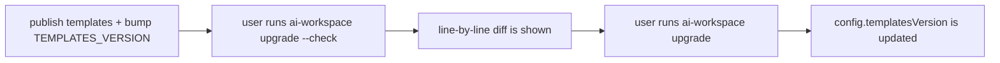

# Maintaining

How to evolve the generator safely and publish updates that reach the projects using it cleanly.

## Versioning: `TEMPLATES_VERSION`

[`src/version.ts`](../../src/version.ts) has two numbers:

- `CLI_VERSION` — the npm package version (also in `package.json`).
- `TEMPLATES_VERSION` — the version of the **template set**. Each generated `workspace.config.yaml` records
  the `templatesVersion` it was rendered with.

**Bump `TEMPLATES_VERSION` whenever you change something that alters generated output**: a `.eta` template,
`composeBlocks`, a `generate*` helper, skill/SDD content, etc. `upgrade` compares the config's
`templatesVersion` with this constant to flag that an update is available.

Suggested semver discipline for templates:
- **patch** — text tweaks, new optional templates (additive, safe).
- **minor** — new blocks/sections, new commands (additive; users see new content on `sync`).
- **major** — renamed/removed block ids, changed marker format (see the migration note).

## The upgrade flow for users



`upgrade` ([`src/commands/upgrade.ts`](../../src/commands/upgrade.ts)) renders in **dry-run**
(`setDryRun` in [`src/render/writer.ts`](../../src/render/writer.ts)), compares against disk using `lineDiff`
([`src/render/diff.ts`](../../src/render/diff.ts)), prints it, and only writes on a real run. Because writes
are idempotent and managed regions preserve the user's text, applying an upgrade never destroys content
outside the markers.

## Renaming or removing a block id

This is the most important gotcha. `writeManaged` / `upsertBlocks`
([`src/render/managed-region.ts`](../../src/render/managed-region.ts)) **only upsert the ids they receive** —
they never delete unknown blocks. Consequences:

- **Renaming `core` → `conventions`**: the user keeps an orphaned `core` block *and* gains a new `conventions`
  block. Duplicated content.
- **Removing a block**: the old block persists in every repo that already has it.

Therefore:
- Treat block ids as permanent public API. Prefer changing *content* over changing *ids*.
- If you must rename/remove, publish a **migration** and mark it as a major change in the changelog.

### The `aiws:` block-id namespace (ADR 0003 F1b)

Governance-spine blocks composed into `AGENTS.md` / `CLAUDE.md` / Copilot carry the reserved `aiws:`
namespace (`header` → `aiws:header`, `lang-*` → `aiws:lang-*`). The prefix is applied **centrally** in
`composeFromManifest` ([`src/generate/agents.ts`](../../src/generate/agents.ts)) — manifest entries and
inline ids (`claude`, `copilot-header`) stay bare in source; the namespace is added at compose time, so
dynamic per-stack ids are covered uniformly. Non-spine managed regions stay bare on purpose:
infra-ignore / `.gitattributes`, the living-doc seeds (`overview`/`diagram`, user-owned), and `imported`.

Renaming bare → namespaced is exactly the orphan trap above, so the migration is **automated**:
`ai-workspace upgrade` runs [`migrateBlockIds`](../../src/commands/migrate.ts) **before** rendering
(rewrites legacy spine markers in place, so generate updates the regions instead of appending duplicates)
and [`pruneRenamedOrphans`](../../src/commands/migrate.ts) **after** (removes the pre-rename skill folders /
command + prompt files left by the `aiws-` rename, guarded by the freshly-written artifact set). Both steps
are idempotent. If you add a new spine block id, no extra migration work is needed — it is born namespaced.

Files written with `writeIfMissing` (`.editorconfig`, `.claude/settings.json`, the SDD store scaffold under
`docs.development` (default `docs/development/`), `docs/development/status/*` seeds, `.vscode/extensions.json`,
imported copies) have the opposite trait: editing their template **does not** reach users who already have the
file. They are the user's by design.

## Local development and testing

```bash
npm install
npm run build        # tsc → dist/
npm run typecheck    # tsc --noEmit
npm run dev -- sync  # run from source via tsx (no build)
npm test             # build + run the test suite (test/*.test.js)
npm link             # expose `ai-workspace` globally
```

Run `npm test` (the automated suite) plus a smoke-test against a disposable repo:

```bash
mkdir /tmp/aiws && cd /tmp/aiws
node /path/to/dist/cli.js init      # or write a workspace.config.yaml and run `sync`
node /path/to/dist/cli.js sync      # re-run: everything should report "unchanged"
# add a manual note outside the markers in AGENTS.md, sync again, confirm it survives
node /path/to/dist/cli.js add language go
node /path/to/dist/cli.js upgrade --check
node /path/to/dist/cli.js doctor
```

Invariants to verify after any change (the critical ones are *enforced* by
[`test/invariants.test.js`](../../test/invariants.test.js) — see [ADR 0002](decisions/0002-extension-contracts.md)):
- AGENTS.md **block order and ids** don't change (golden). If you change them on purpose, update the golden in the same commit.
- A second `sync` reports **0 created, 0 updated** (idempotent).
- Manual text outside the `ai-workspace:begin/end` markers is preserved.
- Skill binaries (logos, `.pptx`/`.dotx` templates) arrive byte-for-byte.
- `doctor` stays green and AGENTS.md is under the token budget.
- `npm run build` is clean.
- Test both languages: generate with `language: es` and `language: en`.

## Release checklist

1. Bump `version` in `package.json`, and `CLI_VERSION` / `TEMPLATES_VERSION` in `src/version.ts`.
2. `npm run build` and `npm test`, plus the smoke-test commands above.
3. Update `README.md` (roadmap, new commands) and record changes in a changelog.
4. If you added/renamed block ids, document the migration.
5. Once per release cycle, run `/sdd-upstream-check` to reconcile the SDD methodology with upstream.
6. Publish: `npm publish --access public` (the package ships `dist/` and `templates/` per `files` in `package.json`).

## Keeping the SDD methodology in sync with upstream

Our SDD flow takes *concepts* (not code) from Spec-Kit and OpenSpec — see
[ADR 0001](decisions/0001-mixed-sdd.md). The entire maintenance surface is the provenance table in
[SDD-UPSTREAM.md](SDD-UPSTREAM.md): three concepts, each pinned to an upstream anchor and a "last reviewed"
date. We do **not** vendor or follow their CLIs.

To reconcile after either one evolves, run the **`/sdd-upstream-check`** command
([`.claude/commands/sdd-upstream-check.md`](../../.claude/commands/sdd-upstream-check.md)): the agent checks
each upstream's changes since the reviewed date, keeps only the philosophy/flow ones, proposes edits to our
concept implementation and bumps `TEMPLATES_VERSION`. Tooling-only changes are ignored by design.

## Maintaining the skill-packs (vendor + `skills sync`)

Rich skills live as data in [`skill-packs/<id>/`](../../skill-packs/) (*skills-as-data* model). A pack's base
may come from a **permissive** upstream (MIT / Apache-2.0 / BSD / CC-BY — e.g. `agent-skills` MIT,
`anthropics/skills` Apache-2.0), **vendored** in [`vendor/`](../../vendor/) — text source only, a versioned
mirror for clean diffs (binaries/build are excluded via `.gitignore`).

> **License gate:** verify the license **per-skill**, not just the repo root. Copyleft/share-alike (CC-BY-SA)
> and source-available (e.g. Anthropic's `docx/pdf/pptx/xlsx` doc-skills) are **rejected**. Apache-2.0/CC-BY
> require **retaining** `LICENSE`/attribution + `NOTICE` — `skills sync` copies the upstream `LICENSE`.

- **Update from upstream:** `ai-workspace skills sync` (dry-run) shows the content diff against the vendored
  base at the pinned `ref` (latest tag by default, or `--ref`). With `--apply` it updates `vendor/`, re-seals
  `.source.json` and **propagates the base** to the packs (via `pack.yaml.base`) **preserving** `pack.yaml`
  and the `overlay.*.md`. It keeps the license attribution (MIT). After applying: `npm run build && npm test`,
  review `git diff`, bump `TEMPLATES_VERSION` if output changed, and commit.
- **Company material:** this public repo includes no company material. If you need it, keep it in a separate
  repo and bring it in as overlays (`templates/company/<org>/`, `skill-packs/corp-*`).
- **Byte-equivalence:** when migrating content from code to packs, verify `generate`'s output doesn't change
  (generate before/after and compare).

## Packaging as a plugin

The repo is also a Claude Code plugin: [`.claude-plugin/plugin.json`](../../.claude-plugin/plugin.json),
[`.claude-plugin/marketplace.json`](../../.claude-plugin/marketplace.json) and the `/aiws` command in
[`commands/`](../../commands/). When adding a user-facing command, update `commands/aiws.md`.

## Performance and token budget

- Keep AGENTS.md **lean**: detail goes into scoped skills/instructions loaded on demand. `doctor` warns when
  AGENTS.md exceeds `tokenBudget.agentsMd`.
- New core sections cost tokens for *every* user — justify them or make them optional.
