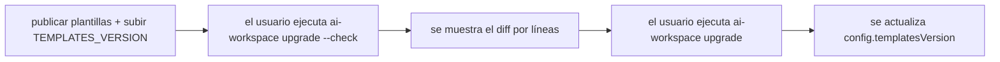

# Mantener

Cómo evolucionar el generador con seguridad y publicar actualizaciones que lleguen limpias a los
proyectos que lo usan.

## Versionado: `TEMPLATES_VERSION`

[`src/version.ts`](../../src/version.ts) tiene dos números:

- `CLI_VERSION` — la versión del paquete npm (también en `package.json`).
- `TEMPLATES_VERSION` — la versión del **conjunto de plantillas**. Cada `workspace.config.yaml` generado
  registra el `templatesVersion` con el que se renderizó.

**Sube `TEMPLATES_VERSION` siempre que cambies algo que altere la salida generada**: una plantilla
`.eta`, `composeBlocks`, un helper `generate*`, el contenido de skills/SDD, etc. `upgrade` compara el
`templatesVersion` de la config con esta constante para avisar de que hay actualización.

Disciplina semver sugerida para plantillas:
- **patch** — retoques de texto, nuevas plantillas opcionales (aditivo, seguro).
- **minor** — nuevos bloques/secciones, nuevos comandos (aditivo; los usuarios ven contenido nuevo en `sync`).
- **major** — ids de bloque renombrados/eliminados, formato de marcadores cambiado (ver nota de migración).

## El flujo de actualización para usuarios



`upgrade` ([`src/commands/upgrade.ts`](../../src/commands/upgrade.ts)) renderiza en **dry-run**
(`setDryRun` en [`src/render/writer.ts`](../../src/render/writer.ts)), compara con el disco usando
`lineDiff` ([`src/render/diff.ts`](../../src/render/diff.ts)), lo imprime, y solo escribe en una
ejecución real. Como las escrituras son idempotentes y las regiones gestionadas preservan el texto del
usuario, aplicar un upgrade no destruye el contenido fuera de los marcadores.

## Renombrar o eliminar un id de bloque

Es el gotcha más importante. `writeManaged` / `upsertBlocks`
([`src/render/managed-region.ts`](../../src/render/managed-region.ts)) **solo hacen upsert de los ids que
reciben** — nunca borran bloques desconocidos. Consecuencias:

- **Renombrar `core` → `conventions`**: el usuario conserva un bloque `core` huérfano *y* gana un bloque
  `conventions` nuevo. Contenido duplicado.
- **Eliminar un bloque**: el bloque viejo persiste en todos los repos que ya lo tienen.

Por tanto:
- Trata los ids de bloque como API pública permanente. Prefiere cambiar *contenido* a cambiar *ids*.
- Si debes renombrar/eliminar, publica una **migración** y márcalo como cambio mayor en el changelog.

Los ficheros escritos con `writeIfMissing` (`.editorconfig`, `.claude/settings.json`, el scaffold del
almacén SDD bajo `docs.development` (por defecto `docs/development/`), seeds `docs/development/status/*`, `.vscode/extensions.json`,
copias importadas) tienen el rasgo opuesto:
editar su plantilla **no** llega a los usuarios que ya tienen el fichero. Son del usuario por diseño.

## Desarrollo y pruebas locales

```bash
npm install
npm run build        # tsc → dist/
npm run typecheck    # tsc --noEmit
npm run dev -- sync  # ejecutar desde fuente vía tsx (sin build)
npm link             # exponer `ai-workspace` globalmente
```

No hay suite de tests automatizada todavía. Haz smoke-test contra un repo desechable:

```bash
mkdir /tmp/aiws && cd /tmp/aiws
node /ruta/a/dist/cli.js init      # o escribe un workspace.config.yaml y ejecuta `sync`
node /ruta/a/dist/cli.js sync      # re-ejecuta: todo debe reportar "unchanged"
# añade una nota manual fuera de los marcadores en AGENTS.md, sync de nuevo, confirma que sobrevive
node /ruta/a/dist/cli.js add language go
node /ruta/a/dist/cli.js upgrade --check
node /ruta/a/dist/cli.js doctor
```

Invariantes a verificar tras cualquier cambio (los críticos están *enforced* por
[`test/invariants.test.js`](../../test/invariants.test.js) — ver [ADR 0002](decisions/0002-extension-contracts.md)):
- El **orden e ids de bloque** de AGENTS.md no cambian (golden). Si los cambias a propósito, actualiza el golden en el mismo commit.
- Un segundo `sync` reporta **0 created, 0 updated** (idempotente).
- El texto manual fuera de los marcadores `ai-workspace:begin/end` se preserva.
- Los binarios de skill (logos, plantillas `.pptx`/`.dotx`) llegan byte-a-byte.
- `doctor` sigue en verde y AGENTS.md está bajo el presupuesto de tokens.
- `npm run build` está limpio.
- Probar ambos idiomas: generar con `language: es` y `language: en`.

## Checklist de release

1. Sube `version` en `package.json`, y `CLI_VERSION` / `TEMPLATES_VERSION` en `src/version.ts`.
2. `npm run build` y smoke-test de los comandos de arriba.
3. Actualiza el `README.md` (roadmap, comandos nuevos) y anota cambios en un changelog.
4. Si añadiste/renombraste ids de bloque, documenta la migración.
4b. Una vez por ciclo de release, ejecuta `/sdd-upstream-check` para reconciliar la metodología SDD con upstream.
5. Publica: `npm publish --access public` (el paquete envía `dist/` y `templates/` según `files` en `package.json`).

## Mantener la metodología SDD sincronizada con upstream

Nuestro flujo SDD toma *conceptos* (no código) de Spec-Kit y OpenSpec — ver
[ADR 0001](../decisions/0001-mixed-sdd.md). Toda la superficie de mantenimiento es la tabla de
procedencia en [SDD-UPSTREAM.md](SDD-UPSTREAM.md): tres conceptos, cada uno fijado a un anchor upstream y
a una fecha de "última revisión". **No** vendorizamos ni seguimos sus CLIs.

Para reconciliar tras una evolución de cualquiera de los dos, ejecuta el comando **`/sdd-upstream-check`**
([`.claude/commands/sdd-upstream-check.md`](../../.claude/commands/sdd-upstream-check.md)): el agente
consulta los cambios de cada upstream desde la fecha revisada, se queda solo con los de filosofía/flujo,
propone ediciones a nuestra implementación de conceptos y sube `TEMPLATES_VERSION`. Los cambios de solo
tooling se ignoran por diseño.

## Mantener los skill-packs (vendor + `skills sync`)

Las skills ricas viven como datos en [`skill-packs/<id>/`](../../skill-packs/) (modelo *skills-as-data*).
La base de un pack puede venir de un upstream
**permisivo** (MIT / Apache-2.0 / BSD / CC-BY — p. ej. `agent-skills` MIT, `anthropics/skills` Apache-2.0),
**vendorizada** en [`vendor/`](../../vendor/) — solo la fuente de texto, mirror versionado para diffs limpios
(binarios/build se excluyen vía `.gitignore`).

> **Gate de licencia:** verifica la licencia **por-skill**, no solo la raíz del repo. Se **rechazan**
> copyleft/share-alike (CC-BY-SA) y *source-available* (p. ej. los doc-skills `docx/pdf/pptx/xlsx` de Anthropic).
> Apache-2.0/CC-BY exigen **retener** `LICENSE`/atribución + `NOTICE` — `skills sync` copia el `LICENSE` del upstream.

- **Actualizar desde upstream:** `ai-workspace skills sync` (dry-run) muestra el diff por contenido contra
  la base vendorizada al `ref` pineado (último tag por defecto, o `--ref`). Con `--apply` actualiza `vendor/`,
  re-sella `.source.json` y **propaga la base** a los packs (vía `pack.yaml.base`) **preservando** `pack.yaml`
  y los `overlay.*.md`. Conserva la atribución de licencia (MIT). Tras aplicar: `npm run build && npm test`,
  revisa `git diff`, sube `TEMPLATES_VERSION` si cambió la salida, y confirma.
- **Material de empresa:** este repo público no incluye material de ninguna empresa. Si lo necesitas,
  mantenlo en un repo aparte y tráelo como overlays (`templates/company/<org>/`, `skill-packs/corp-*`).
- **Byte-equivalencia:** al migrar contenido de código a packs, verifica que la salida de `generate` no
  cambia (genera antes/después y compara).

## Empaquetado como plugin

El repo es también un plugin de Claude Code: [`.claude-plugin/plugin.json`](../../.claude-plugin/plugin.json),
[`.claude-plugin/marketplace.json`](../../.claude-plugin/marketplace.json) y el comando `/aiws` en
[`commands/`](../../commands/). Al añadir un comando de cara al usuario, actualiza `commands/aiws.md`.

## Rendimiento y presupuesto de tokens

- Mantén AGENTS.md **ligero**: el detalle va en skills/instrucciones con ámbito cargadas bajo demanda.
  `doctor` avisa cuando AGENTS.md supera `tokenBudget.agentsMd`.
- Las nuevas secciones de núcleo cuestan tokens a *cada* usuario — justifícalas o hazlas opcionales.
