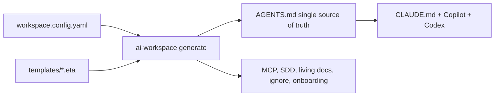

# Documentation (project)

Guides to **use, maintain and extend** the `ai-workspace` generator. Deep guides are in **English**
(canonical); the usage guide is also available in Spanish.

## For users
- Start at the **[root README](../../README.md)** — what it is, install, usage and commands (overview with links).
- **[Usage guide](USAGE.md)** ([🇪🇸 Español](USAGE.es.md)) — detailed CLI reference (every command with its
  options), the `workspace.config.yaml` file, and **multi-repo** usage.
- After running `init`, each generated repo also includes an `AI-WORKSPACE.md` explaining its own configuration.

## Project
- **[Changelog](../../CHANGELOG.md)** — tracks the evolution.

## For maintainers and contributors
- **[Architecture](ARCHITECTURE.md)** — how it works end to end: config → compose → render → write, the layer
  model, managed regions, i18n, and why context7 reconciliation lives in the AI.
- **[Extending](EXTENDING.md)** — step-by-step recipes (add a language, framework, MCP, skill, language,
  target, command) with the **implications** for existing users.
- **[Maintaining](MAINTAINING.md)** — `TEMPLATES_VERSION`, the upgrade flow, the block-id rename gotcha, test
  invariants, the release checklist and the token budget.
- **[Harness Engineering](harness-engineering.md)** — the project's philosophy: *Agent = Model + Harness*,
  context engineering, the ratchet principle, and how the repo **is** a harness generator.
- **[Methodologies: SDD vs SPDD](methodologies.md)** — when to use each flow, with an end-to-end example and
  the "truth lives in the code vs in the prompt" distinction.
- **[SDD upstream](SDD-UPSTREAM.md)** — how to reconcile our methodology with Spec-Kit and OpenSpec.
- **[Distribution](DISTRIBUTION.md)** — `ai-workspace package`: plugin + private marketplace + org skill zips
  (VS Code/CLI, Desktop/Cowork, claude.ai Team/Enterprise).
- **Decisions (ADR):** [0001 mixed SDD](decisions/0001-mixed-sdd.md) ·
  [0002 extension contracts](decisions/0002-extension-contracts.md) (enforced invariants + Phase 2 north star).

## The model in 60 seconds

One config + a layered template library → a canonical `AGENTS.md` → each tool's adapters and supporting
files, written idempotently so human edits are never overwritten.
