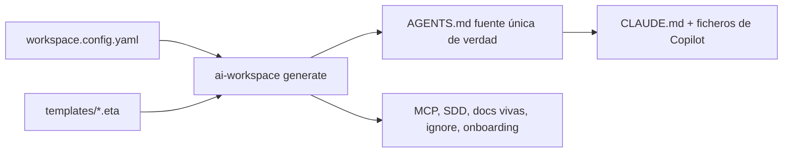

# Documentación (español)

Guías para **usar, mantener y extender** el generador `ai-workspace`.

## Para usuarios
- Empieza por el **[README raíz](../../README.md)** — qué es, instalación, uso y comandos (resumen con enlaces).
- **[Guía de uso](USAGE.md)** — referencia detallada de la CLI (cada comando con opciones), el fichero
  `workspace.config.yaml` y el uso en **multi-repo**.
- Tras ejecutar `init`, cada repo generado incluye además un `AI-WORKSPACE.md` que explica su propia configuración.

## Proyecto
- **[Registro de cambios](../../CHANGELOG.md)** — seguimiento de la evolución.

## Para mantenedores y colaboradores
- **[Arquitectura](ARCHITECTURE.md)** — cómo funciona de punta a punta: config → componer → renderizar →
  escribir, el modelo de capas, regiones gestionadas, i18n y por qué la reconciliación context7 vive en la IA.
- **[Extender](EXTENDING.md)** — recetas paso a paso (añadir lenguaje, framework, MCP, skill, idioma,
  target, comando) con las **implicaciones** para los usuarios existentes.
- **[Mantener](MAINTAINING.md)** — `TEMPLATES_VERSION`, el flujo de upgrade, el gotcha de renombrar ids
  de bloque, invariantes de prueba, checklist de release y presupuesto de tokens.
- **[Harness Engineering](harness-engineering.md)** — la filosofía del proyecto: *Agente = Modelo + Harness*,
  context engineering, el ratchet principle, y cómo el repo **es** un generador de harnesses.
- **[Metodologías: SDD vs SPDD](methodologies.md)** — cuándo usar cada flujo, con ejemplo end-to-end y la
  diferencia "la verdad vive en el código vs en el prompt".
- **[SDD upstream](SDD-UPSTREAM.md)** — cómo reconciliar nuestra metodología con Spec-Kit y OpenSpec.
- **[Distribución](DISTRIBUTION.md)** — `ai-workspace package`: plugin + marketplace privado + zips de skill
  para organización (VS Code/CLI, Desktop/Cowork, claude.ai Team/Enterprise).
- **Decisiones (ADR)** — registro de decisiones de arquitectura:
  [0001 SDD mixto](decisions/0001-mixed-sdd.md) ·
  [0002 contratos de extensión](decisions/0002-extension-contracts.md) (invariantes *enforced* + norte de la Fase 2).

## El modelo en 60 segundos

Una config + una librería de plantillas por capas → un `AGENTS.md` canónico → adaptadores de cada
herramienta y ficheros de apoyo, escritos de forma idempotente para no pisar nunca las ediciones humanas.
