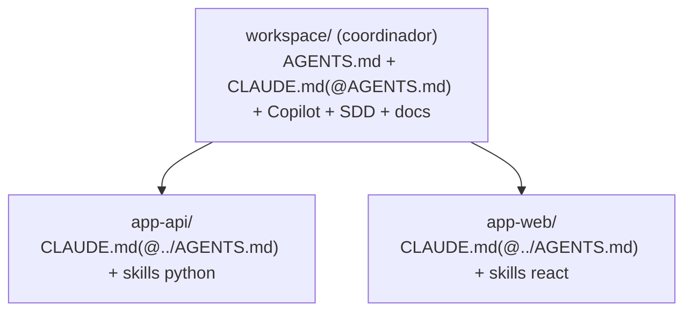

<!-- [🇬🇧 English](USAGE.md) · 🇪🇸 Español (estás aquí) -->

# Guía de uso

> Cómo usar la **CLI `ai-workspace`** en el día a día: configurar un repo, mantenerlo, trabajar en
> **multi-repo** y distribuir el resultado. Para *cómo se instala* lo distribuido, ver
> **[Distribución](DISTRIBUTION.md)**; para *cómo funciona por dentro*, ver **[Arquitectura](ARCHITECTURE.md)**.

La CLI es la herramienta de **configuración y mantenimiento** del workspace. Una vez configurado el repo,
**no necesitas memorizar comandos**: hablas con la IA en lenguaje natural y ella aplica el flujo correcto
(SDD, commits, etc.). La CLI la usas para el arranque (`init`), para regenerar tras editar reglas (`sync`) y
para tareas puntuales (añadir un módulo, actualizar plantillas, empaquetar).

## Requisitos e instalación

**Node.js ≥ 20** y VS Code con Copilot y/o Claude Code. El paquete es `ai-workspace-generator`; el comando
instalado es **`ai-workspace`**.

**Fácil (recomendada) — tarball precompilado del último GitHub Release** (sin clonar ni compilar):

```bash
npm i -g https://github.com/grojof/ai-workspace-generator/releases/latest/download/ai-workspace-generator.tgz
ai-workspace --version
```

**Experta / desde el código:**

```bash
git clone https://github.com/grojof/ai-workspace-generator.git
cd ai-workspace-generator
npm install && npm run build && npm link
```

**Actualizar:** repite la instalación fácil para la última release, o `git pull && npm run build` desde el código.

> **Instalación guiada por IA.** ¿Aún no tienes Node/git? Dile a tu asistente *"instala ai-workspace desde
> &lt;URL del repo&gt;"* y deja que compruebe los requisitos y te guíe la instalación según tu SO (pregunta
> antes de instalar nada). Un binario autónomo sin Node está planificado como cambio aparte.
>
> **Publicar una release (mantenedores).** `node scripts/release.mjs` compila + empaqueta el tarball e imprime
> el comando `gh release create` sin publicar (Safety gate); añade `--publish` para crear la Release.

## Flujo de trabajo típico

```bash
cd /ruta/a/tu-repo
ai-workspace init        # 1) asistente: autodetecta el stack, escribe workspace.config.yaml, genera todo
                         # 2) abre el repo en VS Code (Copilot) o Claude Code
# … editas reglas en AGENTS.md (fuera de los marcadores) o cambias workspace.config.yaml …
ai-workspace sync        # 3) regenera los artefactos (idempotente: 0 ruido, respeta tu texto)
ai-workspace doctor      # 4) lint: presupuesto de tokens, artefactos presentes, bloques huérfanos
```

Tras `init`, lee **`AI-WORKSPACE.md`**: el índice de todo lo generado.

> **Idempotencia.** Re-ejecutar `sync` no debe crear ni actualizar nada si la config no cambió. El texto que
> escribas **fuera** de los marcadores `ai-workspace:begin/end` siempre sobrevive a la regeneración.

## Referencia de comandos

### `init` — asistente de configuración
Detecta el stack, escribe `workspace.config.yaml` y renderiza los artefactos.

| Opción | Efecto |
|--------|--------|
| `--simple` | Pocas preguntas + defaults sensatos; **acepta el stack detectado**. |
| `--advanced` | Asistente completo (controla cada capa). |
| `-y, --yes` | Acepta defaults donde puede (implica `--simple`, no interactivo). |
| `--from <paths...>` | Material de empresa existente a ingestar (se registra para `import`). |

Resolución del modo: `--advanced` → avanzado; `--simple`/`--yes` → simple; si no, pregunta (Simple
preseleccionado). La opción más rica es la skill guiada `/aiws-configure` (AI-first) dentro del editor.

### `detect` — detectar el stack (solo lectura)
Lee manifiestos (`package.json`, `pyproject.toml`, …) y **no escribe nada**.

```bash
ai-workspace detect          # resumen legible
ai-workspace detect --json   # JSON determinista (semilla para la skill aiws-configure-workspace / tooling)
```

### `sync` — regenerar
Re-renderiza todos los artefactos desde `workspace.config.yaml`. Idempotente.

### `doctor` — lint del workspace
Comprueba el presupuesto de tokens de `AGENTS.md`, la presencia de adaptadores (incl. el `CLAUDE.md` de cada
repo hijo en multi-repo), MCP conocidos y bloques gestionados huérfanos.

### `add` / `remove` — módulos
Añade o quita un módulo y regenera. `type` ∈ `language | framework | mcp`; `id` del catálogo (ver `list`).

```bash
ai-workspace add language go
ai-workspace add framework nextjs --module-version 15
ai-workspace add mcp context7
ai-workspace remove framework nextjs
```

### `list` — config + catálogo
Muestra la config actual y el catálogo de módulos (activos vs disponibles), leído del **registro**
(`src/modules/registry.ts`, fuente única).

### `import` — ingestar material existente
Ingesta carpetas con material propio y prepara una checklist de reconciliación con context7.

```bash
ai-workspace import ./docs-internas ./convenciones
```

### `upgrade` — actualizar plantillas
Re-renderiza con las plantillas más recientes mostrando un diff primero.

```bash
ai-workspace upgrade --check   # previsualiza sin escribir
ai-workspace upgrade           # aplica
```

> Actualizar plantillas o dependencias es un cambio **deliberado** (Safety gate). Revisa el diff.

### `package` — empaquetar para distribuir
Proyecta el workspace a un **plugin de Claude Code** + **marketplace privado** (este repo) + **zips de
skill** para subir a una organización de claude.ai. En multi-repo **agrega** las skills de todos los repos.
Detalle e instalación en **[Distribución](DISTRIBUTION.md)**.

### `skills sync` — actualizar skill-packs vendorizados
Trae el upstream de skills (p. ej. `agent-skills`) a un ref fijado y hace diff contra la base vendorizada.
Dry-run salvo `--apply`.

```bash
ai-workspace skills sync                         # dry-run, último tag upstream
ai-workspace skills sync --source agent-skills --ref v1.2.3 --apply
```

## El fichero `workspace.config.yaml`

Es la **única entrada**. `AGENTS.md` es la salida canónica; el resto son proyecciones idempotentes. Campos
principales (esquema completo y defaults en `src/config/schema.ts`):

```yaml
project:
  name: Mi Proyecto
  mode: existing        # new = greenfield (versiones estables) | existing = conservador
  purpose: build        # build = software | learn = workspace tutor
profile:
  userType: technical   # business | technical
  experience: advanced  # beginner | standard | advanced
company: none           # none | example (o tu propia org como overlay)
targets: [claude, copilot]   # claude | copilot | codex (uno o varios)
vscode: true            # genera .vscode/ (extensions/settings/mcp); false para Visual Studio / no VS Code
language: es            # idioma del contenido humano (la IA siempre consume inglés)
stack:
  languages:   [{ id: typescript, version: latest }]
  frameworks:  [{ id: react, version: latest }]
  environments:[{ id: node-runtime, version: latest }]
sdd:
  enabled: true
  backend: files        # files | hybrid | none
  schema: lean          # lean | reasons
  methodology: sdd      # sdd | spdd  (spdd ⇒ schema: reasons)
distribution:           # identidad estable para `package` (opcional)
  plugin: acme-ai-workspace
  marketplace: acme-tools
  owner: Acme IT
mcp: [context7]
skills: []              # lista explícita = allow-list; vacío = todas las recomendadas
workflow:
  safetyGate: true
  commits: { conventional: true, coAuthor: false, automate: with-approval, gitHook: true }
  hooks: { safetyGuard: off }   # off | warn | block (hook PreToolUse, opt-in)
livingDocs: true
repos: []               # multi-repo (ver abajo)
```

> **Política de idioma:** todo lo que consume la IA (`AGENTS.md`, skills, routing) es **inglés siempre**;
> `language` solo rige el contenido humano (`AI-WORKSPACE.md`, `docs/`).

## Targets (qué herramientas de IA) y editores

`targets` decide qué adaptadores se generan (uno o varios):

| Target | Qué recibe | Notas |
|--------|-----------|-------|
| `claude` | `CLAUDE.md` (importa `@AGENTS.md`) + skills `.claude/` + `.mcp.json` | Claude Code |
| `copilot` | `.github/copilot-instructions.md` + `instructions/*.instructions.md` (+ `.vscode/mcp.json` si `vscode`) | **Funciona en VS Code y en Visual Studio** |
| `codex` | **`AGENTS.md` es su fichero de instrucciones** (nativo) + `.codex/config.toml` (MCP) | OpenAI Codex (CLI/IDE), multiplataforma |
| `opencode` | **`AGENTS.md` + `.claude/skills/` se leen nativamente** + `.opencode/opencode.json` (MCP, solo si lo configuras) | [OpenCode](https://opencode.ai) (TUI open-source), multiplataforma |

- `AGENTS.md` se genera siempre (es la fuente única **y** el adaptador nativo de Codex *y* OpenCode). Con
  `targets: [codex]` u `[opencode]` obtienes `AGENTS.md` + el fichero MCP de esa herramienta, sin `CLAUDE.md`
  ni ficheros de Copilot.
- **`vscode: false`** omite toda la carpeta `.vscode/` — útil en **Visual Studio**, **OpenCode** (es un TUI) o
  fuera de VS Code.

### GitHub Copilot en Visual Studio
Visual Studio 2022 (17.10+) lee los mismos ficheros que se generan con el target `copilot`. Solo hay que
activarlo una vez: **Tools → Options → GitHub → Copilot → Copilot Chat → "Enable custom instructions to be
loaded from .github/copilot-instructions.md files and added to requests"**. A partir de ahí lee
`.github/copilot-instructions.md`, `.github/instructions/*.instructions.md` (con `applyTo`) y
`.github/prompts/*.prompt.md`.

### OpenAI Codex
Codex lee `AGENTS.md` de forma nativa (no necesita adaptador propio). Si activas el target `codex`, además se
genera `.codex/config.toml` con los servidores MCP a nivel de proyecto (p. ej. context7). El Codex CLI es de
terminal y multiplataforma, así que conviven con cualquier IDE (incluido Visual Studio).

### OpenCode
[OpenCode](https://opencode.ai) es un agente de terminal open-source y agnóstico de proveedor. Casi todo lo que
genera esta herramienta funciona ahí **sin ficheros extra**:

- **Instrucciones:** OpenCode lee `AGENTS.md` de forma nativa (está en sus `instructions` por defecto), así que
  toda la gobernanza por capas se aplica tal cual.
- **Skills:** OpenCode descubre skills en `.claude/skills/<nombre>/SKILL.md` (una ruta compatible con Claude que
  busca por defecto) — la misma carpeta que ya emite el target `claude`. **Se reutilizan tal cual, no se genera
  nada extra.** Activa también el target `claude` si quieres esas skills en disco.
- **MCP:** lo único que OpenCode necesita es la config de servidores. El target `opencode` escribe un fichero
  **propio y dedicado `.opencode/opencode.json`** con solo `$schema` + `mcp`. OpenCode hace **deep-merge** de la
  config entre ámbitos, así que ese fichero se combina con tu `opencode.json` en vez de sobrescribirlo.

**Cosas a tener en cuenta con OpenCode:**
- `.opencode/opencode.json` lo **regenera `sync`** — pon *tus* ajustes de OpenCode (modelo, tema, agentes,
  permisos…) en el `opencode.json` de la raíz del proyecto (o el global `~/.config/opencode/`), que se fusiona
  por encima. No edites a mano el fichero generado; solo lleva `mcp`.
- Lleva solo `$schema` y `mcp` a propósito — OpenCode da `ConfigInvalidError` ante claves de primer nivel
  desconocidas.
- Si no usas MCP, **no se escribe `.opencode/opencode.json`** — basta con `AGENTS.md`.
- Los slash commands (`/aiws-sdd-*`, `/aiws-commit`, …) **no** se proyectan (todavía) al formato de comandos de OpenCode.
  Puedes lanzar esos flujos en lenguaje natural, o definir los tuyos en `.opencode/command/`.

## Multi-repo

Un mismo workspace puede gobernar **más de un repo** con el array opcional `repos[]`. Vacío = single-repo
(este directorio). Es **aditivo**: las configs single-repo no se ven afectadas.

```yaml
# workspace.config.yaml en la raíz del workspace
project: { name: Plataforma }
repos:
  - path: app-api
    stack: { languages: [{ id: python, version: "3.12" }] }
  - path: app-web
    stack: { frameworks: [{ id: react, version: latest }] }
```

`resolveRepos()` normaliza ambos casos. Cada repo tiene su **stack efectivo** (su `stack` o el del root).

### Qué se genera y dónde

- **El root es coordinador.** Genera la **fuente única** y todo lo de workspace, compuesto sobre la **unión**
  de los stacks de todos los repos: `AGENTS.md`, un `CLAUDE.md` puente (`@AGENTS.md`), instrucciones de
  Copilot, `.mcp.json`/settings, módulo SDD, skills de **workflow** (aiws-sdd-*/aiws-secure-commit…), packs **no-stack**,
  docs vivas y gobernanza.
- **Cada repo hijo** recibe su adaptador de Claude: un `CLAUDE.md` que **importa** el del root
  (`@../AGENTS.md`) y los **skill-packs de su stack** (descubiertos de forma nativa por Claude Code al
  trabajar en esa subcarpeta).



> **Modelo de trabajo:** abre la **raíz del workspace** en el editor. Claude Code carga el `CLAUDE.md` del
> root y descubre los `.claude/skills` de cada hijo bajo demanda; Copilot lee el fichero único de la raíz.

### Distribución en multi-repo
`ai-workspace package` **agrega** los skills, comandos y subagentes del root **y de cada hijo** en un único
**plugin paraguas** (deduplicado por id, primero-gana), con sus zips de organización. Una sola instalación
cubre todo el workspace. Ver **[Distribución](DISTRIBUTION.md)**.

> **Notas de capacidad** (verificadas en la doc de Claude Code): Claude Code lee `CLAUDE.md` (no `AGENTS.md`)
> de forma jerárquica y descubre `.claude/skills/` anidados; por eso el adaptador de Claude es por-repo. En
> cambio **GitHub Copilot** lee un único `.github/copilot-instructions.md` en la raíz del workspace (sin
> descubrimiento anidado), así que su guía es de nivel workspace (cubre la unión de stacks).

## Seguridad y commits

- **Safety gate:** ante un cambio de versión, una migración o un conflicto con varias salidas plausibles, la
  IA **para y pregunta**. No se debilita validación/seguridad para "que funcione".
- **Commits:** Conventional Commits con tu identidad git, **sin** `Co-Authored-By`; la IA commitea solo tras
  tu aprobación. El hook `commit-msg` (`.githooks/`) lo refuerza: actívalo una vez con
  `git config core.hooksPath .githooks`.

## Fuentes (documentación oficial Claude, verificada)

- [Memory / CLAUDE.md imports](https://code.claude.com/docs/en/memory) · [Skills](https://code.claude.com/docs/en/skills)
- [Create plugins](https://code.claude.com/docs/en/plugins) · [Plugin marketplaces](https://code.claude.com/docs/en/plugin-marketplaces)
- [Provision and manage skills for your organization](https://support.claude.com/en/articles/13119606-provision-and-manage-skills-for-your-organization)
