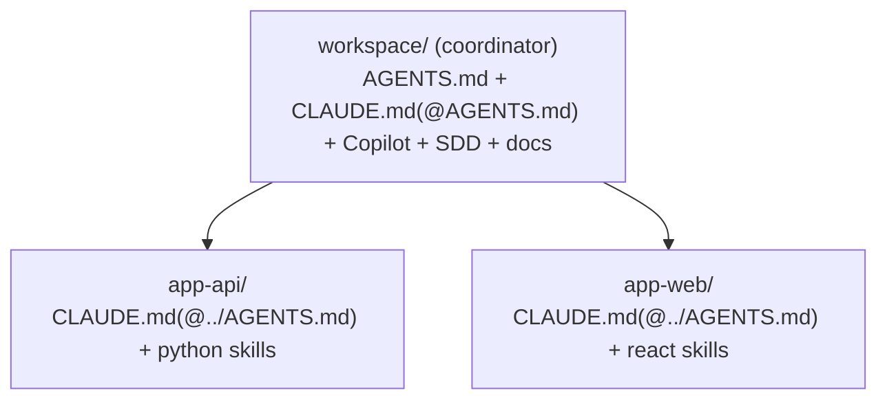

<!-- 🇬🇧 English (you are here) · [🇪🇸 Español](USAGE.es.md) -->

# Usage guide

> How to use the **`ai-workspace` CLI** day to day: configure a repo, maintain it, work in **multi-repo**, and
> distribute the result. For *how the output is installed*, see **[Distribution](DISTRIBUTION.md)**; for *how
> it works inside*, see **[Architecture](ARCHITECTURE.md)**.

The CLI is the workspace's **configuration and maintenance** tool. Once a repo is set up, **you don't need to
memorize commands**: you talk to the AI in plain language and it applies the right flow (SDD, commits, etc.).
You use the CLI to bootstrap (`init`), to regenerate after editing rules (`sync`), and for one-off tasks (add
a module, upgrade templates, package).

## Requirements & install

**Node.js ≥ 20** and VS Code with Copilot and/or Claude Code and/or Codex. The package is
`ai-workspace-generator`; the installed command is **`ai-workspace`**.

**Easy (recommended) — prebuilt tarball from the latest GitHub Release** (no clone, no build):

```bash
npm i -g https://github.com/grojof/ai-workspace-generator/releases/latest/download/ai-workspace-generator.tgz
ai-workspace --version
```

**Expert / from source:**

```bash
git clone https://github.com/grojof/ai-workspace-generator.git
cd ai-workspace-generator
npm install && npm run build && npm link
```

**Update:** re-run the easy install to get the newest release, or `git pull && npm run build` from source.

> **AI-guided install.** No Node/git yet? Tell your AI assistant *"install ai-workspace from &lt;repo URL&gt;"*
> and let it check prerequisites and guide the per-OS setup (it asks before installing anything). A truly
> Node-less standalone binary is planned as a separate change.
>
> **Cutting a release (maintainers).** `node scripts/release.mjs` builds + packs the tarball and prints the
> `gh release create` command without publishing (Safety gate); add `--publish` to create the Release.

## Typical workflow

```bash
cd /path/to/your-repo
ai-workspace init        # 1) wizard: auto-detect the stack, write workspace.config.yaml, generate everything
                         # 2) open the repo in VS Code (Copilot), Claude Code or Codex
# … edit rules in AGENTS.md (outside the markers) or change workspace.config.yaml …
ai-workspace sync        # 3) regenerate the artifacts (idempotent: no noise, your text is preserved)
ai-workspace doctor      # 4) lint: token budget, artifacts present, orphaned blocks
```

After `init`, read **`AI-WORKSPACE.md`**: the index of everything generated.

> **Idempotency.** Re-running `sync` must not create or update anything if the config didn't change. Text you
> write **outside** the `ai-workspace:begin/end` markers always survives regeneration.

## Command reference

### `init` — setup wizard
Detects the stack, writes `workspace.config.yaml` and renders the artifacts.

| Option | Effect |
|--------|--------|
| `--simple` | Few questions + sensible defaults; **accepts the detected stack**. |
| `--advanced` | Full wizard (control every layer). |
| `-y, --yes` | Accept defaults where possible (implies `--simple`, non-interactive). |
| `--from <paths...>` | Existing company material to ingest (recorded for `import`). |

Mode resolution: `--advanced` → advanced; `--simple`/`--yes` → simple; otherwise it asks (Simple
preselected). The richest path is the AI-guided `/configure` skill inside the editor.

### `detect` — detect the stack (read-only)
Reads manifests (`package.json`, `pyproject.toml`, …) and **writes nothing**.

```bash
ai-workspace detect          # human-readable summary
ai-workspace detect --json   # deterministic JSON (seed for the configure-workspace skill / tooling)
```

### `sync` — regenerate
Re-renders all artifacts from `workspace.config.yaml`. Idempotent.

### `doctor` — lint the workspace
Checks the `AGENTS.md` token budget, adapter presence (incl. each child repo's `CLAUDE.md` in multi-repo),
known MCPs and orphaned managed blocks.

### `add` / `remove` — modules
Add or remove a module and regenerate. `type` ∈ `language | framework | environment | mcp`; `id` from the
catalog (see `list`).

```bash
ai-workspace add language go
ai-workspace add framework nextjs --module-version 15
ai-workspace add environment docker
ai-workspace remove framework nextjs
```

### `list` — config + catalog
Shows the current config and the module catalog (enabled vs available), read from the **registry**
(`src/modules/registry.ts`, the single source).

### `import` — ingest existing material
Ingests folders with your own material and prepares a context7 reconciliation checklist.

```bash
ai-workspace import ./internal-docs ./conventions
```

### `upgrade` — update templates
Re-renders with the latest templates, showing a diff first.

```bash
ai-workspace upgrade --check   # preview without writing
ai-workspace upgrade           # apply
```

> Upgrading templates or dependencies is a **deliberate** change (Safety gate). Review the diff.

### `package` — package for distribution
Projects the workspace into a **Claude Code plugin** + **private marketplace** (this repo) + **per-skill
zips** to upload to a claude.ai organization. In multi-repo it **aggregates** every repo's skills. Detail and
install in **[Distribution](DISTRIBUTION.md)**.

### `skills sync` — update vendored skill-packs
Pulls the upstream skill source (e.g. `agent-skills`) at a pinned ref and diffs against the vendored base.
Dry-run unless `--apply`.

```bash
ai-workspace skills sync                         # dry-run, latest upstream tag
ai-workspace skills sync --source agent-skills --ref v1.2.3 --apply
```

## The `workspace.config.yaml` file

It is the **single input**. `AGENTS.md` is the canonical output; everything else is an idempotent projection.
Main fields (full schema and defaults in `src/config/schema.ts`):

```yaml
project:
  name: My Project
  mode: existing        # new = greenfield (stable versions) | existing = conservative
  purpose: build        # build = software | learn = tutor workspace
profile:
  userType: technical   # business | technical
  experience: advanced  # beginner | standard | advanced
company: none           # none | example (or your own org as an overlay)
targets: [claude, copilot]   # claude | copilot | codex (one or more)
vscode: true            # generate .vscode/ (extensions/settings/mcp); false for Visual Studio / non-VS-Code
language: es            # language of human-facing content (the AI always consumes English)
stack:
  languages:   [{ id: typescript, version: latest }]
  frameworks:  [{ id: react, version: latest }]
  environments:[{ id: node-runtime, version: latest }]
sdd:
  enabled: true
  backend: files        # files | hybrid | none
  schema: lean          # lean | reasons
  methodology: sdd      # sdd | spdd  (spdd ⇒ schema: reasons)
distribution:           # stable identity for `package` (optional)
  plugin: acme-ai-workspace
  marketplace: acme-tools
  owner: Acme IT
mcp: [context7]
skills: []              # explicit list = allow-list; empty = all recommended
workflow:
  safetyGate: true
  commits: { conventional: true, coAuthor: false, automate: with-approval, gitHook: true }
  hooks: { safetyGuard: off }   # off | warn | block (PreToolUse hook, opt-in)
livingDocs: true
repos: []               # multi-repo (see below)
```

> **Language policy:** everything the AI consumes (`AGENTS.md`, skills, routing) is **always English**;
> `language` only governs human-facing content (`AI-WORKSPACE.md`, `docs/`).

## Targets (which AI tools) and editors

`targets` decides which adapters are generated (one or more):

| Target | What it gets | Notes |
|--------|-------------|-------|
| `claude` | `CLAUDE.md` (imports `@AGENTS.md`) + `.claude/` skills + `.mcp.json` | Claude Code |
| `copilot` | `.github/copilot-instructions.md` + `instructions/*.instructions.md` (+ `.vscode/mcp.json` if `vscode`) | **Works in VS Code and Visual Studio** |
| `codex` | **`AGENTS.md` is its instructions file** (native) + `.codex/config.toml` (MCP) | OpenAI Codex (CLI/IDE), cross-platform |
| `opencode` | **`AGENTS.md` + `.claude/skills/` read natively** + `.opencode/opencode.json` (MCP, only if configured) | [OpenCode](https://opencode.ai) (open-source TUI), cross-platform |

- `AGENTS.md` is always generated (the single source of truth **and** the native adapter for Codex *and*
  OpenCode). With `targets: [codex]` or `[opencode]` you get `AGENTS.md` + that tool's MCP file only, no
  `CLAUDE.md` or Copilot files.
- **`vscode: false`** skips the whole `.vscode/` folder — useful on **Visual Studio**, **OpenCode** (a TUI) or
  anywhere outside VS Code.

### GitHub Copilot in Visual Studio
Visual Studio 2022 (17.10+) reads the same files generated by the `copilot` target. Enable it once:
**Tools → Options → GitHub → Copilot → Copilot Chat → "Enable custom instructions to be loaded from
.github/copilot-instructions.md files and added to requests"**. From then on it reads
`.github/copilot-instructions.md`, `.github/instructions/*.instructions.md` (with `applyTo`) and
`.github/prompts/*.prompt.md`.

### OpenAI Codex
Codex reads `AGENTS.md` natively (no adapter of its own needed). If you enable the `codex` target, a
`.codex/config.toml` is also generated with project-level MCP servers (e.g. context7). The Codex CLI is
terminal-based and cross-platform, so it coexists with any IDE (including Visual Studio).

### OpenCode
[OpenCode](https://opencode.ai) is an open-source, provider-agnostic terminal agent. Most of what this
generator produces works there **with no extra files**:

- **Instructions:** OpenCode reads `AGENTS.md` natively (it's in its default `instructions`), so the full
  layered governance applies as-is.
- **Skills:** OpenCode discovers skills from `.claude/skills/<name>/SKILL.md` (a Claude-compatible path it
  searches by default) — the same folder the `claude` target already emits. **Reused as-is, nothing extra is
  generated.** Enable the `claude` target too if you want those skills on disk.
- **MCP:** the only piece OpenCode needs is the server config. The `opencode` target writes a **dedicated,
  tool-owned `.opencode/opencode.json`** with just `$schema` + `mcp`. OpenCode **deep-merges** config across
  scopes, so this file combines with your own `opencode.json` instead of overwriting it.

**Things to keep in mind with OpenCode:**
- `.opencode/opencode.json` is **regenerated by `sync`** — put *your* OpenCode settings (model, theme, agents,
  permissions…) in the project root `opencode.json` (or the global `~/.config/opencode/`), which merges on top.
  Don't hand-edit the generated file; it only carries `mcp`.
- It only contains `$schema` and `mcp` on purpose — OpenCode raises a `ConfigInvalidError` on unknown
  top-level keys.
- If you don't use MCP, **no `.opencode/opencode.json` is written** — `AGENTS.md` alone is enough.
- Slash commands (`/sdd-*`, `/commit`, …) are **not** projected to OpenCode's command format (yet). You can
  still trigger those flows in natural language, or define your own under `.opencode/command/`.

## Multi-repo

One workspace can govern **more than one repo** via the optional `repos[]` array. Empty = single-repo (this
directory). It is **additive**: single-repo configs are unaffected.

```yaml
# workspace.config.yaml at the workspace root
project: { name: Platform }
repos:
  - path: app-api
    stack: { languages: [{ id: python, version: "3.12" }] }
  - path: app-web
    stack: { frameworks: [{ id: react, version: latest }] }
```

`resolveRepos()` normalizes both cases. Each repo has its **effective stack** (its own `stack` or the root's).

### What is generated, and where

- **The root is the coordinator.** It generates the **single source of truth** and all workspace-level output,
  composed over the **union** of every repo's stack: `AGENTS.md`, a `CLAUDE.md` bridge (`@AGENTS.md`), Copilot
  instructions, `.mcp.json`/settings, the SDD module, **workflow** skills (sdd/secure-commit…), **non-stack**
  packs, living docs and governance.
- **Each child repo** gets its Claude adapter: a `CLAUDE.md` that **imports** the root's (`@../AGENTS.md`) and
  the **stack skill-packs** for its stack (discovered natively by Claude Code when working in that subfolder).



> **Working model:** open the **workspace root** in your editor. Claude Code loads the root `CLAUDE.md` and
> discovers each child's `.claude/skills` on demand; Copilot reads the single root file.

### Distribution in multi-repo
`ai-workspace package` **aggregates** the root's **and** each child's skills, commands and subagents into a
single **umbrella plugin** (de-duped by id, first-wins), with its org zips. One install covers the whole
workspace. See **[Distribution](DISTRIBUTION.md)**.

> **Capability notes** (verified in the Claude Code docs): Claude Code reads `CLAUDE.md` (not `AGENTS.md`)
> hierarchically and discovers nested `.claude/skills/`, so its adapter is per-repo. **GitHub Copilot**, in
> contrast, reads a single workspace-root `.github/copilot-instructions.md` (no nested discovery), so its
> guidance is workspace-level (covering the union of stacks).

## Safety & commits

- **Safety gate:** on a version change, a migration, or a conflict with multiple plausible outcomes, the AI
  **stops and asks**. Validation/security is never weakened to "make it work".
- **Commits:** Conventional Commits with your git identity, **no** `Co-Authored-By`; the AI commits only after
  your approval. The `commit-msg` hook (`.githooks/`) enforces it: activate once with
  `git config core.hooksPath .githooks`.

## Sources (official Claude docs, verified)

- [Memory / CLAUDE.md imports](https://code.claude.com/docs/en/memory) · [Skills](https://code.claude.com/docs/en/skills)
- [Create plugins](https://code.claude.com/docs/en/plugins) · [Plugin marketplaces](https://code.claude.com/docs/en/plugin-marketplaces)
- [Provision and manage skills for your organization](https://support.claude.com/en/articles/13119606-provision-and-manage-skills-for-your-organization)
- [Codex AGENTS.md](https://developers.openai.com/codex/guides/agents-md) · [Codex MCP](https://developers.openai.com/codex/mcp) · [Copilot in Visual Studio](https://learn.microsoft.com/en-us/visualstudio/ide/copilot-chat-context)
