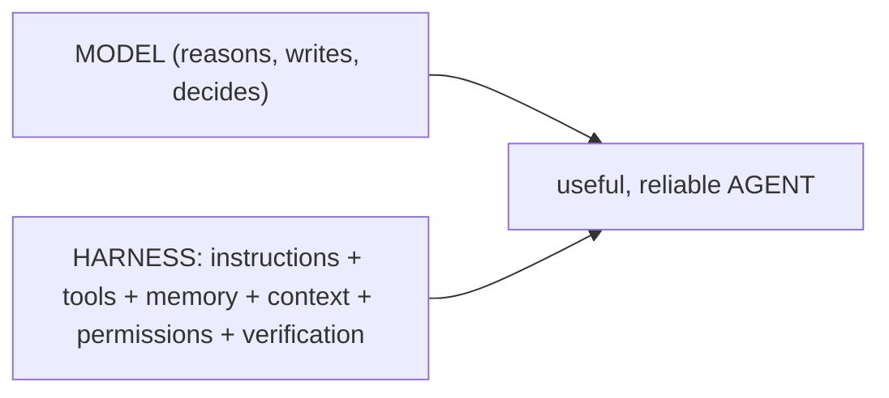

# Harness Engineering

The philosophy behind this generator. Summary in the [README](../../README.md); the full development is here.

## What it is

The core idea (Viv Trivedy, popularized by Addy Osmani [[H1]]): **`Agent = Model + Harness`**. The *harness*
is **everything around the model** that makes it work reliably — instructions, tools, permissions, memory, the
context it receives at each step, hooks, verification. The model is the "engine"; the harness is the chassis,
the steering and the brakes.

**Harness Engineering** = treating that harness as an **engineering artifact** you design, measure and tune —
not as loose prompts. The thesis: *"a decent model with a great harness beats a great model with a bad
harness"* [[H1]]. And the corollary (HumanLayer): when the agent fails, *"it's not a model problem, it's a
configuration problem"*.

## The dimensions of a harness

The pieces ([H1] + the *awesome-harness-engineering* list [[H4]]): **Prompts/Instructions** (system prompt,
`AGENTS.md`, skills) · **Tools/Integration** (tools, skills, MCP, bash) · **Infrastructure** (filesystem, git,
sandbox) · **Memory/Learning** · **Context management** (compaction, progressive disclosure) ·
**Orchestration** (subagents, handoffs, routing) · **Execution control** (hooks, deterministic logic) ·
**Verification** (tests, self-eval, observability).

## Its heart: Context Engineering

The most important sub-discipline ([Anthropic][H2]): *"the set of strategies for curating the optimal set of
tokens during inference"*. Context is a **finite resource** with diminishing returns (attention degrades as
tokens grow — *"context rot"*). The mandate: **"the smallest set of high-signal tokens that achieve the
desired outcome"**. Techniques:

- **Right altitude** for the system prompt: neither hard-coded logic nor vagueness.
- **Progressive disclosure:** load skills/`references/` by *trigger*, not all at once.
- **Just-in-time:** fetch data on the fly (context7), don't pre-load.
- **Compaction** and **structured note-taking:** summarize and keep state outside the window.
- **Subagents:** return a distilled summary, not their whole context.

## How a harness should grow: the ratchet principle

*"Every line of a good `AGENTS.md` should trace back to something concrete that went wrong"* [[H1]]. You add a
rule **only after an observed failure**; and when the agent slips, you **tighten the harness** (a skill, a
hook, a description) rather than piling on prose. Another maxim: *"success is silent, failures are verbose"*.
This avoids the *instruction bloat* that breaks the "right altitude". It is an always-on Layer-0 principle in
generated workspaces (`templates/core/harness-engineering.md.eta`).

## The "aha": this repo **is** a harness generator

`ai-workspace-generator` doesn't generate "configuration" — it generates **harnesses**. Each piece maps to a
dimension:

| Harness dimension | What the repo already does |
|---|---|
| Prompts / right altitude | lean `AGENTS.md` + `tokenBudget` + `doctor` watching the budget |
| Progressive disclosure | `SKILL.md` skills + on-demand `references/`; `loadMode` |
| Just-in-time | context7 (MCP) for living docs; the "the CLI never calls MCP" rule |
| Memory / note-taking | living docs (`PROJECT-STATE.md`) + `/aiws-doc-sync` |
| Tools with a clear purpose | skill catalog and routing by *trigger* |
| Execution control | `commit-msg` hook (git), **safety-guard** (PreToolUse Bash, opt-in: warns/blocks force-push, `rm -rf`, migrations), `/aiws-doc-sync` Stop hook |
| Verification | `doctor`, the invariant tests (Phase 1 contracts, [ADR 0002](decisions/0002-extension-contracts.md)) |
| Permissions / guardrails | the Safety gate (Layer 0) |

That's why adopting Harness Engineering **was not new machinery**: it **made explicit** a posture the repo
already practiced, and gave it a **governance rule** (the ratchet).

## In one sentence

**Prompt engineering** tunes *a question*. **Context engineering** tunes *what the model sees at each step*.
**Harness Engineering** is the larger discipline: designing and tuning **the whole environment** as
engineering — because there, not in the model, lives most of the difference between a mediocre agent and a
reliable one.

> Relationship to SDD/SPDD: the **methodology** ([Methodologies](methodologies.md)) is *how* you take a change
> from idea to code; the **harness** is *the environment* where the agent executes that methodology. The
> ratchet principle governs both.

## Sources
- [H1] Addy Osmani — *Agent Harness Engineering*, 2026-04-19. https://addyosmani.com/blog/agent-harness-engineering/ (Viv Trivedy's equation; HumanLayer).
- [H2] Anthropic — *Effective context engineering for AI agents*, 2025-09-29. https://www.anthropic.com/engineering/effective-context-engineering-for-ai-agents
- [H3] Anthropic — *Effective harnesses for long-running agents*, 2025-11-26. https://www.anthropic.com/engineering/effective-harnesses-for-long-running-agents
- [H4] *awesome-harness-engineering* (GitHub) — taxonomy of dimensions.
