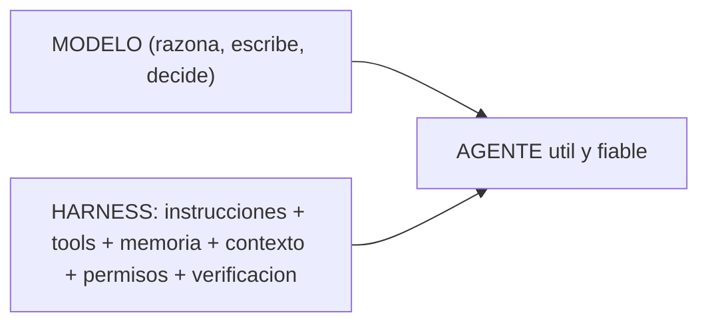

# Harness Engineering

La filosofía que sostiene este generador. Resumen en el [README](../../README.md#filosofía-esto-es-harness-engineering);
aquí el desarrollo extendido.

## Qué es

La idea central (Viv Trivedy, popularizada por Addy Osmani [[H1]]): **`Agente = Modelo + Harness`**. El
*harness* (arnés) es **todo lo que rodea al modelo** para que trabaje de forma fiable —instrucciones,
herramientas, permisos, memoria, el contexto que recibe en cada paso, hooks, verificación. El modelo es el
"motor"; el harness es el chasis, la dirección y los frenos.

**Harness Engineering** = tratar ese arnés como **artefacto de ingeniería** que diseñas, mides y afinas —
no como prompts sueltos. La tesis: *"un modelo decente con un gran harness le gana a un gran modelo con un
mal harness"* [[H1]]. Y el corolario (HumanLayer): cuando el agente falla, *"no es un problema del modelo,
es un problema de configuración"*.

## Las dimensiones de un harness

Las piezas ([H1] + la lista *awesome-harness-engineering* [[H4]]): **Prompts/Instrucciones** (system
prompt, `AGENTS.md`, skills) · **Tools/Integración** (tools, skills, MCP, bash) · **Infraestructura**
(filesystem, git, sandbox) · **Memoria/Aprendizaje** · **Gestión de contexto** (compaction, disclosure
progresivo) · **Orquestación** (subagentes, handoffs, routing) · **Control de ejecución** (hooks, lógica
determinista) · **Verificación** (tests, self-eval, observabilidad).

## Su corazón: Context Engineering

La sub-disciplina más importante ([Anthropic][H2]): *"el conjunto de estrategias para curar el conjunto
óptimo de tokens durante la inferencia"*. El contexto es un **recurso finito** con rendimientos
decrecientes (la atención se degrada al crecer los tokens — *"context rot"*). El mandato: **"el menor
conjunto de tokens de alta señal que logren el resultado deseado"**. Técnicas:

- **Altura justa ("right altitude")** del system prompt: ni lógica hard-codeada ni vaguedad.
- **Disclosure progresivo:** carga skills/`references/` por *trigger*, no todo de golpe.
- **Just-in-time:** recupera datos al vuelo (context7), no pre-cargues.
- **Compaction** y **structured note-taking:** resume y guarda estado fuera de la ventana.
- **Subagentes:** devuelven un resumen destilado, no su contexto entero.

## Cómo debe crecer un harness: el ratchet principle

*"Cada línea de un buen `AGENTS.md` debería poder rastrearse a algo concreto que salió mal"* [[H1]].
Añades una regla **solo tras un fallo observado**; y cuando el agente patina, **aprietas el harness** (una
skill, un hook, una descripción) en vez de amontonar prosa. Otra máxima: *"el éxito es silencioso, los
fallos son verbosos"*. Esto evita el *instruction bloat* que rompe la "altura justa". Es un principio
Layer-0 always-on en los workspaces generados (`templates/core/harness-engineering.md.eta`).

## El "aha": este repo **es** un generador de harnesses

`ai-workspace-generator` no genera "configuración" — genera **harnesses**. Cada cosa mapea a una dimensión:

| Dimensión del harness | Lo que el repo ya hace |
|---|---|
| Prompts / altura justa | `AGENTS.md` lean + `tokenBudget` + `doctor` que vigila el presupuesto |
| Disclosure progresivo | skills `SKILL.md` + `references/` on-demand; `loadMode` |
| Just-in-time | context7 (MCP) para docs vivas; regla "el CLI nunca llama a MCP" |
| Memoria / note-taking | living docs (`PROJECT-STATE.md`) + `/doc-sync` |
| Tools con propósito claro | catálogo y routing de skills por *trigger* |
| Control de ejecución | hook `commit-msg` (git), **safety-guard** (PreToolUse Bash, opt-in: avisa/bloquea force-push, `rm -rf`, migraciones), Stop hook de `/doc-sync` |
| Verificación | `doctor`, los tests-invariante (contratos Fase 1, [ADR 0002](decisions/0002-extension-contracts.md)) |
| Permisos / guardarraíles | el Safety gate (Layer 0) |

Por eso adoptar Harness Engineering
**no fue maquinaria nueva**: fue **hacer explícita** una postura que el repo ya practicaba, y darle una
**regla de gobierno** (el ratchet).

## En una frase

**Prompt engineering** afina *una pregunta*. **Context engineering** afina *qué ve el modelo en cada paso*.
**Harness Engineering** es la disciplina mayor: diseñar y afinar **todo el entorno** tratándolo como
ingeniería — porque ahí, no en el modelo, está la mayor parte de la diferencia entre un agente mediocre y
uno fiable.

> Relación con SDD/SPDD: la **metodología** ([Metodologías](methodologies.md)) es *cómo* llevas un cambio
> de la idea al código; el **harness** es *el entorno* donde el agente ejecuta esa metodología. El ratchet
> principle gobierna ambos.

## Fuentes
- [H1] Addy Osmani — *Agent Harness Engineering*, 19-abr-2026. https://addyosmani.com/blog/agent-harness-engineering/ (ecuación de Viv Trivedy; HumanLayer).
- [H2] Anthropic — *Effective context engineering for AI agents*, 29-sep-2025. https://www.anthropic.com/engineering/effective-context-engineering-for-ai-agents
- [H3] Anthropic — *Effective harnesses for long-running agents*, 26-nov-2025. https://www.anthropic.com/engineering/effective-harnesses-for-long-running-agents
- [H4] *awesome-harness-engineering* (GitHub) — taxonomía de dimensiones.
