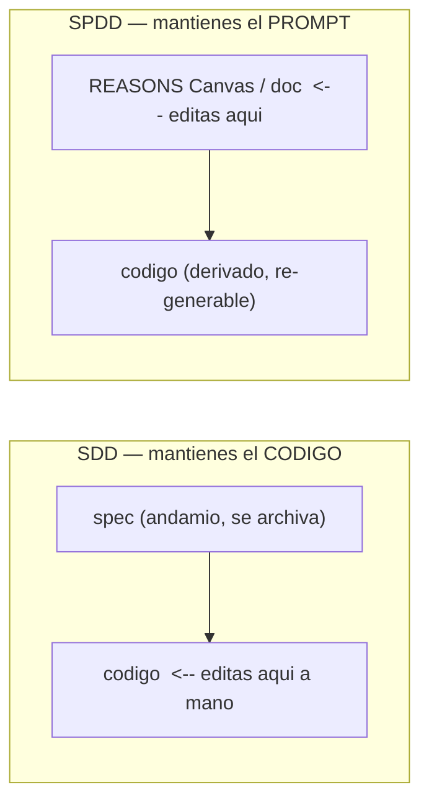
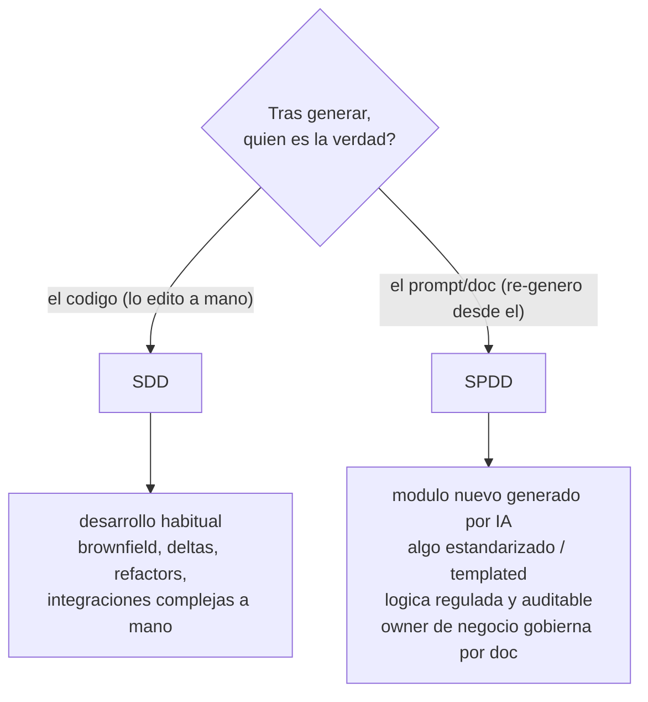

# Metodologías: SDD vs SPDD

El bloque `sdd` de los workspaces generados admite dos **metodologías** (`sdd.methodology`). Las dos son
"intención antes que código" y guardan los artefactos en git; la diferencia real es **dónde editas cuando
llega un cambio** y, por tanto, **dónde vive la verdad**.

> Resumen en una frase: **SDD** → el spec es un andamio y luego **mantienes el código**; **SPDD** → el
> **prompt (REASONS Canvas / doc) es la fuente** y el código es su salida que **re-derivas**.

## La analogía

Como en *Infraestructura como Código*: no entras al servidor a tocar a mano, editas el fichero
declarativo y **re-aplicas**. SPDD es eso para la lógica — el prompt es el "código-fuente" y el código es
un artefacto derivado que regeneras.



## Ejemplo end-to-end: "login con bloqueo tras 5 intentos fallidos"

**Construcción inicial** — ambos se parecen: capturas la intención y generas código + tests.

**Llega un cambio:** *"el bloqueo debe durar 15 min y hay que avisar al equipo de seguridad."*

| Paso | **SDD** | **SPDD** |
|---|---|---|
| ¿Qué tocas? | **el código** (`auth.ts`): añades la ventana de 15 min y la notificación; actualizas tests | **la doc/Canvas**: añades a *Operations* "ventana 15 min" y a *Safeguards* "notificar a seguridad" |
| ¿Y el spec/prompt? | el spec original queda **histórico**; ya no es la verdad | el Canvas **es** la verdad: *fix the prompt first*, luego re-derivas el código desde la doc |
| Invocación típica | "implementa este cambio en el login" (editas código) | "revisa el README/Canvas, detecta los cambios y aplícalos al código" |
| 6 meses después | **lees el código** para saber qué hace | **lees la doc**: refleja la intención actual completa (incl. normas/salvaguardas), **auditable** |
| Revisión | el **diff de código** | el **cambio de intención** (doc) y luego el código |

> ✅ **Estado en este generador** (con `methodology: spdd`):
> el lazo está **cableado** y es **propose-and-review**: **lógica/comportamiento** → editas el Canvas y
> propagas con la skill **sdd-code-maintenance**; **refactor/drift** → **`/sdd-sync`** (skill
> **sdd-spec-sync**) pliega el código de vuelta al Canvas y reporta deriva. Propone diffs; **tú apruebas** —
> nunca reescribe en silencio (Safety gate + *human review load-bearing*).

## Otro caso (regulado)

Un **módulo de cálculo de descuentos / impuestos / cumplimiento**: cuando cambia la norma, editas
*Safeguards/Operations* del Canvas y **regeneras**. Queda **auditable** quién cambió qué intención y
cuándo — la doc es la fuente de verdad legal, no el código.

## Cuándo cada uno



- **SDD (por defecto):** la mayoría del trabajo. Código afinado a mano, cambios como *deltas*, el código
  manda tras implementar. Es lo que usa este propio generador.
- **SPDD (selectivo):** módulos que **nacen** de un prompt y quieres poder **regenerar**; lógica
  **estandarizada** (familias de endpoints/CRUD desde un Canvas plantilla, apoyados en skills con
  templates/snippets); dominios **regulados** donde la intención debe quedar auditable y sin deriva; o
  cuando un **perfil de negocio** mantiene el "qué" desde una doc legible en vez de tocar código.

## Aviso sobre adopción

SPDD luce **al nacer** un componente (greenfield, "el código nace del prompt"). Retrofitear **código
maduro hecho a mano** a SPDD es la dirección **más cara**: habría que reconstruir un Canvas que regenere
fielmente lo existente y, sobre todo, **comprometerse al lazo** (tocar siempre el prompt primero) sin
volver a editar el código a mano. SPDD **no es autopiloto**: sigue requiriendo que un humano edite el
prompt y revise.

## En la config

```yaml
sdd:
  methodology: sdd   # o spdd
  schema: lean       # spdd fuerza 'reasons' (el REASONS Canvas es su artefacto)
```

`methodology` (flujo) y `sdd.schema` (profundidad del spec) son **ortogonales**; `spdd ⇒ reasons` se
normaliza en `ConfigSchema`. SPDD reutiliza la familia `/sdd-*` y las skills `reasons` — no es un fork.
Ver [ARCHITECTURE](ARCHITECTURE.md) y el [ADR 0002](decisions/0002-extension-contracts.md). Fuente del
método: [SPDD, Thoughtworks/Fowler](https://martinfowler.com/articles/structured-prompt-driven/).
