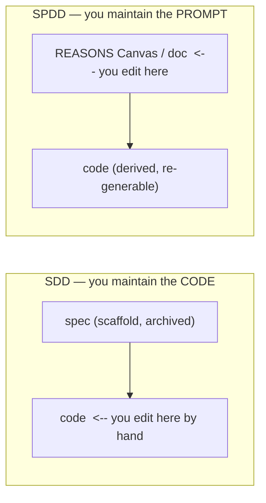
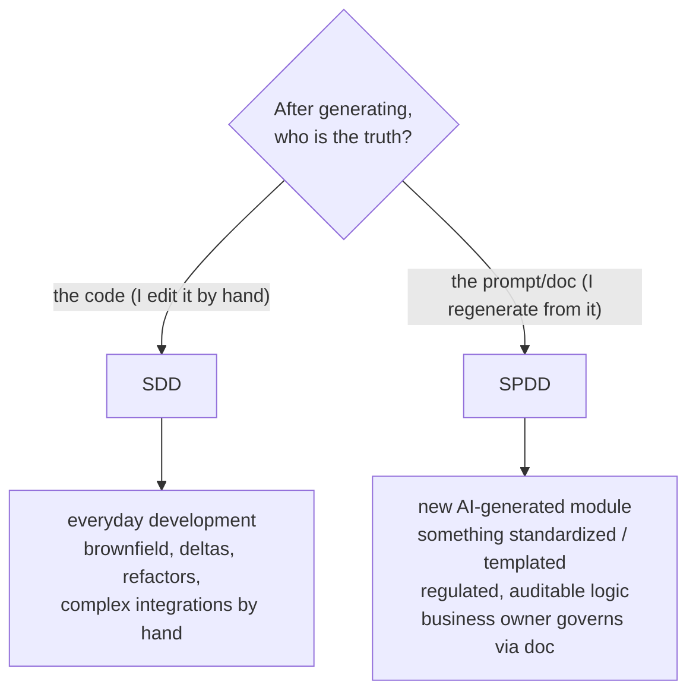

# Methodologies: SDD vs SPDD

The `sdd` block of generated workspaces supports two **methodologies** (`sdd.methodology`). Both are "intent
before code" and store their artifacts in git; the real difference is **where you edit when a change arrives**
and, therefore, **where the truth lives**.

> One-sentence summary: **SDD** → the spec is scaffolding and then you **maintain the code**; **SPDD** → the
> **prompt (REASONS Canvas / doc) is the source** and the code is its output that you **re-derive**.

## The analogy

Like *Infrastructure as Code*: you don't SSH into the server to tweak things by hand, you edit the
declarative file and **re-apply**. SPDD is that for logic — the prompt is the "source code" and the code is a
derived artifact you regenerate.



## End-to-end example: "login with lockout after 5 failed attempts"

**Initial build** — both look alike: you capture the intent and generate code + tests.

**A change arrives:** *"the lockout should last 15 min and the security team must be notified."*

| Step | **SDD** | **SPDD** |
|---|---|---|
| What do you touch? | **the code** (`auth.ts`): add the 15-min window and the notification; update tests | **the doc/Canvas**: add "15-min window" to *Operations* and "notify security" to *Safeguards* |
| And the spec/prompt? | the original spec becomes **historical**; no longer the truth | the Canvas **is** the truth: *fix the prompt first*, then re-derive the code from the doc |
| Typical invocation | "implement this change in the login" (you edit code) | "review the README/Canvas, detect the changes and apply them to the code" |
| 6 months later | **you read the code** to know what it does | **you read the doc**: it reflects the full current intent (incl. rules/safeguards), **auditable** |
| Review | the **code diff** | the **intent change** (doc) and then the code |

> ✅ **State in this generator** (with `methodology: spdd`): the loop is **wired** and is
> **propose-and-review**: **logic/behavior** → edit the Canvas and propagate with the **sdd-code-maintenance**
> skill; **refactor/drift** → **`/sdd-sync`** (the **sdd-spec-sync** skill) folds the code back into the
> Canvas and reports drift. It proposes diffs; **you approve** — it never rewrites silently (Safety gate +
> *human review load-bearing*).

## Another case (regulated)

A **discount / tax / compliance calculation module**: when the rule changes, you edit *Safeguards/Operations*
of the Canvas and **regenerate**. It stays **auditable** who changed which intent and when — the doc is the
legal source of truth, not the code.

## When to use each



- **SDD (default):** most of the work. Hand-tuned code, changes as *deltas*, the code rules after
  implementing. It's what this generator itself uses.
- **SPDD (selective):** modules that **are born** from a prompt and you want to be able to **regenerate**;
  **standardized** logic (families of endpoints/CRUD from a template Canvas, backed by skills with
  templates/snippets); **regulated** domains where intent must stay auditable and drift-free; or when a
  **business profile** maintains the "what" from a readable doc instead of touching code.

## A note on adoption

SPDD shines **at birth** of a component (greenfield, "the code is born from the prompt"). Retrofitting
**mature, hand-written code** to SPDD is the **most expensive** direction: you'd have to rebuild a Canvas that
faithfully regenerates what exists and, above all, **commit to the loop** (always touch the prompt first)
without editing the code by hand again. SPDD **is not autopilot**: it still requires a human to edit the
prompt and review.

## In the config

```yaml
sdd:
  methodology: sdd   # or spdd
  schema: lean       # spdd forces 'reasons' (the REASONS Canvas is its artifact)
```

`methodology` (flow) and `sdd.schema` (spec depth) are **orthogonal**; `spdd ⇒ reasons` is normalized in
`ConfigSchema`. SPDD reuses the `/sdd-*` family and the `reasons` skills — it is not a fork. See
[ARCHITECTURE](ARCHITECTURE.md) and [ADR 0002](decisions/0002-extension-contracts.md). Method source:
[SPDD, Thoughtworks/Fowler](https://martinfowler.com/articles/structured-prompt-driven/).
