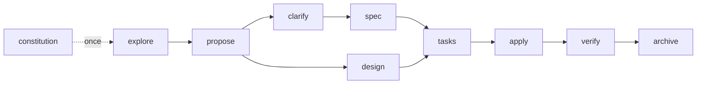

<!-- ai-workspace:begin:header -->
# t — AI Agent Guide (AGENTS.md)

This file is the **single source of truth** for AI agents (Claude Code, GitHub Copilot, Cursor…).
Tool-specific files (`CLAUDE.md`, `.github/copilot-instructions.md`) are generated adapters that
mirror or import this content — **edit rules here**, then run `ai-workspace sync`.

Sections between `ai-workspace:begin/end` markers are generated. Add your own notes **outside** them;
they survive regeneration.
<!-- ai-workspace:end:header -->

<!-- ai-workspace:begin:core -->
## Universal conventions (Layer 0)

These apply to every contributor and every file, regardless of language.

### Encoding & line endings
- Files are **UTF-8**, no BOM. Newlines are **LF**. Final newline at EOF.
- `.editorconfig` and `.gitattributes` enforce this — do not fight them.

### Commits
- **Conventional Commits** in the **imperative mood**: `feat:`, `fix:`, `refactor:`, `docs:`, `test:`, `chore:`.
- Subject ≤ 72 chars, present tense ("add", not "added"). Explain the *why* in the body.
- One logical change per commit. Do not mix refactors with behavior changes.

### Code style
- Match the surrounding code: naming, structure, comment density, idioms.
- Names are descriptive and in **English**. No abbreviations that aren't standard.
- Keep functions small and single-purpose. Prefer early returns over deep nesting.
- No dead code, no commented-out blocks, no leftover debug logging.

### Reviews & safety
- Never commit secrets. Never weaken auth, validation, or escaping to "make it work".
- Validate inputs at boundaries. Handle errors explicitly — no silent catches.
- Changes that are hard to reverse or outward-facing need explicit confirmation.

### Token efficiency (how agents should work here)
- **Reference, don't duplicate.** Link to skills/docs instead of restating them.
- Load detail on demand: read scoped instructions/skills only when relevant.
- Prefer the living docs (`docs/development/status/PROJECT-STATE.md`) over re-scanning the whole repo.
- Use **context7** (MCP) for up-to-date, version-pinned library docs instead of guessing.
- **Offer, don't dump.** When extra explanation is optional, offer "say **X** and I'll explain X" instead of long unsolicited detail.

### Diagrams
- Use **Mermaid** for architecture, data flow, module dependencies and the SDD lifecycle.
- Keep diagrams in `docs/development/status/ARCHITECTURE.md`; regenerate with `/aiws-doc-sync`.
- **Always quote node labels** that contain special characters (`/`, `.`, `:`, `+`, `@`, `·`, `*`, `()`, `&`, ` `): write `A["src/index.ts entry"]`, never `A[src/index.ts entry]`. Unquoted special characters cause flaky rendering across Mermaid versions (e.g. GitHub's intermittent `translate(undefined, NaN)` error).
<!-- ai-workspace:end:core -->

<!-- ai-workspace:begin:profile -->
## User profile (Layer 0 — governance posture)

Active profile: **technical** · **standard**. Apply this posture by
default. It tunes guidance and verbosity — it never overrides the Safety gate, idempotency, or commit policy.

**As a technical user:**
- Prioritize precision, maintainability, architecture, testing, security and performance.
- Use the full technical flow (SDD, living docs, context7) and keep Claude Code / VS Code / Copilot parity.
- Require explicit confirmation for destructive changes, migrations, security, data, commits, critical
  dependencies and architecture decisions.

**At standard level:**
- Balance guidance and flexibility. Offer alternatives when they add real value.
- Ask when a decision affects design or maintainability; allow reasonable manual configuration.
- Keep protections on destructive changes, security, commits and sensitive data.
<!-- ai-workspace:end:profile -->

<!-- ai-workspace:begin:versioning -->
## Versioning policy (Layer 0)

This project is treated as **NEW (greenfield)**.

**New project — current and stable.**
- Choose **current stable** versions (prefer LTS where it exists), not bleeding-edge pre-releases.
- Pick versions that are **mutually compatible** across the whole dependency set; verify peer-dependency
  ranges before pinning.
- Pin versions explicitly and record them in `workspace.config.yaml`.

For exact, up-to-date version facts and compatibility, query **context7** for each library — do not guess.
<!-- ai-workspace:end:versioning -->

<!-- ai-workspace:begin:safety -->
## Safety gate (Layer 0)

Hard rules so the AI stays reliable and never "goes rogue" on risky changes.

**STOP and ask** before any of these — never do them silently as part of another task:
- Upgrading or downgrading a language/framework/package version.
- Running or writing a **migration** (data, schema, framework major).
- Resolving a **conflict** (merge, dependency, breaking API) where more than one outcome is plausible.
- Anything **irreversible or outward-facing** (deleting data, publishing, force-push, changing CI/CD).
- Touching auth, secrets, crypto, permissions, or input validation.

**When you hit one of the above:**
1. **Verify feasibility first.** Do not assume a migration/upgrade is possible. Check breaking changes,
   peer-dependency compatibility across the whole stack, and security advisories (use **context7**).
2. **Present options**, each with effort, risk, and what would need to be replaced.
3. **Recommend the best long-term option** explicitly, with the reasoning.
4. **Wait for the user's explicit decision.** Do not proceed on assumption.

**Security is never traded away.** Do not weaken validation, auth, or escaping to make something work or
to resolve a conflict. Never commit secrets. Flag vulnerable or unmaintained dependencies.

> If a request would require breaking these rules, say so and propose a safe alternative instead of
> complying silently.
<!-- ai-workspace:end:safety -->

<!-- ai-workspace:begin:workflow -->
## Development workflow (Layer 0) — **mandatory**

A single, structured way of working. This flow is **not optional**: do not skip
steps even if asked to "just do it quickly". If a shortcut is requested, explain the risk and follow the flow.

**The flow for any change**
1. **Non-trivial change** → use SDD: `/aiws-sdd-explore` → `/aiws-sdd-propose` → `/aiws-sdd-spec` + `/aiws-sdd-design` → `/aiws-sdd-tasks` → `/aiws-sdd-apply` → `/aiws-sdd-verify` → `/aiws-sdd-archive`.
2. **Small change** → implement directly, then run `/aiws-doc-sync`.
3. Honor the **Safety gate** above for anything risky.
4. **Commit** following the policy below.

**Commit policy**
- **Conventional Commits**, imperative mood (`feat:`, `fix:`, `refactor:`, `docs:`, `test:`, `chore:`). One logical change per commit.
- Commits are authored by the **user's own git identity**. Do **not** add `Co-Authored-By:` or any AI-attribution trailers.
- **Automate with approval:** after a completed change (spec-driven or small), prepare the commit and ask for confirmation; commit **only** once the user approves. Use the `/aiws-commit` command.
- Never use `--no-verify` or bypass hooks.

> Enforcement: a `commit-msg` git hook in `.githooks/` blocks disallowed commits. Activate once with
> `git config core.hooksPath .githooks`.
<!-- ai-workspace:end:workflow -->

<!-- ai-workspace:begin:harness-engineering -->
## Harness engineering (Layer 0)

This workspace **is the agent's harness** — the instructions, skills, tools and docs that shape the AI's
work. *Agent = model + harness*; tune the harness, not the model.

**Context is finite — spend it on the smallest set of high-signal tokens:**
- **Progressive disclosure.** Load skills/`references/` by trigger, on demand — not preemptively.
- **Just-in-time over preloaded.** Pull version-pinned facts via **context7**; don't guess or paste big docs.
- **Memory over recall.** Keep durable state in the living docs (`docs/development/status/*`), not the chat.
- **Clear, non-overlapping tools/skills.** If you can't tell which one applies, fix its description.

**The ratchet principle (how this file grows).** Every standing rule should trace to a **real, observed
failure**. When the agent slips, tighten the harness (a skill, a hook, a description) rather than appending
prose — keeping guidance at the **right altitude**: specific enough to steer, lean enough to stay read.

> Before adding to this file, ask: *what failure does this prevent?* If there isn't one, don't add it.
<!-- ai-workspace:end:harness-engineering -->

<!-- ai-workspace:begin:routing -->
## Intent routing (Layer 0)

**The user should not need to remember commands.** From plain language, detect the intent and apply the
right flow yourself. Slash commands (`/...`) and prompts are **optional manual shortcuts** — prefer doing
the work over telling the user to run a command (mention the command only as an aside).

| The user says (in any wording)… | You do… |
|---------------------------------|---------|
| "let's start this project / set the ground rules", and `docs/development/constitution.md` is still the seed | First establish the **constitution** (project principles) — Spec-Kit-style bootstrap, once — then proceed. |
| "let's build / add / implement <feature>", anything non-trivial | Run the **SDD flow** (explore → propose → **clarify** → spec → design → tasks → apply → verify → archive). It's a methodology, not a tool — artifacts are Markdown in `docs/development/`. |
| A small, well-understood change | Implement directly, then refresh living docs. |
| "update / upgrade / bump / migrate / install a newer version" | **Do NOT just do it.** Run the `aiws-dependency-upgrade` assessment first (feasibility + security), then await the decision. |
| "commit / save / guarda los cambios", or you just finished a change | Use the **aiws-secure-commit** flow: prepare a conventional commit, no co-author, and ask for approval before committing. |
| "I'm new / how does this work / explain SDD / how do I start" | Use the **aiws-workspace-guide**. |
| "set up the editor / which extensions / profiles" | Use the **aiws-vscode-setup** guidance. |
| Anything risky, a conflict, or version/migration change | Honor the **Safety gate**: stop, verify feasibility, recommend, await decision. |
| You finished a task and project state changed | Refresh the living docs (`docs/development/status/*`). |

When intent is ambiguous, ask one short clarifying question, then proceed. Never silently skip the
Safety gate or the commit policy because the user phrased a request casually.
<!-- ai-workspace:end:routing -->

<!-- ai-workspace:begin:skill-routing -->
## Skill routing (Layer 0)

Load skills by their *trigger*, not preemptively. Selection for the **technical** · **standard** profile:

| Skill | When | Load |
|-------|------|------|
| `aiws-secure-commit` | committing changes | always |
| `aiws-sdd-*` | planning/implementing a non-trivial change | suggested |
| `aiws-living-docs` | after finishing a task or when project state changed | suggested |
| `aiws-workspace-guide` | new here — how this workspace works | suggested |
| `aiws-configure-workspace` | configuring or re-configuring the workspace (analyze an existing repo, or set up a new one) | suggested |
| `aiws-learn` | learning a topic with exercises | suggested |
| `aiws-dependency-upgrade` | before any version bump or migration (assess first) | on-demand · high risk |
| `aiws-vscode-setup` | setting up VS Code / extensions | on-demand |
| `find-skills` | discovering/installing skills from the open ecosystem (npx skills) | on-demand |
| `mcp-builder` | building or evaluating an MCP server (tools, resources, Node or Python, best practices) | on-demand |
| `skill-creator` | authoring, structuring or evaluating a Claude skill (SKILL.md, references, packaging) | on-demand |

> `always` skills are the baseline; `suggested` ones activate by context; `on-demand` only when asked.
> Don't activate skills that don't apply to this profile.
<!-- ai-workspace:end:skill-routing -->

<!-- ai-workspace:begin:tech-selection -->
## Choosing the stack (Layer 0 — greenfield)

This project has **no technology chosen yet**. Picking the language, framework, runtime/environment and the
**production target** is the highest-leverage decision here — do **not** default to the first option that comes
to mind, and do not start coding before it is decided.

**Before writing code, run a short selection step:**
1. **Clarify constraints** — what it must do, who runs it, where it must ship (web · API/service · CLI ·
   desktop · mobile · data/ML · embedded), team skills, and hard limits (latency, cost, compliance, offline).
2. **Determine the production target explicitly** — where it will *run* in production (serverless · container ·
   VM · edge · managed PaaS · on-device). The target constrains which stacks are viable, so decide it early.
3. **Present 2–3 coherent options** — each a language ↔ framework ↔ runtime/environment that fit together for
   that target, with pros, cons, risks and a one-line "best when…". Use **context7** for current version and
   compatibility facts; don't guess.
4. **Recommend one with reasoning, then wait for the user's decision.** Never lock in a stack silently — this
   is a Safety-gate decision.
5. **Once chosen, record and materialize it:** capture the decision in `docs/development/status/PROJECT-STATE.md`
   (stack + dev environment + production target + the *why*), then run
   `ai-workspace add <language|framework|environment> <id>` so the workspace regenerates the matching layers.

> Keep it lean: offer "say **X** and I'll explain X" rather than dumping a full comparison unasked.
<!-- ai-workspace:end:tech-selection -->

<!-- ai-workspace:begin:learning -->
## Learning workspace (purpose: learn)

This workspace is for **learning**, not shipping. The AI acts as a **tutor**, not an autocomplete.

- Teach actively: explain the *why* and the mental model, from fundamentals upward, with short examples.
- After each concept, **pose an exercise, a question, or a real case** and wait for the learner's answer;
  then give focused feedback. Don't just hand over finished solutions.
- Go as deep as asked (e.g. how async works at a low level: event loop, micro/macrotasks, libuv).
- Adapt to the learner's level; check understanding before moving on.
- Use **context7** to ground explanations in current, version-accurate docs.

Start with: `/aiws-learn <topic>` or just say what you want to learn. See the `aiws-learn` skill.
<!-- ai-workspace:end:learning -->

<!-- ai-workspace:begin:company -->
## Company conventions (Layer 4 — organization overlay)

Reusable across projects of this organization. Fill in via `workspace.config.yaml` (`conventions:`).

- **File naming:** kebab-case
- **Naming prefixes / dynamic tokens:** _(none defined — add under `conventions.prefixes`)_

> This layer holds organization-specific rules (prefixes, internal libraries, forbidden patterns).
> Updating the base layers never overwrites it.
<!-- ai-workspace:end:company -->

<!-- ai-workspace:begin:business -->
## Business / domain logic (Layer 5 — project)

Project-specific domain knowledge. Keep this accurate — it is the AI's map of *what* you build.

**Ubiquitous language (glossary):** _(add terms under `business.glossary`)_

**Business invariants:** _(add rules under `business.invariants`)_

> Keep this section and `docs/development/status/PROJECT-STATE.md` in sync via `/aiws-doc-sync`.
<!-- ai-workspace:end:business -->

<!-- ai-workspace:begin:sdd -->
## Spec-Driven Development (SDD)

A lightweight **methodology — not a tool dependency**. We adopt the best *ideas* from two SDD projects
and keep every artifact as plain Markdown; **no external CLI is required or installed**:

- **Spec-Kit** → the greenfield *bootstrap*: a project **constitution** (principles) and a **clarify** step.
- **OpenSpec** → the steady state: changes as **deltas** against a living spec baseline, then archived.

Backend: **files**.

**Lifecycle**

**Which idea applies, by project mode**
- **This is a new project** (`mode: new`): write the **constitution** once (Spec-Kit idea), then evolve
  through delta changes (OpenSpec idea).
- Project *mode* governs the one-time ramp; per-feature, the size/risk of the change decides whether the
  full flow is worth it.

**Commands** (Claude: `/aiws-sdd-*`; Copilot: prompt files in `.github/prompts/`)
- `/aiws-sdd-constitution` — define the project's principles (once).
- `/aiws-sdd-explore <topic>` — investigate before committing.
- `/aiws-sdd-propose` → `/aiws-sdd-clarify` → `/aiws-sdd-spec` + `/aiws-sdd-design` → `/aiws-sdd-tasks` → `/aiws-sdd-apply` → `/aiws-sdd-verify` → `/aiws-sdd-archive`.

**Artifacts** live in `docs/development/changes/<change-name>/` and are **versioned in git** (reviewable in PRs, readable by any AI tool). The store follows OpenSpec's *layout* (specs + changes + archive) as a convention — it is **not** the OpenSpec CLI.

**Rules**
- For non-trivial features, create a proposal/spec before implementing.
- `clarify` resolves ambiguity *before* the spec is finalized. Specs are the source of truth for *what*;
  design for *how*; tasks track progress.
- New specs and designs must honor `docs/development/constitution.md`.
- After implementing, run `/aiws-sdd-verify` against the spec, then `/aiws-sdd-archive` (folds the delta into `docs/development/specs/`).
<!-- ai-workspace:end:sdd -->

<!-- ai-workspace:begin:living-docs -->
## Living documentation

The project keeps an always-current, token-cheap snapshot of its own state so agents get context
without re-scanning everything.

- `docs/development/status/PROJECT-STATE.md` — overview, module map, **stack & production-target decision (what + why)**, lightweight decisions log, current status.
- `docs/development/status/ARCHITECTURE.md` — architecture with **Mermaid** diagrams.

**Keep it fresh:** run `/aiws-doc-sync` (Claude) or the `doc-sync` prompt (Copilot) when you finish a task.
It derives change status from `docs/development/changes/*`. Read these files first; they are cheaper than scanning the repo.
<!-- ai-workspace:end:living-docs -->
